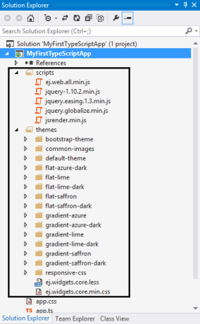
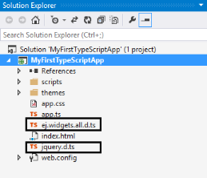
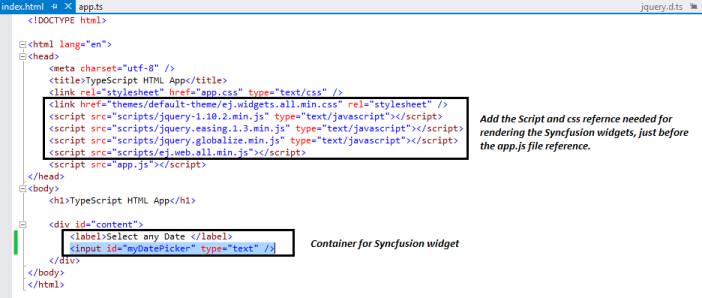
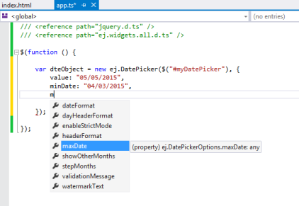
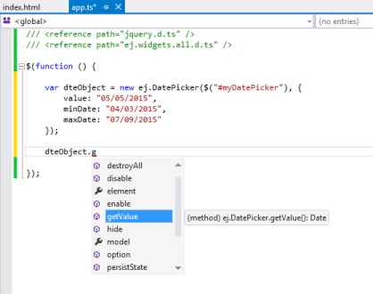
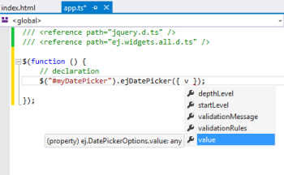
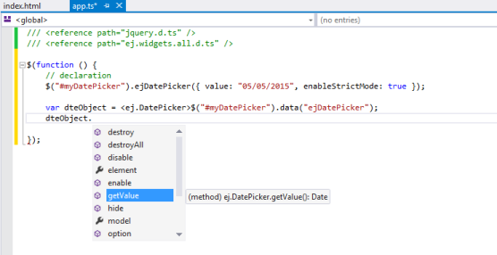

## TypeScript

The **Essential JavaScript** package provides the default type definition file (**ej.widgets.all.d.ts**) to include the support for **type-checking** (checking the type of the input value entered by the user for a particular widget’s API is valid or not) while initializing any of the Syncfusion widget. This file holds the type definition for almost all the widgets available within Syncfusion. The important thing that you need to do is to copy the ej.widgets.all.d.ts file into your project and then need to refer it in your TypeScript application (**app.ts** file), so that you will get the intelliSense support and also the compile time type-checking.

Apart from the type-checking, it also supports the other important concepts like Classes and modules.

The installed location on your machine where you can be availed with **ej.widgets.all.d.ts** file is as follows,



**<installed location>**\Syncfusion\Essential Studio\13.1.0.21\JavaScript\assets\typescript

**For example,** If you have installed the Essential Studio package within **C:\Program Files (x86)**, then navigate to the below location,

C:\Program Files (x86)\Syncfusion\Essential Studio\13.1.0.21\JavaScript\assets\typescript



Apart from the above specified file (**ej.widgets.all.d.ts**), it is also necessary to make use of the **jquery.d.ts** file in your TypeScript application, which can be downloaded from [here](https://github.com/borisyankov/DefinitelyTyped).

### Prerequisites

To work with [TypeScript](http://www.typescriptlang.org/Handbook), the below mentioned System requirements are necessary,

* Visual Studio 2012/ 2013

* TypeScript 1.0 – It is available as built-in with Visual Studio 2013, but the Visual Studio 2012 users’ needs to download it from [here](https://visualstudiogallery.msdn.microsoft.com/fa041d2d-5d77-494b-b0ba-8b4550792b4d).

* Microsoft Web Essential (for [Visual Studio 2012](http://visualstudiogallery.msdn.microsoft.com/07d54d12-7133-4e15-becb-6f451ea3bea6) / for [Visual Studio 2013](http://visualstudiogallery.msdn.microsoft.com/56633663-6799-41d7-9df7-0f2a504ca361))

### Getting Started

* Start Visual Studio 2013 and Create a new TypeScript Application from **File** -> **New** -> **Project** and save it with a meaningful name****as below (Select the **TypeScript** option, which is available by default in the listed Templates on the left side),

{:.image }

Figure 30: Visual Studio New Project Pop-up
{:.caption }

* Now, you need to add the required Scripts and Stylesheets into your Project, as shown below – Copy the required Scripts and themes from the installed location on your machine into your new TypeScript application for rendering the Syncfusion widgets (steps for copying the required scripts and stylesheets are described in the manual reference section of the Getting Started topic),

{:.image }

                               Figure 31: scripts & themes folder copied into current project
{:.caption }

* Add the **ej.widgets.all.d.ts** and **jquery.d.ts** type-definition files in your project and refer it in the **app.ts** file of your project as shown below,

{:.image }

              Figure 32: ej.widgets.all.d.ts & jquery.d.ts files added to the project
{:.caption }

Now, refer these two files within the **app.ts** file (before referring these files, remove all the unwanted content in that app.ts file) as shown below,

{:.image }

                      Figure 33: Reference of ej.widgets.all.d.ts & jquery.d.ts files in app.ts
{:.caption }

* Within the **Index.html** page, define the container name for the specific Syncfusion widget to be used and also make the other Script and css references in this page as shown below,

{:.image }

Figure 34: Script & StyleSheet reference, Container declaration in index.html page
{:.caption }

* Now build your application, so that the **app.js** file is automatically generated and got added to your project (User have nothing to do with this file). Now, whatever code changes that you make in **app.ts** file will be reflected in app.js file automatically. 

Usually, the Syncfusion widget initialization is done within this **app.ts** file using either of the following two ways.

* Widget Class

* jQuery Interface

#### Widget Class

Initialization of Syncfusion widgets can be done through the instance created for the required Widget’s classes. 

{:.image }

{:.caption }
_Figure 38: Initializing DatePicker widget through_ _**ej.DatePicker**_ _class_

{:.image }

Figure 39: Accessing DatePicker methods through the DatePicker instance
{:.caption }

#### JQuery Interface 

Here, the widgets are initialized using the plug-in name, by passing all the required widget properties to it. The property names can be accessible through intelliSense and while providing input values to those properties – if any wrong data values were assigned to the properties by the user, then it will be automatically notified to the user at the compile time itself with an error message.

{:.image }

Figure 35: Initializing the DatePicker widget through intelliSense
{:.caption }

{:.image }

Figure 36: Configuring the DatePicker properties
{:.caption }

{:.image }

Figure 37: Accessing the DatePicker methods through the widgets’ object
{:.caption }

