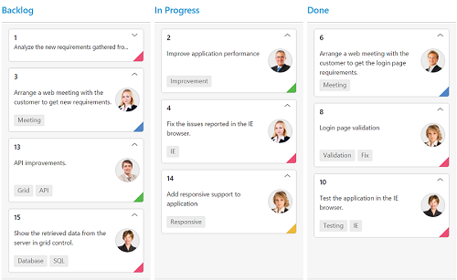
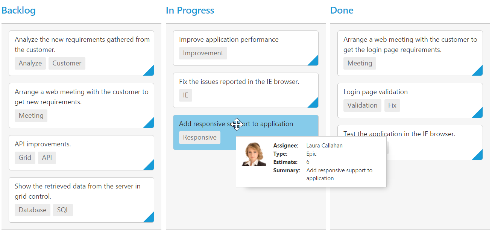

# Cards

## Customization

Cards can be customized with appropriate mapping fields from the database. The customizable mapping properties are listed as follows 

<table>
<tr>
<th>
Mapping Fields</th><th>
Description</th></tr>
<tr>
<td>
{{ '[content](https://help.syncfusion.com/api/js/ejkanban#members:fields-content)' | markdownify }} </td><td> Map the column name to use as content to cards.</td></tr>
<tr>
<td>
{{ '[tag](https://help.syncfusion.com/api/js/ejkanban#members:fields-tag)' | markdownify }} </td><td>
Map the column name to use as tag. Multiple tags can be given with comma separated.  E.g. "API","SQL, Database".</td></tr>
<tr>
<td>
{{ '[color](https://help.syncfusion.com/api/js/ejkanban#members:fields-color)' | markdownify }} </td><td>
 Map the column name to use as colors to highlight cards left border.</td></tr>
<tr>
<td>
{{ '[colorMapping](https://help.syncfusion.com/api/js/ejkanban#members:cardsettings-colormapping)' | markdownify }} </td><td>
Map the colors to use with column values which is mapped with `fields.color`.</td></tr>
<tr>
<td>
{{ '[imageUrl](https://help.syncfusion.com/api/js/ejkanban#members:fields-imageurl)' | markdownify }} </td><td>
Map the column name to use as image to cards.</td></tr>
<tr>
<td>
{{ '[primaryKey](https://help.syncfusion.com/api/js/ejkanban#members:fields-primarykey)' | markdownify }} </td><td>
Map the column name to use as primary key to cards.</td></tr>
<tr>
<td>
{{ '[priority](https://help.syncfusion.com/api/js/ejkanban#members:fields-priority)' | markdownify }} </td><td>
Map the column name to use as priority to cards.</td></tr>
<tr>
<td>
{{ '[title](https://help.syncfusion.com/api/js/ejkanban#members:fields-title)' | markdownify }} </td><td>
Map the column name to use as title to cards. Default title is  `primaryKey`.</td></tr>
<tr>
<td>
{{ '[allowTitle](https://help.syncfusion.com/api/js/ejkanban#members:allowtitle)' | markdownify }} </td><td>
Set as true to enable title for card.</td></tr>
</table>

The following code example describes the above behavior.



    





    $(function () {
    var data = ej.DataManager(window.kanbanData).executeLocal(ej.Query().take(20));
    
    $("#Kanban").ejKanban(
            {
            dataSource: data,
                columns: [
                    { headerText: "Backlog", key: "Open" },
                    { headerText: "In Progress", key: "InProgress" },
                    { headerText: "Done", key: "Close" }
                ],
                keyField: "Status",
                allowTitle:true,
                fields: {
                    content: "Summary",
                    primaryKey: "Id",
                    priority: "RankId",
                    tag: "Tags",
                    color: "Type",
                    imageUrl: "ImgUrl"
                },
                cardSettings: {
                    colorMapping: {
                        "#cb2027": "Bug,Story",
                        "#67ab47": "Improvement",
                        "#fbae19": "Epic",
                        "#6a5da8": "Others"
                    }
                }
            });
    });



The following output is displayed as a result of the above code example.

## Template

Templates are used to create custom card layout as per the user convenient. HTML templates can be specified in the [`template`](https://help.syncfusion.com/api/js/ejkanban#members:cardsettings-template) property of the [`cardSettings`](https://help.syncfusion.com/api/js/ejkanban#members:cardsettings) as an ID of the template’s HTML element.

You can use JsRender syntax in the template. For more information about JsRender syntax, please refer this [`link`](https://www.jsviews.com/).

The following code example describes the above behavior.



    

    
            




    $(function () {
        var data = new ej.DataManager(window.kanbanData).executeLocal(new ej.Query().take(20));
    
        $("#Kanban").ejKanban(
        {
            dataSource: data,
            columns: [
                { headerText: "Backlog", key: "Open"},
                { headerText: "In Progress", key: "InProgress"},
                { headerText: "Done", key: "Close"}
            ],
            keyField: "Status",
        fields: {
            primaryKey: "Id",
            color: "Type",
        },
            cardSettings: {
                template: "#template",                    
                colorMapping: {
                    "#cb2027": "Bug,Story",
                    "#67ab47": "Improvement",
                    "#fbae19": "Epic",
                    "#6a5da8": "Others"
                }
            }
        });
    });





    <!--CSS for card template-->
        



The following output is displayed as a result of the above code example.

## Tooltip

You can enable HTML tooltip for Kanban card elements by setting [`enable`](https://help.syncfusion.com/api/js/ejkanban#members:tooltipsettings-enable) property as true in [`tooltipSettings`](https://help.syncfusion.com/api/js/ejkanban#members:tooltipsettings).

The following code example describes the above behavior.



    





    $(function () {
        var data = ej.DataManager(window.kanbanData).executeLocal(ej.Query().take(20));

        $("#Kanban").ejKanban(
            {
                dataSource: data,
                tooltipSettings: {
                    enable: true
                },
                columns: [
                    { headerText: "Backlog", key: "Open" },
                    { headerText: "In Progress", key: "InProgress" },
                    { headerText: "Done", key: "Close" }
                ],
                keyField: "Status",
                fields: {
                    primaryKey: "Id",
                    content: "Summary",
                    tag: "Tags"
                }            
            });
    });


 
The following output is displayed as a result of the above code example.

### Template

By making use of template feature with tooltip, all the field names that are mapped from the `dataSource` can be accessed to define the [`template`](https://help.syncfusion.com/api/js/ejkanban#members:tooltipsettings-template) tooltip for card. The [`tooltipSettings.enable`](https://help.syncfusion.com/api/js/ejschedule#members:tooltipsettings.enable) must be enabled first.

The following code example describes the tooltip template.



    

    





    $(function () {
    var data = ej.DataManager(window.kanbanData).executeLocal(ej.Query().take(20));
    
    $("#Kanban").ejKanban(
        {
            dataSource: data,
            tooltipSettings: {
                enable: true,
                template: "#tooltipTemp"
            },
            columns: [
                { headerText: "Backlog", key: "Open" },
                { headerText: "In Progress", key: "InProgress" },
                { headerText: "Done", key: "Close" }
            ],
            keyField: "Status",
            fields: {
                primaryKey: "Id",
                content: "Summary",
                tag: "Tags"
            }            
        });
    });





    <!--toolTip template releated css -->
    



 
The following output is displayed as a result of the above code example.

## Collapsible Cards

You can set particular cards to the collapsed state in Kanban by defining the [`collapsibleCards`](https://help.syncfusion.com/api/js/ejkanban#members:fields-collapsiblecards) property. Based on the [`collapsibleCards`](https://help.syncfusion.com/api/js/ejkanban#members:fields-collapsiblecards) object value, it maps the cards to the collapsible area. 

You can set [`collapsibleCards`](https://help.syncfusion.com/api/js/ejkanban#members:fields-collapsiblecards) as object which consists of [`field`](https://help.syncfusion.com/api/js/ejkanban#members:fields-collapsiblecards-field) and [`key`](https://help.syncfusion.com/api/js/ejkanban#members:fields-collapsiblecards-key) properties. The [`field`](https://help.syncfusion.com/api/js/ejkanban#members:fields-collapsiblecards-field) property map the datasource field to be used in [`collapsibleCards`](https://help.syncfusion.com/api/js/ejkanban#members:fields-collapsiblecards). The [`key`](https://help.syncfusion.com/api/js/ejkanban#members:fields-collapsiblecards-key) property map the specific column key which is to be in collapsed state.

<table>
<tr>
<th>
Mapping Fields</th><th>
Description</th></tr>
<tr>
<td>
{{ '[collapsibleCards.field](https://help.syncfusion.com/api/js/ejkanban#members:fields-collapsiblecards-field) ' | markdownify }} </td><td>
 Map the collapsible card's field mapping.</td></tr>
<tr>
<td>
{{ '[collapsibleCards.key](https://help.syncfusion.com/api/js/ejkanban#members:fields-collapsiblecards-key)' | markdownify }} </td><td>
Map the collapsible card's key mapping which is available in datasource value of field mapped in {{ '[collapsibleCards.field](https://help.syncfusion.com/api/js/ejkanban#members:fields-collapsiblecards-field) ' | markdownify }}.</td></tr>
</table>

N> 1. If the `collapsibleCards` with `field` is in the dataSource and `key` values specified will available in column values, then the cards will be rendered inside the collapsible card's division.

The following code example describes the collapsible cards.



    





    $(function() {
        var data = ej.DataManager(window.kanbanData).executeLocal(ej.Query().take(20));

        $("#Kanban").ejKanban(
            {
                dataSource: data,
                columns: [
                    { headerText: "Andrew", key: "Andrew Fuller"},
                    { headerText: "Janet", key: "Janet Leverling"},
					{ headerText: "Nancy", key: "Nancy Davloio"}
				],                                                           			
                keyField: "Assignee",
                allowTitle: true,
                fields: {
                content: "Summary",
                primaryKey: "Id",
				tag: "Status",
				collapsibleCards: { field:"Status", key:"Close"}
            },
			allowSelection: false,
        });
    });



The following output is displayed as a result of the above code example.

N> For cards event handling , please refer this [API](https://help.syncfusion.com/api/js/ejkanban#events:cardclick).