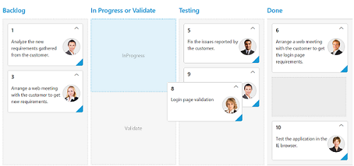
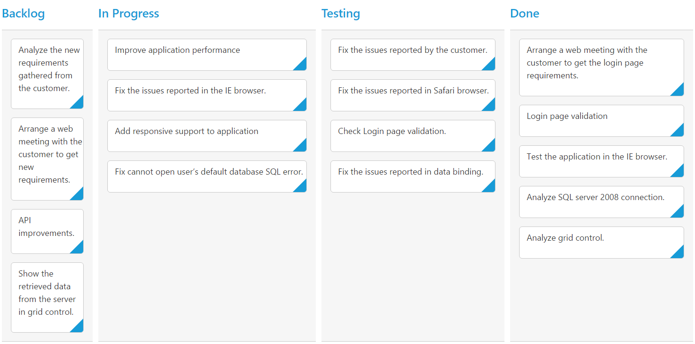

# Columns 

Column fields are present in the [`dataSource`](https://help.syncfusion.com/api/js/ejkanban#members:datasource) schema and it is rendering cards based its mapping column values.

## Key Mapping

To render Kanban with simple cards, you need to map the `dataSource` fields to Kanban cards and [`columns`](https://help.syncfusion.com/api/js/ejkanban#members:columns). The required mapping field are listed as follows

<table>
<tr>
<th>
Mapping Fields</th><th>
Description</th></tr>
<tr>
<td>
{{ '[keyField](https://help.syncfusion.com/api/js/ejkanban#members:keyField)' | markdownify }} </td><td>
Map the column name to use as {{ '[key](https://help.syncfusion.com/api/js/ejkanban#members:columns-key)'| markdownify }} values to columns.</td></tr>
<tr>
<td>
{{ '[columns.key](https://help.syncfusion.com/api/js/ejkanban#members:columns-key)' | markdownify }} </td><td>
Map the corresponding `key` values of `keyField` column to each columns.</td></tr>
<tr>
<td>
{{ '[columns.headerText](https://help.syncfusion.com/api/js/ejkanban#members:columns-headertext)' | markdownify }} </td><td>
 It represents the title for particular column</td></tr>
<tr>
<td>
{{ '[fields.content](https://help.syncfusion.com/api/js/ejkanban#members:fields-content)' | markdownify }} </td><td>
Map the column name to use as content to cards.</td></tr>
</table>

N> 1. If the column with `keyField` is not in the dataSource and `key` values specified will not available in column values, then the cards will not be rendered.
N> 2. If the `fields.content` is not in the dataSource, then empty cards will be rendered.

The following code example describes the above behavior.



    





    $(function () {
        var data = ej.DataManager(window.kanbanData).executeLocal(ej.Query().take(30));
    
        $("#Kanban").ejKanban({    
            dataSource: data,
            columns: [
                        { headerText: "Backlog", key: "Open"},
                { headerText: "In Progress", key: "InProgress"},
                { headerText: "Testing", key: "Testing"},
                { headerText: "Done", key: "Close"}    
            ],        
            keyField: "Status",
            fields: {
                content: "Summary",
                primaryKey: "Id"
            }
        });
    }); 



The following output is displayed as a result of the above code example.

## Multiple Key Mapping

You can map more than one datasource fields as [`key`](https://help.syncfusion.com/api/js/ejkanban#members:columns-key) values to show different key cards into single column. For e.g , you can map "Validate,In progress" keys under "In progress" column. 

The following code example and screenshot which describes the above behavior.



    





    $(function() {
        var data = ej.DataManager(window.kanbanData).executeLocal(ej.Query().take(10));
        
        $("#Kanban").ejKanban(
            {
                dataSource: data,
                columns: [
                    { headerText: "Backlog", key: "Open"},
                    { headerText: "In Progress or Validate", key: "InProgress,Validate" },
                    { headerText: "Testing", key: "Testing" },
                    { headerText: "Done", key: "Close" }
                ],                                                           			
                keyField: "Status",
                allowTitle: true,
                fields: {
                content: "Summary",
                primaryKey: "Id"
            },
            });
    });



The following output is displayed as a result of the above code example.

## Headers

### Header Template

The template design that applies on for the column header. To render template, set [`headerTemplate`](https://help.syncfusion.com/api/js/ejkanban#members:columns-headertemplate) property of the [`columns`](https://help.syncfusion.com/api/js/ejkanban#members:columns).

You can use JsRender syntax in the template. For more information about JsRender syntax, please refer the [`link`](https://www.jsviews.com/).

The following code example describes the above behavior.



        <!—Column Template -->
        
        

             Done
        

    

 





    $(function () {
        var data = ej.DataManager(window.kanbanData).executeLocal(ej.Query().take(30));
    
        $("#Kanban").ejKanban(
            {
                dataSource: data,
                columns: [
                { headerText: "Backlog", key: "Open", headerTemplate: "#column1" },
                { headerText: "In Progress", key: "InProgress" },
                { headerText: "Testing", key: "Testing" },
                { headerText: "Done", key: "Close", headerTemplate: "#column4" }    
            ],
                keyField: "Status",
                fields: {
                    content: "Summary",
                    primaryKey: "Id"
                }
            });
    });





    /*CSS for Header template icon*/
    .e-backlog,.e-done {
        font-size: 16px;
        padding-right: 5px;
        display: inline-block;
        }    
    .e-backlog:before {
        content: "\e807";
        }    
    .e-done:before {
        content: "\e80a";
        }



The following output is displayed as a result of the above code example.

## Width

You can specify the width for particular column by setting [`width`](https://help.syncfusion.com/api/js/ejkanban#members:columns-width) property of [`columns`](https://help.syncfusion.com/api/js/ejkanban#members:columns) as in pixel (ex: 100) or in percentage (ex: 40%).

The following code example describes the above behavior.


  
    





    $(function () {
        var data = ej.DataManager(window.kanbanData).executeLocal(ej.Query().take(30));
        
        $("#Kanban").ejKanban(
            {
                dataSource: data,
                columns: [
                    { headerText: "Backlog", key: "Open", width: "5%" },
                    { headerText: "In Progress", key: "InProgress", width: "12%" },
                    { headerText: "Testing", key: "Testing", width: 100 },
                    { headerText: "Done", key: "Close", width: 100 }
                ],
                keyField: "Status",
                fields: {
                    content: "Summary",
                    primaryKey: "Id"
                }
            });
    });



The following output is displayed as a result of the above code example.

## Visibility 

You can hide particular column in Kanban by setting [`visible`](https://help.syncfusion.com/api/js/ejkanban#members:columns-visible) property of it as false.

The following code example describes the above behavior.



    





    $(function () {
        var data = ej.DataManager(window.kanbanData).executeLocal(ej.Query().take(30));
        
        $("#Kanban").ejKanban(
            {
                dataSource: data,
                columns: [
                    { headerText: "Backlog", key: "Open" },
                    { headerText: "In Progress", key: "InProgress" },
                    { headerText: "Testing", key: "Testing", visible: false },
                    { headerText: "Done", key: "Close" }
                ],
                keyField: "Status",
                fields: {
                    content: "Summary",
                    primaryKey: "Id"
                }
            });
    });



The following output is displayed as a result of the above code example.

## Toggle 

You can set particular column collapsed state in Kanban by setting [`isCollapsed`](https://help.syncfusion.com/api/js/ejkanban#members:columns-iscollapsed) property of it as true. You need to set [`allowToggleColumn`](https://help.syncfusion.com/api/js/ejkanban#members:allowtogglecolumn) as true to use “Expand/Collapse” Column.

The following code example describes the above behavior.



    





    $(function() {
        var data = ej.DataManager(window.kanbanData).executeLocal(ej.Query().take(30));
        
        $("#Kanban").ejKanban(
            {
                dataSource: data,
                allowToggleColumn:true,
                columns: [
                    { headerText: "Backlog", key: "Open",isCollapsed:true },
                    { headerText: "In Progress", key: "InProgress" },
                    { headerText: "Testing", key: "Testing" },
                    { headerText: "Done", key: "Close" }
                ],                                                           			
                keyField: "Status",
                fields: {
                content: "Summary",
                primaryKey: "Id"
            },
            });
    });



The following output is displayed as a result of the above code example.

## Allow Dragging

You can enable and disable drag behavior to the cards in the Kanban columns using the [allowDrag](https://help.syncfusion.com/api/js/ejkanban#members:columns-allowdrag) property and the default value is `true`.

The following code example describes the above behavior.



    





    $(function () {
        var data = ej.DataManager(window.kanbanData).executeLocal(ej.Query().take(30));
        
         $("#Kanban").ejKanban(
            {
                dataSource: data,
                columns: [
                    { headerText: "Backlog", key: "Open", allowDrag: false },
                    { headerText: "In Progress", key: "InProgress" },
                    { headerText: "Done", key: "Close" }
                ],
                keyField: "Status",
                fields: {
                    content: "Summary",
                    primaryKey: "Id",
                    priority: "RankId"
                }
            });
    });



The following output is displayed as a result of the above code example.

## Allow Dropping

You can enable and disable drop behavior to the cards in the Kanban columns using the [allowDrop](https://help.syncfusion.com/api/js/ejkanban#members:columns-allowdrop) property and the default value is `true`.

The following code example describes the above behavior.



    





    $(function () {
        var data = ej.DataManager(window.kanbanData).executeLocal(ej.Query().take(30));
        
        $("#Kanban").ejKanban(
            {
                dataSource: data,
                columns: [
                    { headerText: "Backlog", key: "Open"},
                    { headerText: "In Progress", key: "InProgress" },
                    { headerText: "Done", key: "Close", allowDrop: false  }
                ],
                keyField: "Status",
                fields: {
                    content: "Summary",
                    primaryKey: "Id",
                    priority: "RankId"
                }
            });
    });



The following output is displayed as a result of the above code example.

## Items Count

You can show total cards count in each column's header using the property [enableTotalCount](https://help.syncfusion.com/api/js/ejkanban#members:enabletotalcount) and the default value is `false`.

The following code example describes the above behavior.



    





    $(function () {
        var data = ej.DataManager(window.kanbanData).executeLocal(ej.Query().take(30));
        
        $("#Kanban").ejKanban(
            {
                dataSource: data,
				enableTotalCount:true,
                columns: [
                    { headerText: "Backlog", key: "Open"},
                    { headerText: "In Progress", key: "InProgress" },
                    { headerText: "Done", key: "Close" }
                ],
                keyField: "Status",
                fields: {
                    content: "Summary",
                    primaryKey: "Id"
                }
            });
    });



The following output is displayed as a result of the above code example.

## Customize Items Count Text

You can customize the Items count text using [totalCount](https://help.syncfusion.com/api/js/ejkanban#members:columns-totalcount) property of [text](https://help.syncfusion.com/api/js/ejkanban#members:columns-totalcount-text).

The following code example describes the above behavior.



    





    $(function () {
        var data = ej.DataManager(window.kanbanData).executeLocal(ej.Query().take(30));
        
          $("#Kanban").ejKanban(
            {
                dataSource: data,
				enableTotalCount:true,
                columns: [
                    { headerText: "Backlog", key: "Open",totalCount:{text:"Backlog Count"}},
                    { headerText: "In Progress", key: "InProgress" },
                    { headerText: "Done", key: "Close" }
                ],
                keyField: "Status",
                fields: {
                    content: "Summary",
                    primaryKey: "Id"
                }
            });
    });



The following output is displayed as a result of the above code example.

## Display Empty Column

On binding empty data source to Kanban control, it displays "No cards to display" text. Using [`showColumnWhenEmpty`](https://help.syncfusion.com/api/js/ejkanban#members:showcolumnwhenempty) property, we can render empty kanban columns. Set allowEditing and allowAdding property as true to add new data into the empty kanban column. 

The following code example describes the above behavior.



    





    $(function () {
        var data = ej.DataManager(window.kanbanData).executeLocal(ej.Query().take(0));
        
        $("#Kanban").ejKanban(
        {
                dataSource: data,
				showColumnWhenEmpty: true,
                columns: [
                    { headerText: "Backlog", key: "Open"},
                    { headerText: "In Progress", key: "InProgress" },
					{ headerText: "Testing", key: "Testing" },
                    { headerText: "Done", key: "Close" }
                ],
                keyField: "Status",
                fields: {
                    content: "Summary",
                    primaryKey: "Id"
                },
				editSettings: {
                    editItems: [
                        { field: "Id", editType: ej.Kanban.EditingType.Text,validationRules: { required: true, number: true }},
                        { field: "Status", editType: ej.Kanban.EditingType.Text },
                        { field: "Assignee", editType: ej.Kanban.EditingType.Text },
                        { field: "Estimate", editType: ej.Kanban.EditingType.Numeric, editParams: { decimalPlaces: 2 },validationRules: {range: [0, 1000]}},
                        { field: "Summary", editType: ej.Kanban.EditingType.TextArea,validationRules: { required: true}}
					    ],
                    allowEditing: true,
                    allowAdding: true
                }
        });
    });



The following output is displayed as a result of the above code example.

