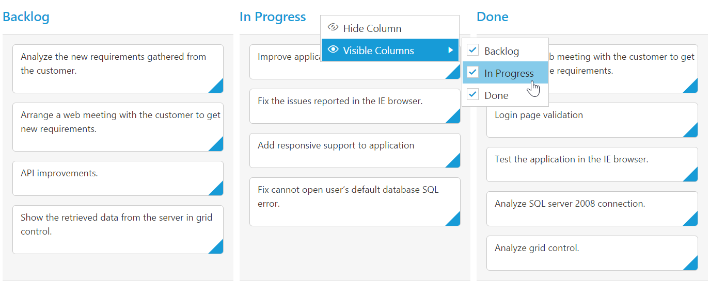

# Context Menu  

Context menu is used to improve user action with Kanban using popup menu. It can be shown by defining [contextMenuSettings](https://help.syncfusion.com/api/js/ejkanban#members:contextmenusettings) property of [enable](https://help.syncfusion.com/api/js/ejkanban#members:contextmenusettings-enable) set as true. Context menu has option to add default items in [`contextMenuSettings.menuItems`](https://help.syncfusion.com/api/js/ejkanban#members:contextmenusettings-menuitems) and customized items in [`contextMenuSettings.customMenuItems`](https://help.syncfusion.com/api/js/ejkanban#members:contextmenusettings-custommenuitems).

N> For using event handling in context menu, please refer this [API](https://help.syncfusion.com/api/js/ejkanban#events:contextclick).

## Default Context Menu items

Please find the below table for default context menu items and its actions.

<table>
        <tr>
            <th>
                Section 
            </th>
            <th>
               Context menu items 
            </th>
            <th>
                Action
            </th>
        </tr>
        <tr>
            <td rowspan="2">
                Header 
            </td>
            <td>
                Hide Column
            </td>
            <td>
               Hide the current column 
            </td>
        </tr>
        <tr>
            <td>
                Visible Columns
            </td>
            <td>
                Show the column if already hidden 
            </td>
        </tr>
       <tr>
            <td>
                Content
            </td>
            <td>
                Add Card 
            </td>
             <td>
                Start Add new card 
            </td>
        </tr>
        <tr>
            <td rowspan="10">
                Card
            </td>
            <td>
               Edit Card 
            </td>
            <td>
               Start Edit in current card 
            </td>
        </tr>
        <tr>
            <td>
               Delete Card 
            </td>
            <td>
                Delete the current card 
            </td>
        </tr>
        <tr>
            <td>
                Top of Row
            </td>
            <td>
                Move the card to Top of Row
            </td>
        </tr>
        <tr>
            <td>
               Bottom of Row
            </td>
            <td>
                Move the card to Bottom of Row
            </td>
        </tr>
        <tr>
            <td>
               Move Up
            </td>
            <td>
                Move the card in Up direction 
            </td>
        </tr>
        <tr>
            <td>
               Move Down
            </td>
            <td>
               Move the card in Down direction
            </td>
        </tr>
        <tr>
            <td>
                Move Left
            </td>
            <td>
                Move the card in Left direction
            </td>
        </tr>
        <tr>
            <td>
               Move Right
            </td>
            <td>
                Move the card in Right direction
            </td>
        </tr>
        <tr>
            <td>
              Move to Swimlane
            </td>
            <td>
                Move the card to Swim lane which is chosen from given list
            </td>
        </tr>
         <tr>
            <td>
              Print Card
            </td>
            <td>
                Print the specific card
            </td>
        </tr>
    </table>

    
The following code example describes the above behavior.



    





    



The following output is displayed as a result of the above code example.

## Custom Context Menu

Custom context menu is used to create your own menu item and its action. To add customized context menu items, you need to use [`contextMenuSettings.customMenuItems`](https://help.syncfusion.com/api/js/ejkanban#members:contextmenusettings-custommenuitems) property of [text](https://help.syncfusion.com/api/js/ejkanban#members:contextmenusettings-custommenuitems-text) or [target](https://help.syncfusion.com/api/js/ejkanban#members:contextmenusettings-custommenuitems-target) or [template](https://help.syncfusion.com/api/js/ejkanban#members:contextmenusettings-custommenuitems-template) and to bind required actions for this, use [`contextClick`](https://help.syncfusion.com/api/js/ejkanban#events:contextclick) event.

The following code example describes the above behavior.



    





    $(function() {
        var data = ej.DataManager(window.kanbanData).executeLocal(ej.Query().take(30));
    
        $("#Kanban").ejKanban(
        {
            dataSource: data,
            contextClick: function (args) {
                if (args.text == "Clear Selection")
                    this.KanbanSelection.clear();
            },
            columns: [
                { headerText: "Backlog", key: "Open" },
                { headerText: "In Progress", key: "InProgress" },
                { headerText: "Done", key: "Close" }
            ],
            keyField: "Status",
            fields: {
                primaryKey: "Id",
                swimlaneKey: "Assignee",
                content: "Summary",
                tag: "Tags"
            },
            contextMenuSettings: {
                enable: true,
                menuItems: [],
                customMenuItems: [{ text: "Clear Selection" }]
            },
            editSettings: {
                editItems: [
                    { field: "Id"},
                    { field: "Status", editType: ej.Kanban.EditingType.Dropdown },
                    { field: "Assignee", editType: ej.Kanban.EditingType.Dropdown },
                    { field: "Estimate", editType: ej.Kanban.EditingType.Numeric },
                    { field: "Summary", editType: ej.Kanban.EditingType.TextArea }
                ],
                allowEditing: true,
                allowAdding: true
            }
        });
    });



The following output is displayed as a result of the above code example.

## Sub Context Menu

Sub context menu is used to add customized sub menu to the custom context menu item. To add a sub context menu, you need to use [`contextMenuSettings.subMenu`](https://help.syncfusion.com/api/js/ejkanban#members:contextmenusettings-custommenuitems-template) property and to bind required actions for this, use [`contextClick`](https://help.syncfusion.com/api/js/ejkanban#events:contextclick) event.

The following code example describes the above behavior.



    





    $(function() {
        var data = ej.DataManager(window.kanbanData).executeLocal(ej.Query().take(30));

        $("#Kanban").ejKanban(
        {
            dataSource: data,
            contextClick: function (args) {
                if (args.text == "Clear Selection")
                    this.KanbanSelection.clear();
                else if (args.text != "Move to Column")
                    this.updateCard(args.data.id, args.data);
            },
            columns: [
                { headerText: "Backlog", key: "Open" },
                { headerText: "In Progress", key: "InProgress" },
                { headerText: "Done", key: "Close" }
            ],
            keyField: "Status",
            fields: {
                primaryKey: "Id",
                swimlaneKey: "Assignee",
                content: "Summary",
                tag: "Tags"
            },
            contextMenuSettings: {
                enable: true,
                menuItems: [],
                customMenuItems: [{ text: "Clear Selection" }, { text: "Move to Column", template: "#submenu"}]
            },
            editSettings: {
                editItems: [
                    { field: "Id"},
                    { field: "Status", editType: ej.Kanban.EditingType.Dropdown },
                    { field: "Assignee", editType: ej.Kanban.EditingType.Dropdown },
                    { field: "Estimate", editType: ej.Kanban.EditingType.Numeric },
                    { field: "Summary", editType: ej.Kanban.EditingType.TextArea }
                ],
                allowEditing: true,
                allowAdding: true
            }
        });
    });



The following output is displayed as a result of the above code example.

