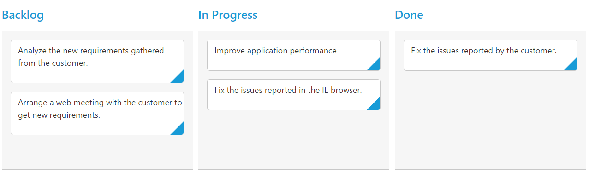
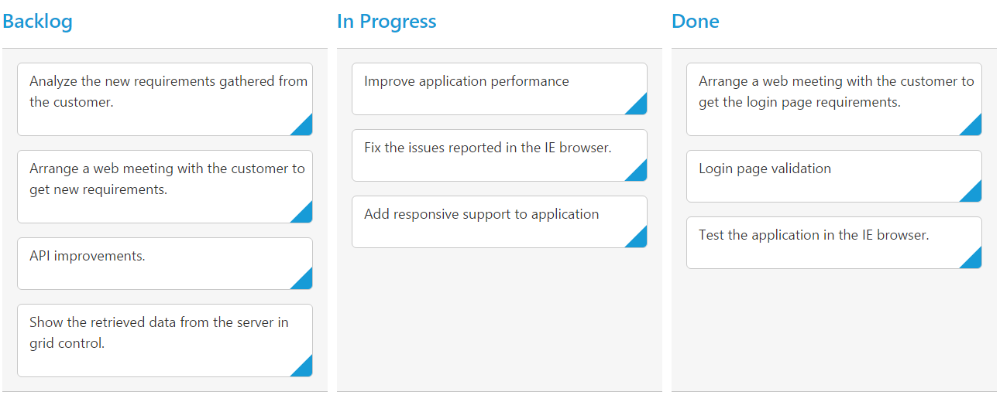

# Data Binding  

The Kanban control uses [`ej.DataManager`](https://help.syncfusion.com/js/datamanager/overview) which supports both RESTful JSON data services binding and local JSON array binding. The [`dataSource`](https://help.syncfusion.com/api/js/ejkanban#members:datasource) property can be assigned either with the instance of [`ej.DataManager`](https://help.syncfusion.com/js/datamanager/overview) or JSON data array collection. It supports different kinds of data binding methods such as

1.	Local data
2.	Remote data

## Local Data

To bind local data to the Kanban, you can assign a JSON array to the [`dataSource`](https://help.syncfusion.com/api/js/ejkanban#members:datasource) property.

The JSON array to the [`dataSource`](https://help.syncfusion.com/api/js/ejkanban#members:datasource) property can also be provided as an instance of the [`ej.DataManager`](https://help.syncfusion.com/js/datamanager/overview). When the JSON array is passed as an instance of [`ej.DataManager`](https://help.syncfusion.com/js/datamanager/overview), the `ej.JsonAdaptor` will be used to manipulate the Kanban data source.

The following code example describes the above behavior.



    

 





    var kanbanData = [
        { Id: 1, Status: "Open", Summary: "Analyze the new requirements gathered from the customer.", Assignee: "Nancy" },
        { Id: 2, Status: "InProgress", Summary: "Improve application performance", Assignee: "Andrew" },
        { Id: 3, Status: "Open", Summary: "Arrange a web meeting with the customer to get new requirements.", Assignee: "Janet" },
        { Id: 4, Status: "InProgress", Summary: "Fix the issues reported in the IE browser.", Assignee: "Janet" },
        { Id: 5, Status: "Testing", Summary: "Fix the issues reported by the customer.", Assignee: "Steven" }
    ];

    $("#Kanban").ejKanban(
    {
        dataSource: kanbanData,
        columns: [
            { headerText: "Backlog", key: "Open" },
            { headerText: "In Progress", key: "InProgress" },
            { headerText: "Done", key: "Close" }
        ],
        keyField: "Status",
        fields: {
            content: "Summary",
            primaryKey: "Id"
        }
    });



The following output is displayed as a result of the above code example.

## Remote Data

To bind remote data to Kanban Control, you can assign a service data as an instance of [`ej.DataManager`](https://help.syncfusion.com/js/datamanager/overview) to the [`dataSource`](https://help.syncfusion.com/api/js/ejkanban#members:datasource) property.

### OData

OData is a standardized protocol for creating and consuming data. You can provide the [`OData service`](http://www.odata.org/) URL directly to the [`ej.DataManager`](https://help.syncfusion.com/api/js/ejdatamanager) class and then you can assign it to Kanban [`dataSource`](https://help.syncfusion.com/api/js/ejkanban#members:datasource).

The following code example describes the above behavior.



    





    $(function () {
        var data = new ej.DataManager("http://mvc.syncfusion.com/Services/Northwnd.svc/Tasks");

        $("#Kanban").ejKanban(
        {
            dataSource: kanbanData,
            columns: [
                { headerText: "Backlog", key: "Open" },
                { headerText: "In Progress", key: "InProgress" },
               { headerText: "Done", key: "Close" }
            ],
            keyField: "Status",
            fields: {
                content: "Summary",
                primaryKey: "Id"
            }
        });
    });



The following output is displayed as a result of the above code example.

### URL Adaptor

You can use the `UrlAdaptor` of [`ejDataManger`](https://help.syncfusion.com/api/js/ejdatamanager) when binding `dataSource` from remote data. At initial load of Kanban, using `url` property of DataManager, data are fetched from remote data and bound to Kanban. You can map CRUD operation in Kanban to Server-Side Controller action using the property `crudUrl`.

The following code example describes the above behavior.



    





   



Also when you use `UrlAdaptor`, you need to return the data as JSON and the JSON object must contain a properties result & count. The `result` holds the `dataSource` as its value and `count` holds the total cards count as its value.

The following code example describes the above behavior.


     
    public ActionResult GetData(Syncfusion.JavaScript.DataManager value)
        {
           var DataSource = db.Tasks.ToList();
           DataResult result1 = new DataResult();
           DataOperations operation = new DataOperations();
           result1.result = DataSource;
           result1.count = DataSource.AsQueryable().Count();
           if (value.Skip > 0)
               result1.result = operation.PerformSkip(result1.result, value.Skip);
           if (value.Take > 0)
               result1.result = operation.PerformTake(result1.result, value.Take);
           return Json(result1, JsonRequestBehavior.AllowGet);
       }
     public class DataResult
      {
        public IEnumerable result { get; set; }
        public int count { get; set; }
    }
         


Please refer to the below screenshot.

Using `DataOperations` helper class you can perform Kanban action at server side. The in-built methods that we have provided in the DataOperations class are listed below.

1.	PerformTake
2.	PerformSelect
3.	Execute

For more information about the Server-Side operation you can refer the below link.

[`Persisting Data in Server`](https://help.syncfusion.com/js/kanban/editing#persisting-data-in-server) 

### WebAPI

Using `ej.WebApiAdaptor`, you can bind WebApi service data to Kanban. The data from WebApi service must be returned as object that has property `Items` with its value as `dataSource` and another property `Count` with its value as dataSource’s total cards count.

The following code example describes the above behavior.



    





    $(function () {
    var dataManager = ej.DataManager({
        url: "/api/Tasks", adaptor: new ej.WebApiAdaptor()
    });

    $("#Kanban").ejKanban(
    {
        dataSource: dataManager,
        columns: [
            { headerText: "Backlog", key: "Open" },
            { headerText: "In Progress", key: "InProgress" },
            { headerText: "Testing", key: "Testing" },
            { headerText: "Done", key: "Close" }
        ],
        keyField: "Status",
        fields: {
            content: "Summary",
            primaryKey: "Id"
        } 
    });
    });



Please refer the following link for common WebAPI creation.

http://www.asp.net/web-api/overview/getting-started-with-aspnet-web-api/tutorial-your-first-web-api



    using EJKanban.Models;
    using System;
    using System.Collections.Generic;
    using System.Linq;
    using System.Linq.Expressions;
    using System.Net;
    using System.Net.Http;
    using System.Web;
    using System.Web.Http;

    namespace EJKanban.Controllers
    {

        public class TasksController: ApiController
        {

            // GET: api/Tasks
            NORTHWNDEntities db = new NORTHWNDEntities();

            public object Get()
            {
                var data = db.Tasks.Take(30).ToList();
                return new {
                    Items = data, Count = data.Count()
                };
            }
        }
    }

 

The following output is displayed as a result of the above code example.

