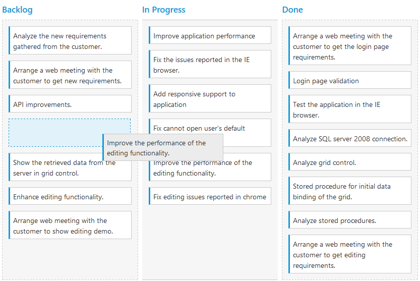

# Drag and Drop

By default [`allowDragAndDrop`](https://help.syncfusion.com/js/api/ejkanban#members:allowdraganddrop) is true.Cards can be transited from one column to another column, by dragging and dropping. And it has drop position indicator which enables easier positioning of cards

N> It is not possible transit cards to other swim lanes through Drag and Drop.

## Prioritization of cards

Prioritizing cards is easy with drag-and-drop re-ordering that helps you to categorize most important work at the top.Cards can be categorized with priority by mapping specific database field into [`priority`](https://help.syncfusion.com/js/api/ejkanban#members:fields-priority) property.

`RankId` defined in the dataSource which is consist priority of cards. The `RankId` will be changed while card ordering changes through `DragandDrop` and `Editing`.

The following code example describes the above behavior.



    





    $(function () {
        var data = ej.DataManager(window.kanbanData).executeLocal(ej.Query().take(30));
        
        $("#Kanban").ejKanban(
            {
                dataSource: data,
                columns: [
                    { headerText: "Backlog", key: "Open" },
                    { headerText: "In Progress", key: "InProgress" },    
                    { headerText: "Done", key: "Close" }
                ],
                keyField: "Status",
                fields: {
                    content: "Summary",
                    primaryKey: "Id",
                    priority: "RankId"
                }
        });
    });



The following output is displayed as a result of the above code example.

## Swim lanes

Swim lanes are a horizontal categorization of issues in the Kanban control which brings transparency to the workflow. This can be enabled by mapping the [`swimlaneKey`](https://help.syncfusion.com/js/api/ejkanban#members:swimlaneKey) to appropriate column name in the [`dataSource`](https://help.syncfusion.com/js/api/ejkanban#members:datasource).

The following code example describes the above behavior.



    





    $(function () {
        var data = ej.DataManager(window.kanbanData).executeLocal(ej.Query().take(30));
        
        $("#Kanban").ejKanban(
            {
                dataSource: data,
                columns: [
                    { headerText: "Backlog", key: "Open" },
                    { headerText: "In Progress", key: "InProgress" },
                    { headerText: "Done", key: "Close" }
                ],
                keyField: "Status",
                fields: {
                    content: "Summary",
                    primaryKey: "Id",
                    swimlaneKey: "Assignee",
                    imageUrl: "ImgUrl"
                }
            });
    });



The following output is displayed as a result of the above code example.

