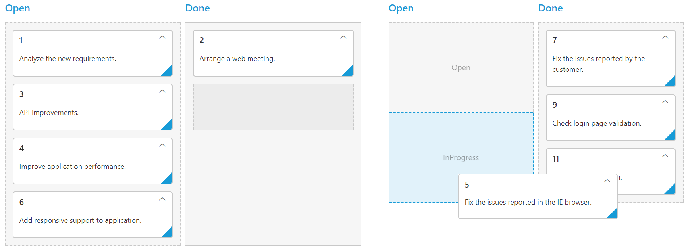
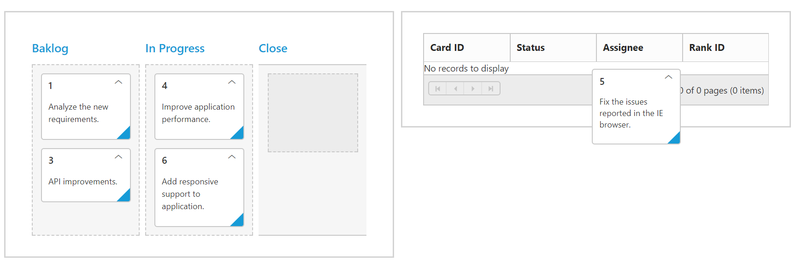

# Drag and Drop

By default [`allowDragAndDrop`](https://help.syncfusion.com/api/js/ejkanban#members:allowdraganddrop) is true.Cards can be transited from one column to another column, by dragging and dropping. And it has drop position indicator which enables easier positioning of cards

N> To transit cards to other swim lanes through Drag and Drop, please refer [here](https://help.syncfusion.com/js/kanban/swimlanes#drag-and-drop-between-swim-lanes).

## Drag and Drop to external control

Kanban is now provided support to drag and drop cards to external controls, when ['allowExternalDragAndDrop'](https://help.syncfusion.com/api/js/ejkanban#members:allowexternaldraganddrop) is set to true.  Along with that you need to specify the ID of the component to which the card must be dropped in ['cardSettings'](https://help.syncfusion.com/api/js/ejkanban#members:cardSettings) property ['externalDropTarget'](https://help.syncfusion.com/api/js/ejkanban#members:cardsettings-externaldroptarget).

Here, in order to drag and drop cards between two Kanban, enable the Kanban property ['allowExternalDragAndDrop'](https://help.syncfusion.com/api/js/ejkanban#members:allowexternaldraganddrop) and specify the target Kanban ID in ['externalDropTarget'](https://help.syncfusion.com/api/js/ejkanban#members:cardsettings-externaldroptarget).

The following code example describes the above behavior. 



     
 
		

	 

	 

		

	 





     $(function () {
            var data = [
                 { Status: "Open", Id: "1", Summary: "Analyze the new requirements.", Assignee: "Andrew" },
                 { Status: "Testing", Id: "2", Summary: "Arrange a web meeting.", Assignee: "Nancy"},
                 { Status: "Open", Id: "3", Summary: "API improvements.", Assignee: "Andrew" },
                 { Status: "InProgress", Id: "4", Summary: "Improve application performance.", Assignee: "Nancy"},
                 { Status: "Close", Id: "5", Summary: "Fix the issues reported in the IE browser.", Assignee: "Andrew"},
                 { Status: "InProgress", Id: "6", Summary: "Add responsive support to application.", Assignee: "Nancy" },
                 ];
            var data1=[
                 { Status: "Testing", Id: "7", Summary: "Fix the issues reported by the customer.", Assignee: "Mike" },
                 { Status: "Open", Id: "8", Summary: "Fix the issues reported in safari browser.", Assignee: "Andrew" },
                 { Status: "Testing", Id: "9", Summary: "Check login page validation.", Assignee: "Andrew" },
                 { Status: "InProgress", Id: "10", Summary: "Arrange a web meeting with the customer to get the login page requirements.", Assignee: "Mike" },
                 { Status: "Close", Id: "11", Summary: "Login page validation.", Assignee: "Andrew"},
                 ];
            $("#Kanban").ejKanban(
                {
                    dataSource: data,
					columns: [
                        { headerText: "Open", key: "Open,InProgress" },
                        { headerText: "Done", key: "Testing,Close" }
                    ],                                                           			
                    keyField: "Status",
					allowTitle: true,
					fields: {
					    content: "Summary",
					    primaryKey: "Id"
                    },
					allowExternalDragAndDrop: true,
					cardSettings:{
					    externalDropTarget: "#Kanban1"
					}
			    });
				$("#Kanban1").ejKanban(
                {
                    dataSource: data1,
					columns: [
                        { headerText: "Open", key: "Open,InProgress" },
                        { headerText: "Done", key: "Testing,Close" }
                    ],                                                           			
                    keyField: "Status",
					allowTitle: true,
					fields: {
					    content: "Summary",
					    primaryKey: "Id"
					},
					allowExternalDragAndDrop: true,
					cardSettings:{
					    externalDropTarget: "#Kanban"
					}
                });
        });





    .e-kanban .e-draggedcard {
	     z-index:1;
	  }



The following output is displayed before dropping Kanban cards.

The following output is displayed after dropping Kanban cards.

### See Also

You can also drag and drop Kanban cards to any custom control. For instance, let it be a Grid control. Enable the Kanban property ['allowExternalDragAndDrop'](https://help.syncfusion.com/api/js/ejkanban#members:allowexternaldraganddrop) and specify the target Grid element ID in ['externalDropTarget'](https://help.syncfusion.com/api/js/ejkanban#members:cardsettings-externaldroptarget).

N> The target control must have droppable feature to handle the card dropped from Kanban and customize it based on corresponding control. 

The following code example describes the above behavior. 



    

         

    

    

         

    





    $(function () {
		 var data = [
                 { Status: "Open", Id: 1, Summary: "Analyze the new requirements.", Assignee: "Andrew", RankId: 1 },
                 { Status: "Testing", Id: 2, Summary: "Arrange a web meeting.", RankId: 1},
                 { Status: "Open", Id: 3, Summary: "API improvements.", Assignee: "Andrew", RankId: 2 },
                 { Status: "InProgress", Id: 4, Summary: "Improve application performance.", Assignee: "Nancy", RankId: 1},
                 { Status: "Close", Id: 5, Summary: "Fix the issues reported in the IE browser.", Assignee: "Andrew", RankId: 1},
                 { Status: "InProgress", Id: 6, Summary: "Add responsive support to application.", Assignee: "Nancy", RankId: 2 },
                 ];
            $("#Kanban").ejKanban({
                    dataSource: data,
					isResponsive:true,
                    columns: [
                        { headerText: "Backlog", key: "Open" },
                        { headerText: "In Progress", key: "InProgress" },
						{ headerText: "Close", key: "Close"}
                       
                    ],                                                           			
                    keyField: "Status",
					allowTitle: true,
					fields: {
					    content: "Summary",
					    primaryKey: "Id",  
					},
					allowExternalDragAndDrop: true,
					cardSettings:{
					    externalDropTarget: "#Grid"
					},
					cardDragStop: "cardDrop"
			});
		    $("#Grid").ejGrid({
                dataSource: [],
                allowPaging: true,
                allowSorting: true,
				editSettings: { allowAdding: true },
				columns: [
                        { field: "Id", headerText: "Card ID", isPrimaryKey: true},
                        { field: "Status", headerText: "Status"},
                        { field: "Assignee", headerText: "Assignee"},
                        { field: "RankId", headerText: "Rank ID"}
                    ],
            });
        });





    .e-kanban .e-draggedcard {
	     z-index:1;
	  }



The following output is displayed before dropping the cards on Grid.

The following output is displayed after dropping the cards on Grid.

