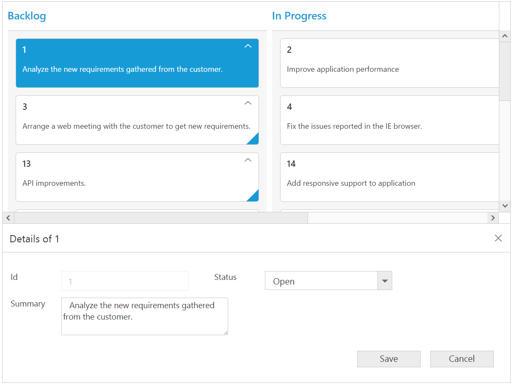
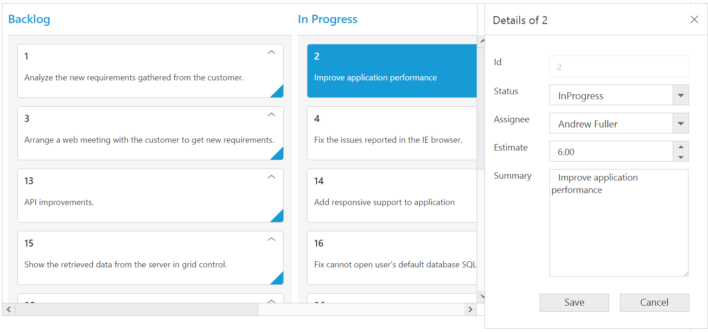
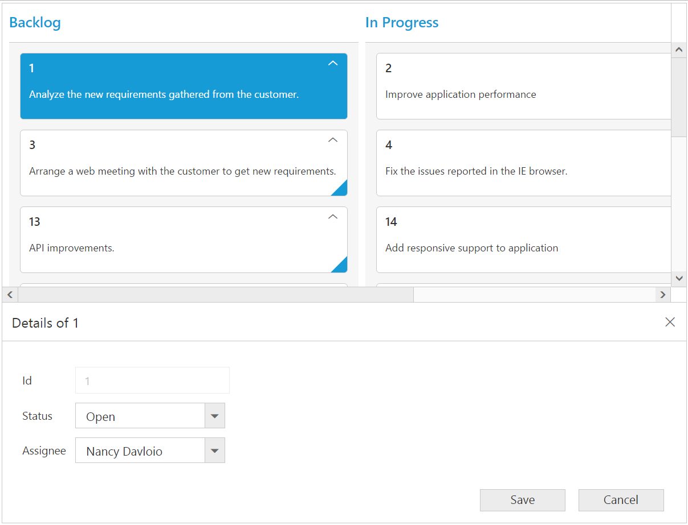
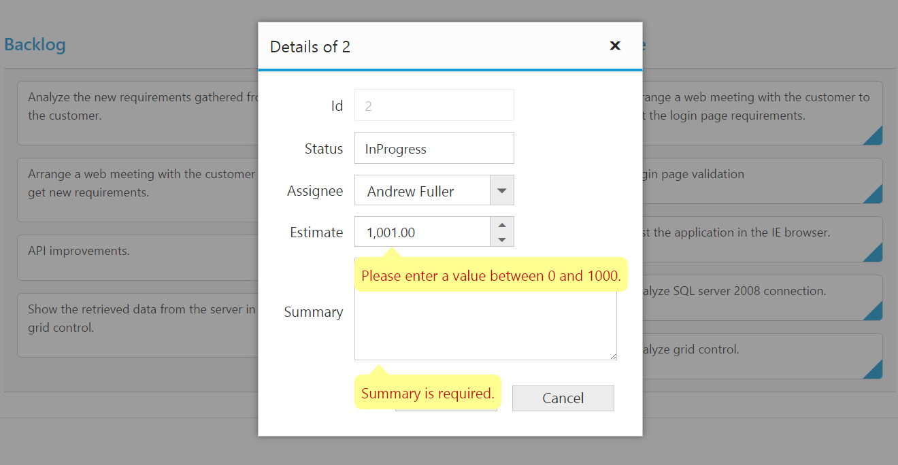
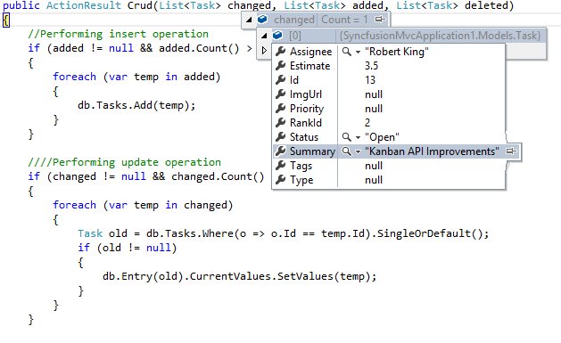

# Editing

The Kanban control has support for dynamic insertion, updating and deletion of cards. 

Set [`allowEditing`](https://help.syncfusion.com/api/js/ejkanban#members:editsettings-allowediting) and [`allowAdding`](https://help.syncfusion.com/api/js/ejkanban#members:editsettings-allowadding) property as true to enable editing/inserting respectively. The primary key for the data source should be defined in [`primaryKey`](https://help.syncfusion.com/api/js/ejkanban#members:primarykey), for editing to work properly. 

You can start the edit action by double clicking the particular card. Similarly, you can add new card to Kanban either by double clicking the particular cell or on an external button which is bound to call [`addCard`](https://help.syncfusion.com/api/js/ejkanban#methods:kanbanedit-addcard) method of Kanban. 

Deletion of the card is possible by using [`deleteCard`](https://help.syncfusion.com/api/js/ejkanban#methods:kanbanedit-deletecard) by passing primary key as attribute.

N> In Kanban, the `primary key` column will be automatically set to `read only` while editing the card which is to avoid duplicate entry in the cards.

## Configuring Edit Items

You need to configure the list of data source fields that are allowable in editing state using [`editItems`](https://help.syncfusion.com/api/js/ejkanban#members:editsettings-edititems) property. The [`field`](https://help.syncfusion.com/api/js/ejkanban#members:editsettings-edititems-field) property of [`editItems`](https://help.syncfusion.com/api/js/ejkanban#members:editsettings-edititems) needs to be mapped with data source fields.

You can map the data source field as title to edit form using [`title`](https://help.syncfusion.com/api/js/ejkanban#members:fields-title) property of `fields`. By default, it’s mapped with `primaryKey`.

The following code example describes the above behavior.



    





    $(function () {
        var data = ej.DataManager(window.kanbanData).executeLocal(ej.Query().take(30));
        
        $("#Kanban").ejKanban(
        {
            dataSource: data,
            columns: [
                { headerText: "Backlog", key: "Open" },
                { headerText: "In Progress", key: "InProgress" },
                { headerText: "Done", key: "Close" }
            ],
            keyField: "Status",
            fields: {
                content: "Summary",
                primaryKey: "Id"
            },
            editSettings: {
                editItems: [
                    { field: "Id" },
                    { field: "Status", editType: ej.Kanban.EditingType.Dropdown },
                    { field: "Assignee", editType: ej.Kanban.EditingType.Dropdown },
                    { field: "Estimate", editType: ej.Kanban.EditingType.Numeric, editParams: { decimalPlaces: 2 } },
                    { field: "Summary", editType: ej.Kanban.EditingType.TextArea, editParams: {height:100,width:200}}
                ],
                allowEditing: true,
                allowAdding: true
            }
        });
    });



The following output is displayed as a result of the above code example.

N> For editing event handling, please refer this [API](https://help.syncfusion.com/api/js/ejkanban#events:endedit).

## Edit modes

### Dialog

Set [`editMode`](https://help.syncfusion.com/api/js/ejkanban#members:editsettings-editmode) as `dialog` to edit data using a dialog box, which displays the fields associated with the data card being edited. Default value is `dialog`.

N> For [`editMode`](https://help.syncfusion.com/api/js/ejkanban#members:editsettings-editmode) property you can assign either `string` value (“dialog”) or `enum` value (`ej.Kanban.EditMode.Dialog`).

The following code example describes the above behavior.



    





    $(function () {
        var data = ej.DataManager(window.kanbanData).executeLocal(ej.Query().take(30));
        
        $("#Kanban").ejKanban(
        {
            dataSource: data,
            columns: [
                { headerText: "Backlog", key: "Open" },
                { headerText: "In Progress", key: "InProgress" },
                { headerText: "Done", key: "Close" }
            ],
            keyField: "Status",
            fields: {
                content: "Summary",
                primaryKey: "Id"
            },
            editSettings: {
                editItems: [
                    { field: "Id" },
                    { field: "Status", editType: ej.Kanban.EditingType.Dropdown },
                    { field: "Assignee", editType: ej.Kanban.EditingType.Dropdown },
                    { field: "Estimate", editType: ej.Kanban.EditingType.Numeric, editParams: { decimalPlaces: 2 } },
                    { field: "Summary", editType: ej.Kanban.EditingType.TextArea }
                ],
                allowEditing: true,
                allowAdding: true
            }
        });
    });



The following output is displayed as a result of the above code example.

### Dialog Template Form

You can edit any of the fields pertaining to a single card of data and apply it to a template so that the same format is applied to all the other cards that you may edit later. 

Using this template support, you can edit the fields that are not bound to [`editItems`](https://help.syncfusion.com/api/js/ejkanban#members:editsettings-edititems).

To edit the cards using Dialog template form, set [`editMode`](https://help.syncfusion.com/api/js/ejkanban#members:editsettings-editmode) as `dialogtemplate` and specify the template id to [`dialogTemplate`](https://help.syncfusion.com/api/js/ejkanban#members:editsettings-dialogtemplate) property of [`editSettings`](https://help.syncfusion.com/api/js/ejkanban#members:editsettings).

N> 1. `value` attribute is used to bind the corresponding field value while editing.
N> 2. `name` attribute is used to get the changed field values while save the edited card.
N> 3.  For [`editMode`](https://help.syncfusion.com/api/js/ejkanban#members:editsettings-editmode) property you can assign either `string` value (“dialogtemplate”) or `enum` value (`ej.Kanban.EditMode.DialogTemplate`).

The following code example describes the above behavior.



    

    





    $(function () {
        var data = ej.DataManager(window.kanbanData).executeLocal(ej.Query().take(30));
    
        $("#Kanban").ejKanban(
            {
                dataSource: data,
                actionComplete: "complete",
                columns: [
                    { headerText: "Backlog", key: "Open" },
                    { headerText: "In Progress", key: "InProgress" },
                    { headerText: "Done", key: "Close" }
                ],
                keyField: "Status",
                fields: {
                    content: "Summary",
                    primaryKey: "Id"
                },
                editSettings: {
                    allowEditing: true,
                    allowAdding: true,
                    editMode: ej.Kanban.EditMode.DialogTemplate,
                    dialogTemplate: "#template" 
                },
            }
        );
    });



While using template, you can change the elements that are defined in the `template`, to appropriate Syncfusion JS controls based on the column type. This can be achieved by using [`actionComplete`](https://help.syncfusion.com/api/js/ejkanban#events:actioncomplete) event of Kanban. Please refer to following code snippets.



    function complete(args) {
        if ((args.requestType == "beginedit" || args.requestType == "add") && args.model.editSettings.editMode == "dialogtemplate") {
            $("#Estimate").ejNumericTextbox({ value: parseFloat($("#Estimate").val()), width: "175px", height: "34px", decimalPlaces: 2 });
            $("#Assignee").ejDropDownList({ width: '175px' });
            $("#Status").ejDropDownList({ width: '175px' });
            if (args.requestType == "beginedit" || args.requestType == "add") {
                $("#Assignee").ejDropDownList("setSelectedValue", args.data['Assignee']);
                $("#Status").ejDropDownList("setSelectedValue", args.data['Status']);
            }        
        }
    }



The following output is displayed as a result of the above code example.

### External Form

Set the [`editMode`](https://help.syncfusion.com/api/js/ejkanban#members:editsettings-editmode) as externalform to open the edit form in outside kanban content.

The following code example describes the above behavior.



    





    $(function () {
        var data = ej.DataManager(window.kanbanData).executeLocal(ej.Query().take(30));
        
        $("#Kanban").ejKanban(
        {
            dataSource: data,
            columns: [
                { headerText: "Backlog", key: "Open" },
                { headerText: "In Progress", key: "InProgress" },
                { headerText: "Done", key: "Close" }
            ],
            keyField: "Status",
            allowTitle: true,
            fields: {
                content: "Summary",
                primaryKey: "Id"
            },
            scrollSettings:{  
			      height:500,
				  width:700,
			},
            editSettings: {
                editMode: ej.Kanban.EditMode.ExternalForm,
                editItems: [
                            { field: "Id", editType: ej.Kanban.EditingType.String,validationRules: { required: true, number: true }},
                            { field: "Status", editType: ej.Kanban.EditingType.Dropdown },
                            { field: "Assignee", editType: ej.Kanban.EditingType.Dropdown },
                            { field: "Estimate", editType: ej.Kanban.EditingType.Numeric, editParams: { decimalPlaces: 2 },validationRules: {range: [0, 1000]}},
                            { field: "Summary", editType: ej.Kanban.EditingType.TextArea,validationRules: { required: true}},
                ],
                allowEditing: true,
                allowAdding: true
            }
        });
    });



The following output is displayed as a result of the above code example.

Form Position:

Form Position can be customized by setting the [`formPosition`](https://help.syncfusion.com/api/js/ejkanban#members:editsettings-formposition) property of [`editSettings'](https://help.syncfusion.com/api/js/ejkanban#members:editsettings) as "right" or "bottom".

The following code example describes the above behavior.



    





    $(function() {
          var data = ej.DataManager(window.kanbanData).executeLocal(ej.Query().take(30));
            
            $("#Kanban").ejKanban(
                {
                    dataSource: data,   
                    columns: [
                        { headerText: "Backlog", key: "Open"},
                        { headerText: "In Progress", key: "InProgress"},
                        { headerText: "Done", key: "Close"}
                   ],
                   keyField: "Status",
                   allowTitle: true,
                   fields: {
					     content: "Summary",
					     primaryKey: "Id"
                    },
                    allowScrolling:true,
                    scrollSettings:{  
					       height:250,
				           width:700,
                     },
                    editSettings: {
					   editMode:ej.Kanban.EditMode.ExternalForm,
					   formPosition: ej.Kanban.FormPosition.Bottom,
                       editItems: [
                            { field: "Id", editType: ej.Kanban.EditingType.String,validationRules: { required: true, number: true }},
                            { field: "Status", editType: ej.Kanban.EditingType.Dropdown },
                            { field: "Assignee", editType: ej.Kanban.EditingType.Dropdown },
                            { field: "Estimate", editType: ej.Kanban.EditingType.Numeric, editParams: { decimalPlaces: 2 },validationRules: {range: [0, 1000]}},
                            { field: "Summary", editType: ej.Kanban.EditingType.TextArea,validationRules: { required: true}}
							],
                        allowEditing: true,
                        allowAdding: true
                    },
                });
		}); 
        


The following output is displayed as a result of the above code example.

### External Template Form

You can edit any of the fields pertaining to a single card of data and apply it to a template so that the same format is applied to all the other cards that you may edit later. 

Using this template support, you can edit the fields that are not bound to Kanban Edit Items.

To edit the cards using External template form, set [`editMode`](https://help.syncfusion.com/api/js/ejkanban#members:editsettings-editmode) as `externalformtemplate` and specify the template id to [`externalFormTemplate`](https://help.syncfusion.com/api/js/ejkanban#members:editsettings-externalformtemplate) property of [`editSettings`](https://help.syncfusion.com/api/js/ejkanban#members:editsettings).

While using template, you can change the elements that are defined in the template, to appropriate Syncfusion JS controls based on the column type. This can be achieved by using [`actionComplete`](https://help.syncfusion.com/api/js/ejkanban#events:actioncomplete) event of Kanban.

N> 1. `value` attribute is used to bind the corresponding field value while editing. 
N> 2. `name` attribute is used to get the changed field values while save the edited card. 
N> 3. For [`editMode`](https://help.syncfusion.com/api/js/ejkanban#members:editsettings-editmode) property you can assign either `string` value ("externalformtemplate") or `enum` value (`ej.Kanban.EditMode.ExternalFormTemplate`).

The following code example describes the above behavior.



    

    
    
 




      $(function() {
      
       var data = ej.DataManager(window.kanbanData).executeLocal(ej.Query().take(30));
            
            $("#Kanban").ejKanban(
                {
                    dataSource: data,   
                    actionComplete: "complete",
                    columns: [
                        { headerText: "Backlog", key: "Open"},
                        { headerText: "In Progress", key: "InProgress"},
                        { headerText: "Done", key: "Close"}
                    ],
                    keyField: "Status",
                    allowTitle: true,
                    fields: {
					     content: "Summary",
					     primaryKey: "Id"
					},
                    allowScrolling:true,
                    scrollSettings:{  
					       height:450,
				           width:700,
					},
                    editSettings: {
                        editMode:ej.Kanban.EditMode.ExternalFormTemplate,
                        externalFormTemplate: "#template",
                        allowEditing: true,
                        allowAdding: true
                    },
                }
            );
		});
       function complete(args) {
            if ((args.requestType == "beginedit" || args.requestType == "add") && args.model.editSettings.editMode == "externalformtemplate") {
                $("#Assignee").ejDropDownList({ width: '175px' });
                $("#Status").ejDropDownList({ width: '175px' });
                if(args.requestType == "beginedit" || args.requestType == "add" ){
				     $("#Assignee").ejDropDownList("setSelectedValue", args.data['Assignee']);
				     $("#Status").ejDropDownList("setSelectedValue", args.data['Status']);
				}                
            }
        }


The following output is displayed as a result of the above code example.

## Cell edit type and its params

The edit type of bound column can be customized using [`editType`](https://help.syncfusion.com/api/js/ejkanban#members:editsettings-edititems-edittype) property of [`editItems`](https://help.syncfusion.com/api/js/ejkanban#members:editsettings-edititems). The following Essential JavaScript controls are supported built-in by `editType`. And also you can define the model for all the edit types controls while editing through `editParams` property of `editItems`.

The following table describes [`editType`](https://help.syncfusion.com/api/js/ejkanban#members:editsettings-edititems-edittype) and their corresponding [`editParams`](https://help.syncfusion.com/api/js/ejkanban#members:editsettings-edititems-editparams) of the specific data type of the column.

<table>
<tr>
<th>
EditType</th><th>
EditParams</th>
<th>
Description</th>
<th>
Example</th>
</tr>
<tr>
<td>
Numeric</td><td>
{{ '[ejTextBoxes](https://help.syncfusion.com/api/js/ejtextboxes)' | markdownify }} </td>
<td>
control for integers, double, and decimal data’s</td>
<td>
editParams: { decimalPlaces: 2}</td>
</tr>
<tr>
<td>
String</td><td>
HTML Textbox</td>
<td>
HTML Textbox</td>
<td>
-</td>
</tr>
<tr>
<td>
DatePicker </td><td>
{{ '[ejDatePicker](https://help.syncfusion.com/api/js/ejdatepicker)' | markdownify }} </td>
<td>
control for date data</td>
<td>
editParams: { buttonText : "Now" }</td>
</tr>
<tr>
<td>
DateTimePicker </td><td>
{{ '[ejDateTimePicker](https://help.syncfusion.com/api/js/ejdatetimepicker)' | markdownify }} </td>
<td>
control for date data-time data</td>
<td>
editParams: { enabled: true }</td>
</tr>
<tr>
<td>
DropDown </td><td>
{{ '[ejDropDownList](https://help.syncfusion.com/api/js/ejdropdownlist)' | markdownify }} </td>
<td>
control for list of data</td>
<td>
editParams: { allowGrouping: true }</td>
</tr>
<tr>
<td>
RTE </td><td>
{{ '[ejRTE](https://help.syncfusion.com/api/js/ejrte)' | markdownify }} </td>
<td>
control for customizing text in RTE format</td>
<td>
editParams: { allowResize: true }</td>
</tr>
<tr>
<td>
TextArea </td><td>
HTML TextArea</td>
<td>
Control for multi-line plain-text editing</td>
<td>
editParams:{height:100,width:200}</td>
</tr>
</table>

N> 1. If [`editType`](https://help.syncfusion.com/api/js/ejkanban#members:editsettings-edititems-edittype) is not set, then by default it will display HTML textbox while editing a card.
N> 2. For [`editType`](https://help.syncfusion.com/api/js/ejkanban#members:editsettings-edititems-edittype) property you can assign either string value (“numericedit”) or `enum` value (`ej.Kanban.EditingType.Numeric`).

The following code example describes the above behavior.



    





    $(function () {
        var data = ej.DataManager(window.kanbanData).executeLocal(ej.Query().take(30));
        
        $("#Kanban").ejKanban(
        {
            dataSource: data,
            columns: [
                { headerText: "Backlog", key: "Open" },
                { headerText: "In Progress", key: "InProgress" },
                { headerText: "Done", key: "Close" }
            ],
            keyField: "Status",
            fields: {
                content: "Summary",
                primaryKey: "Id"
            },
            editSettings: {
                editItems: [
                    { field: "Id" },
                    { field: "Status", editType: ej.Kanban.EditingType.Dropdown },
                    { field: "Estimate", editType: ej.Kanban.EditingType.Numeric, editParams: { decimalPlaces: 2 } },
                    { field: "Summary", editType: ej.Kanban.EditingType.RTE, editParams: { height:150,minHeight: 100 } }
                ],
                allowEditing: true,
                allowAdding: true
            }
        });
    });



The following output is displayed as a result of the above code example.

## Column Validation

We can validate the value of the added or edited card cell before saving.

The below validation script files are needed when editing is enabled with validation.

1.	jquery.validate.min.js
2.	jquery.validate.unobtrusive.min.js

N> If you enabled the unobtrusive option, then need to refer the jquery.validate.unobtrusive.min.js
file in your application along with the other script.

### jQuery Validation

You can set validation rules using [`validationRules`](https://help.syncfusion.com/api/js/ejkanban#members:editsettings-edititems-validationrules) property of [`columns`](https://help.syncfusion.com/api/js/ejkanban#members:columns). The following are jQuery validation methods.

#### List of jQuery validation methods

<table>
<tr>
<th>
Rules</th><th>
Description</th>
</tr>
<tr>
<td>
required</td><td>
Requires an element.</td></tr>
<tr>
<td>
remote</td><td>
Requests a resource to check the element for validity.</td></tr>
<tr>
<td>
minlength</td><td>
Requires the element to be of given minimum length.</td></tr>
<tr>
<td>
maxlength</td><td>
Requires the element to be of given maximum length.</td></tr>
<tr>
<td>
rangelength</td><td>
Requires the element to be in given value range.</td></tr>
<tr>
<td>
min</td><td>
The element requires a given minimum.</td></tr>
<tr>
<td>
max</td><td>
The element requires a given maximum.</td></tr>
<tr>
<td>
range</td><td>
Requires the element to be in a given value range.</td></tr>
<tr>
<td>
email</td><td>
The element requires a valid email.</td></tr>
<tr>
<td>
url</td><td>
The element requires a valid url.</td></tr>
<tr>
<td>
date</td><td>
Requires the element to be a date.</td></tr>
<tr>
<td>
dateISO</td><td>
The element requires an ISO date.</td></tr>
<tr>
<td>
number</td><td>
The element requires a decimal number.</td></tr>
<tr>
<td>
digits</td><td>
The element requires digits only.</td></tr>
<tr>
<td>
creditcard</td><td>
Requires the element to be a credit card number.</td></tr>
<tr>
<td>
equalTo</td><td>
Requires the element to be the same as another.</td></tr>
</table>

Kanban supports all the standard validation methods of jQuery, please refer the jQuery validation documentation [`link`](https://jqueryvalidation.org/) for more information.

The following code example describes the above behavior.



    





    $(function () {
        var data = ej.DataManager(window.kanbanData).executeLocal(ej.Query().take(30));
    
        $("#Kanban").ejKanban(
        {
            dataSource: data,
            columns: [
                { headerText: "Backlog", key: "Open" },
                { headerText: "In Progress", key: "InProgress" },
                { headerText: "Done", key: "Close" }
            ],
            keyField: "Status",
            fields: {
                primaryKey: "Id",
                content: "Summary"
            },
            editSettings: {
                editItems: [
                { field: "Id" },
                { field: "Status", editType: ej.Kanban.EditingType.String },
                { field: "Assignee", editType: ej.Kanban.EditingType.Dropdown },
                { field: "Estimate", editType: ej.Kanban.EditingType.Numeric, editParams: { decimalPlaces: 2 }, validationRules: { range: [0, 1000] } },
                { field: "Summary", editType: ej.Kanban.EditingType.TextArea, validationRules: { required: true } }
                ],
                allowEditing: true,
                allowAdding: true
            }
        });
    }); 



The following output is displayed as a result of the above code example.

## Persisting data in server

Edited data can be persisted in database using RESTful web services.

All the CRUD operations in Kanban are done through DataManager. DataManager have an option to bind all the CRUD related data in server side. Please refer the [`link`](https://help.syncfusion.com/js/datamanager/overview) to know about the DataManager.

### URL Adaptor

You can use the `UrlAdaptor` of [`ejDataManger`](https://help.syncfusion.com/api/js/ejdatamanager) when binding `dataSource` from remote data. At initial load of Kanban, using `url` property of DataManager, data are fetched from remote data and bound to Kanban. You can map CRUD operation in Kanban to Server-Side Controller action using the property `crudUrl`.

The following code example describes the above behavior.



    

    
    
    





   



Also when you use `UrlAdaptor`, you need to return the data as JSON and the JSON object must contain a properties result & count. The `result` holds the `dataSource` as its value and `count` holds the total cards count as its value.

The following code example describes the above behavior.


     
    public ActionResult GetData(Syncfusion.JavaScript.DataManager value)
        {
           var DataSource = db.Tasks.ToList();
           DataResult result1 = new DataResult();
           DataOperations operation = new DataOperations();
           result1.result = DataSource;
           result1.count = DataSource.AsQueryable().Count();
           if (value.Skip > 0)
               result1.result = operation.PerformSkip(result1.result, value.Skip);
           if (value.Take > 0)
               result1.result = operation.PerformTake(result1.result, value.Take);
           return Json(result1, JsonRequestBehavior.AllowGet);
       }
     public class DataResult
      {
        public IEnumerable result { get; set; }
        public int count { get; set; }
    }
         


Please refer to the below screenshot.

Using `DataOperations` helper class you can perform Kanban action at server side. The in-built methods that we have provided in the DataOperations class are listed below.

1.	PerformTake
2.	PerformSelect
3.	Execute

### Accessing CRUD action request details in server side

The Server-Side function must be declared with the following parameter name for each editing functionality.

#### Parameters Table

<table>
<tr>
<th>Action</th>
<th>Parameter Name</th>
<th>Example</th>
</tr>
<tr>
<td>
Update, Insert, Remove, Crud Update(Multiple cards data will be passed to the server when drag and drop enabled with priority.)
</td>
<td>
Changed values,
Added values,
Deleted value
</td>
<td>
public ActionResult Crud(List<Task> `changed`, List<Task> `added`, List<Task> `deleted`)
</td>
</tr>
</table>

### Insert Card

Using `crudUrl` property, you can specify the controller action mapping URL to perform `insert` operation at server side.

The following code example describes the above behavior.



    public ActionResult Crud(List<Task> changed, List<Task> `added`, List<Task> deleted)
        {
            // Insert card in the database.
            if (added != null && added.Count() > 0)
            {
                foreach (var temp in added)
                {
                    db.Tasks.Add(temp);
                }
            }
            db.SaveChanges();
            var data = db.Tasks.ToList();
            return Json(data, JsonRequestBehavior.AllowGet);
        }



The newly added card details are bound to the `added` parameter. Please refer the below image.

### Update Card

Using `crudUrl` property, you can specify the controller action mapping URL to perform `save/update` operation at server side. 

The following code example describes the above behavior.



        public ActionResult Crud(List<Task> `changed`, List<Task> added, List<Task> deleted)
        {
            //Update card in the database.
            if (changed != null && changed.Count() > 0)
            {
                foreach (var temp in changed)
                {
                    Task old = db.Tasks.Where(o => o.Id == temp.Id).SingleOrDefault();
                    if (old != null)
                    {
                        db.Entry(old).CurrentValues.SetValues(temp);
                    }
                }
            }
            
            db.SaveChanges();
            var data = db.Tasks.ToList();
            return Json(data, JsonRequestBehavior.AllowGet);
        }



The updated card details are bound to the `changed` parameter. Please refer the below image.

### Delete Card

Using `crudUrl` property, you can specify the controller action mapping URL to perform `delete` operation at server side.

The following code example describes the above behavior.



    public ActionResult Crud(List<Task> changed, List<Task> added, List<Task> deleted)
        {
            //Delete card in the database.
            if (deleted != null && deleted.Count() > 0)
            {
                foreach (var temp in deleted)
                {
                    db.Tasks.Remove(db.Tasks.Where(o => o.Id == temp.Id).SingleOrDefault());
                }
            }

            db.SaveChanges();
            var data = db.Tasks.ToList();
            return Json(data, JsonRequestBehavior.AllowGet);
        }



The deleted card details are bound to the `deleted` parameter. Please refer the below image.

