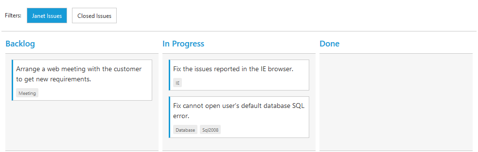

# Filtering

Filtering allows to filter the collection of cards from `dataSource` which meets the predefined `query` in the quick filters collection. To enable filtering, define [`filterSettings`](https://help.syncfusion.com/api/js/ejkanban#members:filtersettings) collection with display `text` and [`ej.Query`](https://help.syncfusion.com/js/datamanager/query). 

You can also define display tip to describe filter definition to user using property `description`. If the [`description`](https://help.syncfusion.com/api/js/ejkanban#members:filtersettings-description) property is not defined, given [`text`](https://help.syncfusion.com/api/js/ejkanban#members:filtersettings-text) will act as display tip.

We can also customize filter option through external button or [`customToolbarItems`](https://help.syncfusion.com/api/js/ejkanban#members:customtoolbaritems) by using [`filterCards()`](https://help.syncfusion.com/api/js/ejkanban#methods:kanbanfilter-filtercards) method.

The following code example describes the above behavior.



    





    $(function () {
        var data = ej.DataManager(window.kanbanData).executeLocal(ej.Query().take(20));

        $("#Kanban").ejKanban(
        {
            dataSource: data,
            columns: [
                { headerText: "Backlog", key: "Open" },
                { headerText: "In Progress", key: "InProgress" },
                { headerText: "Done", key: "Close" }
            ],
            keyField: "Status",
            fields: {
                primaryKey: "Id",
                content: "Summary",
                tag: "Tags"
            },
            filterSettings: [
                { text: "Janet Issues", query: new ej.Query().where("Assignee", "equal", "Janet"), description: "Displays issues which matches the assignee as 'Janet'" },
                { text: "Closed Issues", query: new ej.Query().where("Status", "equal", "Close"), description: "Display the 'Closed' issues" }
            ]
        });
    });



The following output is displayed as a result of the above code example.

