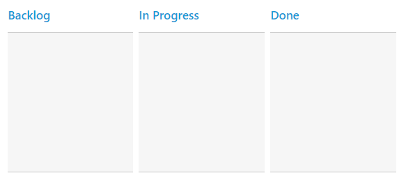
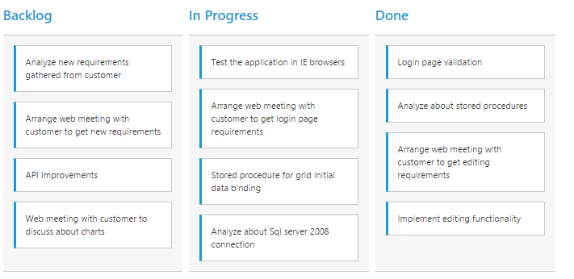
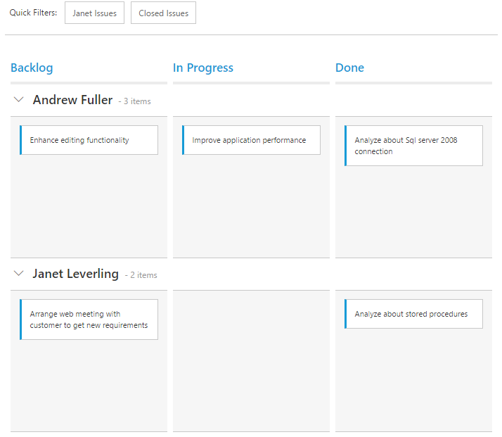

# Getting Started

## Preparing HTML document

The Kanban control has the following list of external JavaScript dependencies.

* [`jQuery 1.7.1`](http://jquery.com) and later versions
* [`jsRender`](https://github.com/borismoore/jsrender) - to render the templates

Refer to the internal dependencies in the following table.

<table>
   <tr>
      <th>
         <b>Files</b>
      </th>
      <th>
         <b>Description/Usage </b>
      </th>
   </tr>
   <tr>
      <td>
         ej.core.min.js
      </td>
      <td>
        It is referred always before using all the JS controls.
      </td>
   </tr>
   <tr>
      <td>
         ej.data.min.js
      </td>
      <td>
         Used to handle data operation and is used while binding data to the JS controls.
      </td>
   </tr>
   <tr>
      <td>
        ej.touch.min.js 
      </td>
      <td>
          It is referred when using touch functionalities in Kanban.
      </td>
   </tr>
    <tr>
      <td>
        ej.draggable.min.js 
      </td>
      <td>
          It is referred when using drag and drop in Kanban.
      </td>
   </tr>
   <tr>
      <td>
        ej.kanban.min.js
      </td>
      <td>
        The Kanban’s main file.
      </td>
   </tr>
   <tr>
      <td>
        ej.globalize.min.js
      </td>
      <td>
       It is referred when using localization in Kanban.
      </td>
   </tr>
   <tr>
      <td>
         ej.scroller.min.js
      </td>
      <td>
         It is referred when scrolling is used in the Kanban. 
      </td>
   </tr>
   <tr>
      <td>
         ej.waitingpopup.min.js
      </td>
      <td>
        It is referred when waiting popup used.
      </td>
   </tr>
   <tr>
      <td>
        ej.dropdownlist.min.js
      </td>
      <td rowspan = "5">
         These files are used while enable the Editing feature in the Kanban.
      </td>
   </tr>
   <tr>
      <td>
         ej.dialog.min.js
      </td>
   </tr>
   <tr>
      <td>
        ej.button.min.js
      </td>
   </tr>
   <tr>
      <td>
         ej.datepicker.min.js
      </td>
   </tr>
   <tr>
      <td>
         ej.datetimepicker.min.js
      </td>
   </tr>
   <tr>
      <td>
         ej.editor.min.js
      </td>
   </tr>
   <tr>
      <td>
        ej.toolbar.min.js
      </td>
      <td>
        These files are used while enable the Filtering feature in the Kanban.
      </td>
   </tr>
    <tr>
      <td>
        ej.menu.min.js
      </td>
      <td rowspan = "2">
         These files are used while enable the context menu feature in the Kanban.
      </td>
   </tr>
   <tr>
      <td>
         ej.checkbox.min.js
      </td>
   </tr>
   <tr>
      <td>
        ej.rte.min.js
      </td>
      <td>
        These files are used while using the cell edit type as RTE in the Kanban.
      </td>
   </tr>
</table>

To get started, you can use the `ej.web.all.min.js` file that encapsulates all the `ej` controls and frameworks in one single file. So the complete boilerplate code is



    <!DOCTYPE html>
    <html>
    <head>
    <meta name="viewport" content="width=device-width, initial-scale=1.0">
    <meta name="description" content="Essential Studio for JavaScript">
    <meta name="author" content="Syncfusion">
    <title></title>
    <!-- Essential Studio for JavaScript  theme reference -->
    <link href="http://cdn.syncfusion.com/{{ site.releaseversion }}/js/web/flat-azure/ej.web.all.min.css" rel="stylesheet" />
    <!-- Essential Studio for JavaScript  script references -->
    
    
    
    <!-- Add your custom scripts here -->
    </head>
    <body>
    </body>
    </html>



N> 1. In production, we highly recommend you to use our [`custom script generator`](https://help.syncfusion.com/js/custom-script-generator) to create custom script file with required controls and its dependencies only. Also to reduce the file size further please use [`GZip compression`](https://developers.google.com/web/fundamentals/performance/optimizing-content-efficiency/optimize-encoding-and-transfer?hl=en) in your server.
N> 2. For themes, you can use the `ej.web.all.min.css` CDN link from the code snippet given. To add the themes in your application, please refer to [`this link`](https://help.syncfusion.com/js/theming-in-essential-javascript-components).

## Create a Kanban

The Kanban can be created from a HTML `DIV` element with the HTML `id` attribute set to it. To create the Kanban, you should call the `ejKanban` jQuery plug-in function with the options as parameter. Refer to the following code example.



    

        



## Data Binding

`Data binding` in the Kanban is achieved by using the [`ej.DataManager`](https://help.syncfusion.com/js/datamanager/overview) that supports both RESTful JSON data services binding and local JSON array binding. To set the data source to Kanban, the `dataSource` property is assigned with the instance of the `ej.DataManger`. 



    

    



N>  ODataAdaptor is the default adaptor used within DataManager. While binding to other web services, proper [`data adaptor`](https://help.syncfusion.com/js/datamanager/data-adaptors) needs to be set for `adaptor` option of DataManager.

## Mapping Values

In order to display cards in Kanban control, you need to map the database fields to Kanban cards and columns. The required mapping field are listed as follows

* `keyField` - Map the column name to use as `key` values to columns.
* `columns` -  Map the corresponding `key` values of [keyField](https://help.syncfusion.com/api/js/ejkanban#members:keyfield) column to each columns.
* `fields.content` - Map the column name to use as content to cards.
* `fields.primaryKey` - Map the column name to use as primary Key.



    

        

 

N>  `fields.primaryKey` field is mandatory for “Drag and Drop” ,”Selection” and “Editing” Features.

## Enable Swimlane

`Swimlane` can be enabled by mapping the [fields.swimlaneKey](https://help.syncfusion.com/api/js/ejkanban#members:fields-swimlanekey) to appropriate column name in `dataSource`. This enables the grouping of the cards based on the mapped column values.



    

        

 

## Adding Filters

Filters allows to filter the collection of cards from `dataSource` which meets the predefined `query` in the filters collection. To enable filtering, define `filterSettings` collection with display `text` and [`ej.Query`](https://help.syncfusion.com/js/datamanager/query).
 


    

        

 

