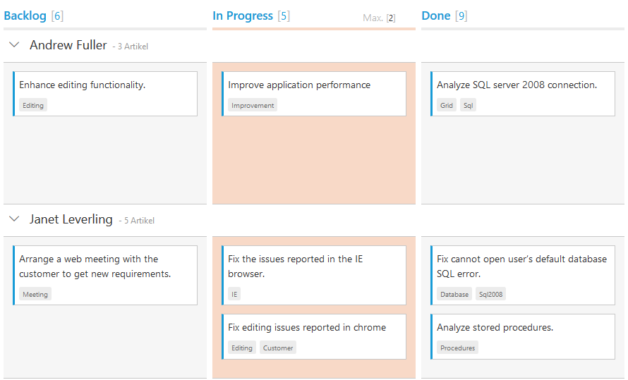
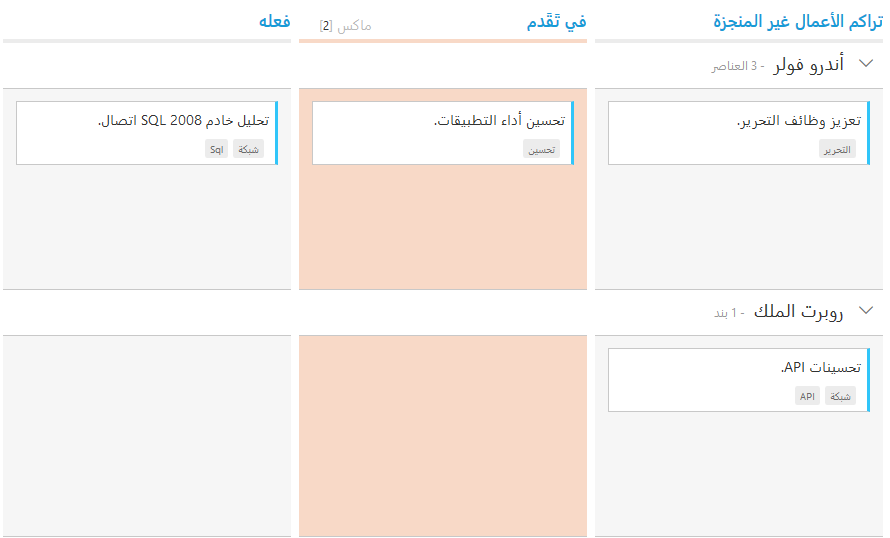

# Localization

## Localization
All text in Kanban can be localized using `ej.Kanban.Locale` object. Please find the table with list of properties and its value in locale object.

<table>
<tr>
<th>
Locale key words </th><th>
Text</th></tr>
<tr>
<td>
EmptyCard
</td><td>
No cards to display
</td></tr>
<tr>
<td>
SaveButton
</td><td>
Save
</td></tr>
<tr>
<td>
CancelButton
</td><td>
Cancel
</td></tr>
<tr>
<td>
EditFormTitle
</td><td>
Details of
</td></tr>
<tr>
<td>
AddFormTitle
</td><td>
Add New Card
</td></tr>
<tr>
<td>
SwimlaneCaptionFormat
</td><td>
"- {{:count}}{{if count == 1 }} item {{else}} items {{/if}}"
</td></tr>
<tr>
<td>
FilterSettings
</td><td>
Filters:
</td></tr>
<tr>
<td>
Min
</td><td>
Min
</td></tr>
<tr>
<td>
Max
</td><td>
Max
</td></tr>
<tr>
<td>
FilterOfText
</td><td>
Of
</td></tr>
<tr>
<td>
Cards
</td><td>
Cards
</td></tr>
<tr>
<td>
ItemsCount
</td><td>
Items Count :
</td></tr>
<tr>
<td>
Unassigned
</td><td>
Unassigned
</td></tr>
<tr>
<td>
AddCard
</td><td>
Add Card
</td></tr>
<tr>
<td>
EditCard
</td><td>
Edit Card
</td></tr>
<tr>
<td>
DeleteCard
</td><td>
Delete Card
</td></tr>
<tr>
<td>
TopofRow
</td><td>
Top of Row
</td></tr>
<tr>
<td>
BottomofRow
</td><td>
Bottom of Row
</td></tr>
<tr>
<td>
MoveUp
</td><td>
Move Up
</td></tr>
<tr>
<td>
MoveDown
</td><td>
Move Down
</td></tr>
<tr>
<td>
MoveLeft
</td><td>
Move Left
</td></tr>
<tr>
<td>
MoveRight
</td><td>
Move Right
</td></tr>
<tr>
<td>
MovetoSwimlane
</td><td>
Move to Swimlane
</td></tr>
<tr>
<td>
HideColumn
</td><td>
Hide Column
</td></tr>
<tr>
<td>
VisibleColumns
</td><td>
Visible Columns
</td></tr>
<tr>
<td>
PrintCard
</td><td>
Print Card
</td></tr>
<tr>
<td>
Search
</td><td>
Search
</td></tr>
</table>

The following code example describes the above behavior.



    





    ej.Kanban.Locale["de-DE"] = {
        EmptyCard: "Keine Karten angezeigt werden",
        SaveButton: "Speichern",
        CancelButton: "stornieren",
        EditFormTitle: "Details von ",
        AddFormTitle: "Neue Karte hinzufügen",
        SwimlaneCaptionFormat: "- {{:count}}{{if count == 1 }} Artikel {{else}} Artikel {{/if}}",
        FilterSettings: "Filter:",
        FilterOfText: "Von",
        Max: "Max.",
        Min: "Min.",
        Cards: "Karten",
        ItemsCount:"Artikel Graf :",
        Unassigned:"Nicht zugewiesen",
    };
    $(function () {
        var data = ej.DataManager(window.kanbanData).executeLocal(ej.Query().take(30));
    
        $("#Kanban").ejKanban(
        {
            dataSource: data,
            locale: "de-DE",
            enableTotalCount: true,
            columns: [
                { headerText: "Backlog", key: "Open" },
                { headerText: "In Progress", key: "InProgress", constraints: { max: 2 } },
                { headerText: "Done", key: "Close" }
            ],
            keyField: "Status",
            fields: {
                primaryKey: "Id",
                swimlaneKey: "Assignee",
                content: "Summary",
                tag:"Tags"
            }
        });
    });



The following output is displayed as a result of the above code example.

## Right to Left (RTL)

By default, Kanban render its text and layout from left to right. To customize Kanban’s direction, you can change direction from LTR to RTL by using [`enableRTL`](https://help.syncfusion.com/api/js/ejkanban#members:enablertl) as true.

The following code example describes the above behavior.



    





    ej.Kanban.Locale["ar-AE"] = {
      EmptyCard: "لا بطاقات لعرض",
      SaveButton: "حفظ",
      CancelButton: "إلغاء",
      EditFormTitle: "تفاصيل ",
      AddFormTitle: "إضافة بطاقة جديدة",
      SwimlaneCaptionFormat: "- {{:count}}{{if count == 1 }} بند {{else}} العناصر {{/if}}",
      FilterSettings: "مرشحات:",
      FilterOfText: "من",
      Max: "ماكس",
      Min: "دقيقة",
      Cards: "  بطاقات",
      ItemsCount: "عد العناصر:",
      Unassigned: "غير معين",
};
    $(function() {
        var data = ej.DataManager(window.kanbanLocaleData).executeLocal(ej.Query().take(30));
    
        $("#Kanban").ejKanban(
        {
            dataSource: data,
            enableRTL: true,
            locale: "ar-AE",
            columns: [
                { headerText: "تراكم الأعمال غير المنجزة", key: "Open" },
                { headerText: "في تَقَدم", key: "InProgress", constraints: { max: 2 } },
                { headerText: "فعله", key: "Close" }
            ],                                                       			
            keyField: "Status",
            allowTitle: true,
            fields: {
                primaryKey: "Id",
                content: "Summary",
                imageUrl: "ImgUrl",
                swimlaneKey: "Assignee"
            }
        });
    });



The following output is displayed as a result of the above code example.

