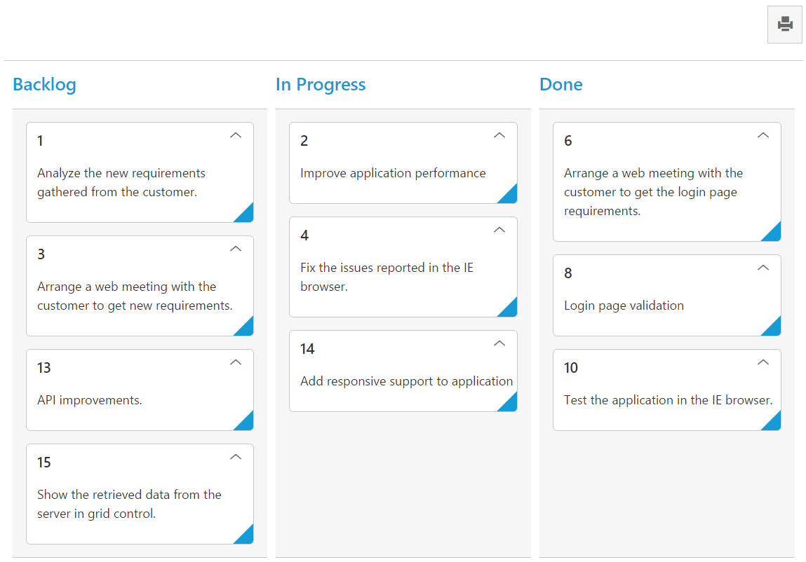

# Print

 Set [‘allowPrinting’](https://help.syncfusion.com/api/js/ejkanban#members:allowprinting) as true, to enable Print icon in the Kanban toolbar.  You can use [‘print()’](https://help.syncfusion.com/api/js/ejkanban#methods:print) method from Kanban instance to print the Kanban.

The following code example describes the above behavior.



    





    $(function () {
        var data = ej.DataManager(window.kanbanData).executeLocal(ej.Query().take(15));

        $("#Kanban").ejKanban(
        {
            dataSource: data,
            columns: [
                { headerText: "Backlog", key: "Open" },
                { headerText: "In Progress", key: "InProgress" },
                { headerText: "Done", key: "Close" }
            ],
            keyField: "Status",
            allowTitle: true,
            fields: {
                primaryKey: "Id",
                content: "Summary",
            },
            allowPrinting: true,
        });
    });



The following output is displayed as a result of the above code example.

