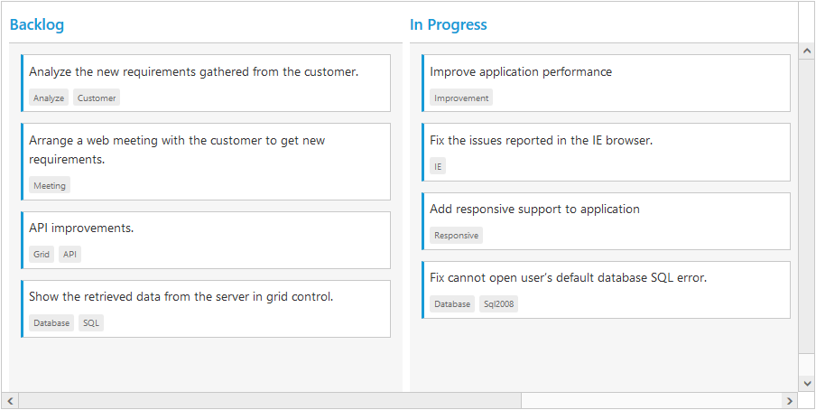
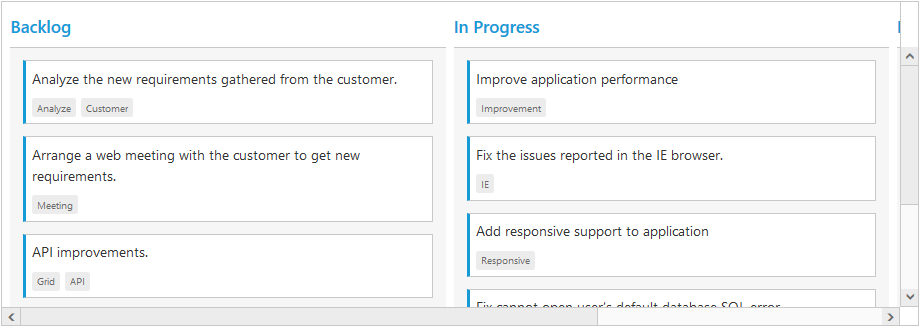
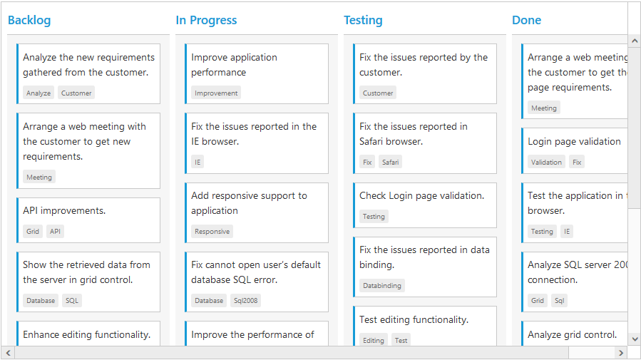
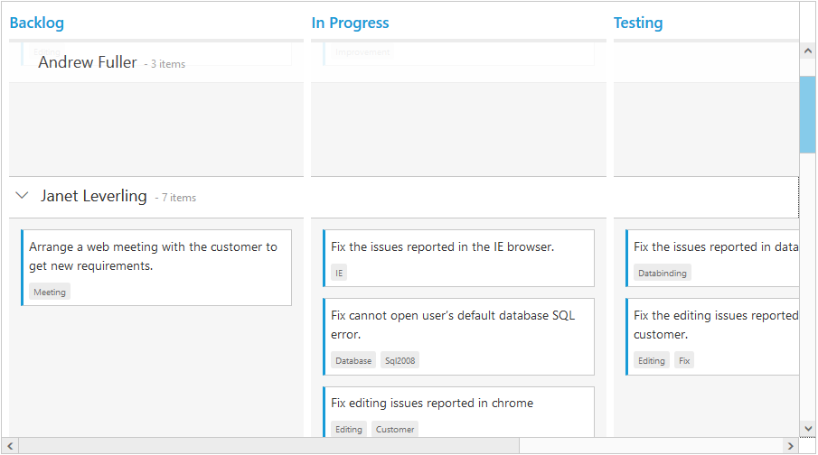

# Scrolling

Scrolling can be enabled by setting [`allowScrolling`](https://help.syncfusion.com/api/js/ejkanban#members:allowscrolling) as true. The height and width can be set to Kanban by using the properties [`scrollSettings.height`](https://help.syncfusion.com/api/js/ejkanban#members:scrollsettings-height) and [`scrollSettings.width`](https://help.syncfusion.com/api/js/ejkanban#members:scrollsettings-width) respectively.

N> The height and width can be set in percentage and pixel. The default value for [`height`](https://help.syncfusion.com/api/js/ejkanban#members:scrollsettings-height) and [`width`](https://help.syncfusion.com/api/js/ejkanban#members:scrollsettings-width) in [`scrollSettings`](https://help.syncfusion.com/api/js/ejkanban#members:scrollsettings) is 0 and auto respectively.

## Set width and height in pixel

To specify the [`scrollSettings.width`](https://help.syncfusion.com/api/js/ejkanban#members:scrollsettings-width) and [`scrollSettings.height`](https://help.syncfusion.com/api/js/ejkanban#members:scrollsettings-height) in pixel, by set the pixel value as integer.

The following code example describes the above behavior.



    





    $(function () {
        var data = ej.DataManager(window.kanbanData).executeLocal(ej.Query().take(20));
    
        $("#Kanban").ejKanban(
        {
            dataSource: data,
            allowScrolling: true,
            scrollSettings: {
                width: 900,
                height: 450
            },
            columns: [
                { headerText: "Backlog", key: "Open" },
                { headerText: "In Progress", key: "InProgress" },
                { headerText: "Done", key: "Close" }
            ],
            keyField: "Status",
            fields: {
                primaryKey: "Id",
                content: "Summary",
                tag: "Tags"
            }
        });
    });



The following output is displayed as a result of the above code example.

## Set height and width in percentage

To specify the [`scrollSettings.width`](https://help.syncfusion.com/api/js/ejkanban#members:scrollsettings-width) and [`scrollSettings.height`](https://help.syncfusion.com/api/js/ejkanban#members:scrollsettings-height) in percentage, by set the percentage value as string.

The following code example describes the above behavior.



    





    $(function () {
        var data = ej.DataManager(window.kanbanData).executeLocal(ej.Query().take(20));
    
        $("#Kanban").ejKanban(
        {
            dataSource: data,
            allowScrolling: true,
            scrollSettings: {
                width: "70%", height: "70%"
            },
            columns: [
                { headerText: "Backlog", key: "Open" },
                { headerText: "In Progress", key: "InProgress" },
                { headerText: "Done", key: "Close" }
            ],
            keyField: "Status",
            fields: {
                primaryKey: "Id",
                content: "Summary",
                tag: "Tags"
            }
        });
    });



The following output is displayed as a result of the above code example.

## Set width as auto

Specify [`width`](https://help.syncfusion.com/api/js/ejkanban#members:scrollsettings-width) property of [`scrollSettings`](https://help.syncfusion.com/api/js/ejkanban#members:scrollsettings) as auto, then the scrollbar is rendered only when the Kanban width exceeds the browser window width.

The following code example describes the above behavior.



    





    $(function() {
        var data = ej.DataManager(window.kanbanData).executeLocal(ej.Query().take(30));
    
        $("#Kanban").ejKanban(
            {
                dataSource: data,
                allowScrolling: true,
                scrollSettings: { width: "auto", height: 500 },
                columns: [
                    { headerText: "Backlog", key: "Open" },
                    { headerText: "In Progress", key: "InProgress" },
                    { headerText: "Testing", key: "Testing" },
                    { headerText: "Done", key: "Close" }
                ],                                                           			
                keyField: "Status",					
            fields: {
                content: "Summary",
                primaryKey: "Id",
                tag: "Tags"
                }
            });
    });



The following output is displayed as a result of the above code example.

## Enabling freeze swim lane

Set [`allowFreezeSwimlane`](https://help.syncfusion.com/api/js/ejkanban#members:scrollsettings-allowfreezeswimlane) as true. This enables scrolling with freezing of swim lane until you scroll to the next Swim lane, which helps user to aware of current swim lane target.

The following code example describes the above behavior.



    





    $(function() {
        var data = ej.DataManager(window.kanbanData).executeLocal(ej.Query().take(30));
        
        $("#Kanban").ejKanban(
            {
                dataSource: data,
                allowScrolling: true,
                scrollSettings: { width: "auto", height: 500,allowFreezeSwimlane: true },
                columns: [
                    { headerText: "Backlog", key: "Open" },
                    { headerText: "In Progress", key: "InProgress" },
                    { headerText: "Testing", key: "Testing" },
                    { headerText: "Done", key: "Close" }
                ],                                                           			
                keyField: "Status",					
            fields: {
                content: "Summary",
                primaryKey: "Id",
                swimlaneKey: "Assignee",
                tag: "Tags"
                }

            });
    });



The following output is displayed as a result of the above code example.

N> `allowFreezeSwimlane` is applicable when swim lane grouping enabled by setting `swimlaneKey`.

