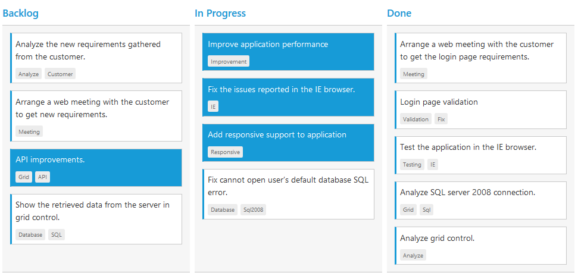

# Selection and Hovering

Selection provides an interactive support to highlight the card that you select. Selection can be done through simple Mouse down or Keyboard interaction. To enable selection, set [`allowSelection`](https://help.syncfusion.com/api/js/ejkanban#members:allowselection) as true.

You can see the mouse hovering effect on the corresponding cards using [`allowHover`](https://help.syncfusion.com/api/js/ejkanban#members:allowhover) property. By default selection and hovering is `true`.

## Types of Selection

Two types of selections available in Kanban are,

1.	Single
2.	Multiple

### Single Selection

To enable single selection by setting [`selectionType`](https://help.syncfusion.com/api/js/ejkanban#members:selectiontype) property as single.

### Multiple Selection

Multiple selections is an interactive support to select a group of cards in Kanban by mouse or keyboard interactions. To enable multiple selections by set [`selectionType`](https://help.syncfusion.com/api/js/ejkanban#members:selectiontype) property as `multiple`.

You can select multiple random cards below key press.

<table>
<tr>
<th>
Keys</th><th>
Description</th></tr>
<tr>
<td>
Ctrl + mouse left</td><td>
To select multiple random cards.</td></tr>
<tr>
<td>
Shift + mouse left </td><td>
To continuous cards select.</td></tr>
</table>

To unselect selected cards, by press “Shift + mouse left” click on selected row.

The following code example describes the above behavior.



    





    $(function() {
        var data = ej.DataManager(window.kanbanData).executeLocal(ej.Query().take(20));
    
        $("#Kanban").ejKanban(
        {
            dataSource: data,
            columns: [
                { headerText: "Backlog", key: "Open" },
                { headerText: "In Progress", key: "InProgress" },
                { headerText: "Done", key: "Close" }
            ],
            keyField: "Status",
            fields: {
            primaryKey: "Id",
            content: "Summary",
            tag: "Tags"
        },
            selectionType:ej.Kanban.SelectionType.Multiple                
        });
    });



The following output is displayed as a result of the above code example.

