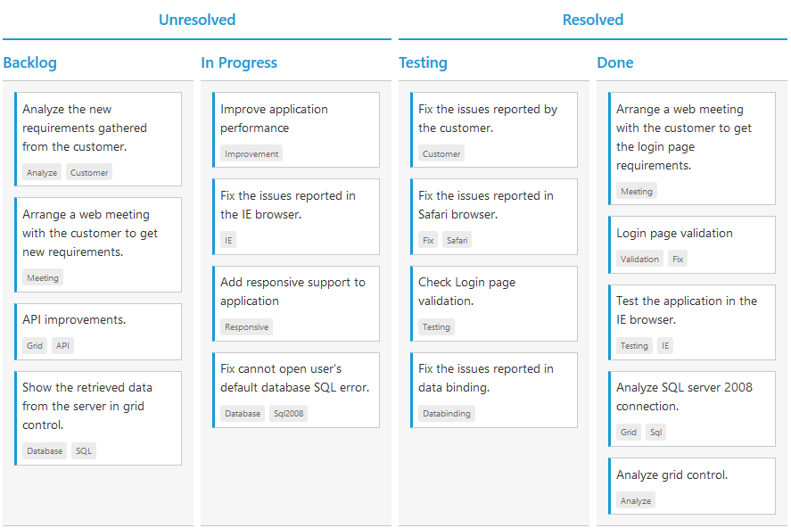

# Stacked Headers

The stacked headers helps you to group the logical columns in Kanban. It can be shown by setting `showStackedHeader` as true and by defining [`stackedHeaderRows`](https://help.syncfusion.com/api/js/ejkanban#members:stackedheaderrows).

## Adding Stacked header columns

To stack columns in stacked header, you need to define [`column`](https://help.syncfusion.com/api/js/ejkanban#members:stackedheaderrows-stackedheadercolumns-column) property in [`stackedHeaderColumns`](https://help.syncfusion.com/api/js/ejkanban#members:stackedheaderrows-stackedheadercolumns) with field names of visible columns.

The following code example describes the above behavior.



    





    



The following output is displayed as a result of the above code example.

