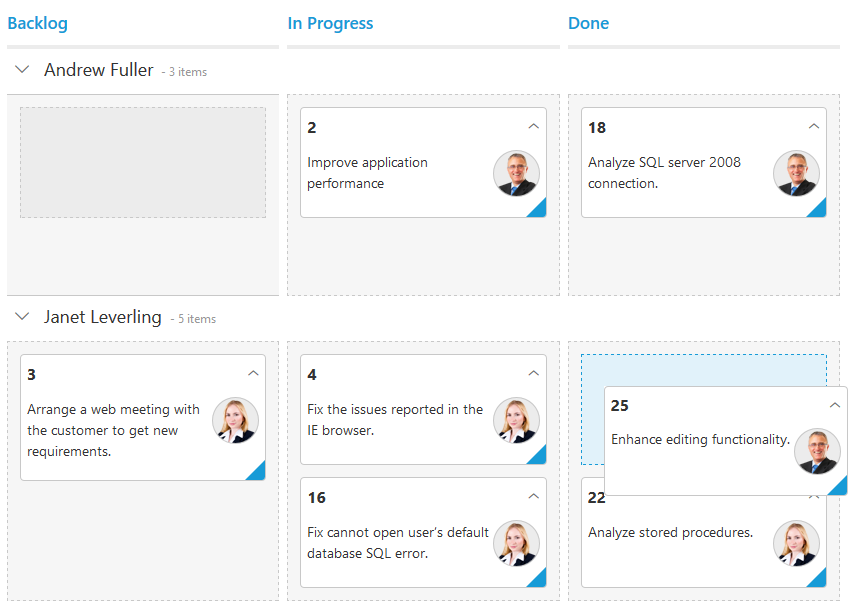

# Swim lanes

Swim lanes are a horizontal categorization of issues in the Kanban control which brings transparency to the workflow. This can be enabled by mapping the [`swimlaneKey`](https://help.syncfusion.com/api/js/ejkanban#members:swimlaneKey) to appropriate column name in the [`dataSource`](https://help.syncfusion.com/api/js/ejkanban#members:datasource).

The following code example describes the above behavior.



    





    $(function () {
        var data = ej.DataManager(window.kanbanData).executeLocal(ej.Query().take(30));
        
        $("#Kanban").ejKanban(
            {
                dataSource: data,
                columns: [
                    { headerText: "Backlog", key: "Open" },
                    { headerText: "In Progress", key: "InProgress" },
                    { headerText: "Done", key: "Close" }
                ],
                keyField: "Status",
                fields: {
                    content: "Summary",
                    primaryKey: "Id",
                    swimlaneKey: "Assignee",
                    imageUrl: "ImgUrl"
                }
            });
    });



The following output is displayed as a result of the above code example.

## Drag And Drop between swim lanes

You can set ['allowDragAndDrop'](https://help.syncfusion.com/api/js/ejkanban#members:swimlanesettings-allowdraganddrop) property of ['swimlaneSettings'](https://help.syncfusion.com/api/js/ejkanban#members:swimlanesettings) as true to enable Drag and Drop between the swim lanes.

If a card is to be dragged in the same swim lane, only a droppable target cell is added to the dotted line border. If a card is dragged from one swim lane to another, all the Kanban cells will be added to the dotted line borders, except the dragged card cell.

The following code example describes the above behavior.



    





    $(function () {
        var data = ej.DataManager(window.kanbanData).executeLocal(ej.Query().take(30));
        
        $("#Kanban").ejKanban(
            {
                dataSource: data,
                columns: [
                    { headerText: "Backlog", key: "Open" },
                    { headerText: "In Progress", key: "InProgress" },
                    { headerText: "Done", key: "Close" }
                ],
                keyField: "Status",
                fields: {
                    content: "Summary",
                    primaryKey: "Id",
                    swimlaneKey: "Assignee",
                    imageUrl: "ImgUrl"
                },
                swimlaneSettings:{
                    allowDragAndDrop: true,
                },
            });
    });



The following output is displayed as a result of the above code example.

## Unassigned swim lane group

Unassigned swim lane feature provides option to group some common swim lane key values as separate swim lane group. You can enable and disable this behavior using the property [enable](https://help.syncfusion.com/api/js/ejkanban#members:swimlanesettings-unassignedgroup-enable).
User can use default common key values or user defined key values. 

    •	Using default values
    •	Using user defined values

N> By default, given common keys are grouped under the swim lane name “Unassigned”, user can customize the name using localization.

### Using default values

By default, the swim lane keys of card which is having null, undefined, empty string ("") values will be grouped as unassigned category when [enable](https://help.syncfusion.com/api/js/ejkanban#members:swimlanesettings-unassignedgroup-enable) property is set as true. 
Default values in the [keys](https://help.syncfusion.com/api/js/ejkanban#members:swimlanesettings-unassignedgroup-keys) collection are null, undefined, empty string ("").

The following code example describes the above behavior.



    





    window.kanbanData = [{ Id: 1, Status: "Open", Summary: "Analyze the new requirements gathered from the customer.", Type: "Story", Priority: "Low", Tags: "Analyze, Customer", Estimate: 3.5, Assignee: "Andrew Fuller", ImgUrl: "../content/images/kanban/2.png", RankId: 1 }, { Id: 2, Status: "InProgress", Summary: "Improve application performance", Type: "Improvement", Priority: "Normal", Tags: "Improvement", Estimate: 6, Assignee: "Andrew Fuller", ImgUrl: "../content/images/kanban/2.png", RankId: 1 }, { Id: 3, Status: "Open", Summary: "Arrange a web meeting with the customer to get new requirements.", Type: "Others", Priority: "Critical", Tags: "Meeting", Estimate: 5.5, Assignee: undefined, RankId: 2 }, { Id: 4, Status: "InProgress", Summary: "Fix the issues reported in the IE browser.", Type: "Bug", Priority: "Release Breaker", Tags: "IE", Estimate: 2.5, Assignee: null, RankId: 2 }, { Id: 5, Status: "Close", Summary: "Fix the issues reported by the customer.", Type: "Bug", Priority: "Low", Tags: "Customer", Estimate: "3.5", Assignee: "", RankId: 1 }];
    
    $(function () {
         var data = ej.DataManager(window.kanbanData).executeLocal(ej.Query().take(5));
         $("#Kanban").ejKanban(
                {
                    dataSource: data,
                    columns: [
                        { headerText: "Backlog", key: "Open" },
                        { headerText: "In Progress", key: "InProgress" },
                        { headerText: "Done", key: "Close" }
                    ],
                    keyField: "Status",
                    allowTitle: true,
                    fields: {
                        content: "Summary",
                        primaryKey: "Id",
                        swimlaneKey: "Assignee",
                        imageUrl: "ImgUrl"
                    },
                    allowSelection: false
         });
    });



The output of the above code example.

### Using user defined values

You can override default values for unassigned swim lane group using the property [keys](https://help.syncfusion.com/api/js/ejkanban#members:swimlanesettings-unassignedgroup-keys).
The following code example describes the above behavior.



    





 window.kanbanData = [
            { Id: 1, Status: "Open", Summary: "Analyze the new requirements gathered from the customer.", Type: "Story", Priority: "Low", Tags: "Analyze,Customer", Estimate: 3.5, Assignee: "Nancy", ImgUrl: "../content /images/kanban/1.png", RankId: 1 },
            { Id: 2, Status: "InProgress", Summary: "Improve application performance", Type: "Improvement", Priority: "Normal", Tags: "Improvement", Estimate: 6, Assignee: "Andrew", ImgUrl: "../content/images/kanban/2.png", RankId: 1 }, 
            { Id: 3, Status: "Open", Summary: "Arrange a web meeting with the customer to get new requirements.", Type: "Others", Priority: "Critical", Tags: "Meeting", Estimate: 5.5, Assignee: "", RankId: 2 }, 
            { Id: 4, Status: "InProgress", Summary: "Fix the issues reported in the IE browser.", Type: "Bug", Priority: "Release Breaker", Tags: "IE", Estimate: 2.5, Assignee: null, RankId: 2 },
            { Id: 5, Status: "Close", Summary: "Fix the issues reported by the customer.", Type: "Bug", Priority: "Low", Tags: "Customer", Estimate: "3.5", Assignee: "", RankId: 1 }];
    $(function () {
    var data = ej.DataManager(window.kanbanData).executeLocal(ej.Query().take(5));
            $("#Kanban").ejKanban(
                {
                    dataSource: data,
                    columns: [
                        { headerText: "Backlog", key: "Open" },
                        { headerText: "In Progress", key: "InProgress" },
                        { headerText: "Done", key: "Close" }
                    ],
                    keyField: "Status",
                    allowTitle: true,
                    fields: {
                        content: "Summary",
                        primaryKey: "Id",
                        swimlaneKey: "Assignee",
                        imageUrl: "ImgUrl"
                    },
                    swimlaneSettings: {
                        unassignedGroup: {
                            keys: ["Andrew Fuller", "", "null"]
                        }
                    },
                    allowSelection: false
                });
    });


The output of the above code example.

