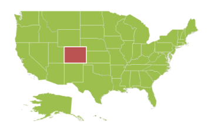
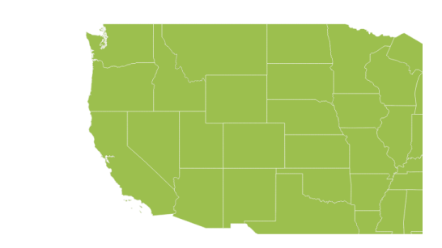
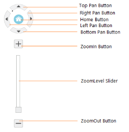

# User Interaction

Options like zooming, panning, and map selection enables the effective interaction on Map elements.

## Map Selection

Each shape in the [`Map`](../api/ejmap#members:layers-showmapitems) can be selected and deselected during interaction with the shapes. 

The [`selectionColor`](../api/ejmap#members:layers-shapesettings-selectioncolor) property is used to get or set the selected shape color. The [`selectionStroke`](../api/ejmap#members:layers-shapesettings-selectionstroke) and [`selectionStrokeWidth`](../api/ejmap#members:layers-shapesettings-selectionstrokewidth) properties are used to customize the [`selected shape`](../api/ejmap#members:layers-selectedmapshapes) border.

You can select the shape by tapping the shape. The Single selection is enabled by the [`enableSelection`](../api/ejmap#members:layers-enableselection) property of shape layer. When [`enableSelection`](../api/ejmap#members:layers-enableselection) is set to false, the shapes cannot be selected. 



        jQuery(function($) {
            $("#mapContainer").ejMap({
                layers: [
                    {
                        shapeData: usMap,
                        shapeSettings: {
                            fill: "#9CBF4E",
                            strokeThickness: "0.5",
                            stroke: "White",
                            selectionStrokeWidth: 2,
                            selectionStroke:"white",
                            selectionColor: "#BC5353"
                        },
                        enableSelection: true
                    }
                ]
            });
        }); 



## MultiSelection

This feature enables you to select multiple Map shapes on mouse taps accompanied by the "**Control**" key press. To enable this feature, set the [`selectionMode`](../api/ejmap#members:layers-selectionmode) property as "**multiple**" along with the [`enableSelection`](../api/ejmap#members:layers-enableselection) property.



        jQuery(function($) {
            $("#mapContainer").ejMap({
                layers: [
                    {
                        shapeData: usMap,
                        // ...
                        enableSelection: true,
                        selectionMode: "multiple",
                        // ..
                    }
                ]
            });
        }); 



## Dragging On Selection

This feature enables you to select the shapes by dragging over the shapes. While dragging over the shapes, a rectangle is generated and the shapes that comes within the rectangle is selected.
You can enable this feature by setting the [`draggingOnSelection`](../api/ejmap#members:draggingonselection) property in the [`layers`](../api/ejmap#members:layers) to **true**.



        jQuery(function($) {
            $("#mapContainer").ejMap({
                layers: [
                    {
                        // ...                        
                        draggingOnSelection: true
                        // ...
                    }
                ]
            });
        }); 



## Enable Mouse hover

Enables or disables the shape [`mouse hover`](../api/ejmap#members:layers-enablemousehover).



        jQuery(function($) {
            $("#mapContainer").ejMap({
                layers: [
                    {
                        // ...                        
                        enableMouseHover: true
                        // ...
                    }
                ]
            });
        }); 



## Zooming

The [`zooming`](../api/ejmap#members:zoomsettings) feature enables you to zoom in and out the Map to show in-depth information. It is controlled by the [`level`](../api/ejmap#members:zoomsettings-level) property of the Map. When the zoom level of the Map control is increased, the Map is zoomed in. When the zoom level is decreased, then the Map is zoomed out.

### Properties

The following properties are related to the zooming feature of the **Maps** control:

1. level

2. enableZoom

3. minValue

4. maxValue

### Level

The [`level`](../api/ejmap#members:zoomsettings-level) property determines the Map’s scale size when zooming. The default value of [`level`](../api/ejmap#members:zoomsettings-level) is 1. 

N> level cannot be less than 1

### EnableZoom

The [`enableZoom`](../api/ejmap#members:zoomsettings-enablezoom) property enables or disables the zooming feature. 

### MinValue

The [`minValue`](../api/ejmap#members:zoomsettings-minvalue) property is used to set the minimum zoom level of the Map. 

### MaxValue

The [`maxValue`](../api/ejmap#members:zoomsettings-maxvalue) property is used to set the maximum zoom level of the Map.



        jQuery(function($) {
            $("#mapContainer").ejMap({
                layers: [
                    {
                        shapeData: usMap
                    }
                ],
                zoomSettings:{
                    enableZoom: true,
                    minValue: 1,
                    maxValue: 20,
                    level: 1
                }
            });
        }); 	



### Factor

Specifies the zoom factor for map zoom value, you can use [`factor`](../api/ejmap#members:zoomsettings-factor) property.



        jQuery(function($) {
            $("#mapContainer").ejMap({
                layers: [
                    {
                        shapeData: usMap
                    }
                ],
                zoomSettings:{
                    enableZoom: true,
                    factor: 1
                }
            });
        }); 	



### Additional Options to Zoom the Map

Maps can be zoomed by using the following options also,

* Zoom method.
* mouse scroll.
* mouse double tap.
* shape selection
* Position

### Zoom method

You can zoom the Maps by using `zoom` method. The `zoom` method contains parameter zoom value. The Map can be zoomed or scaled based on zoom value parameter.


 
        $("#map").ejMap("zoom", 2);



### Mouse scroll

You can zoom the Map with mouse events by using mouse scroll. When the mouse is scrolled up, the Map is zoomed in and when the mouse is scrolled down, the Map is zoomed out.

### Mouse double tap

When the Map is double-tapped by using mouse, the zoom in operation is performed. 

### Shape Selection

Map shape is zoomed to the whole Map area on the shape selected. Animation can be applied for that zooming by using the [`enableAnimation`](../api/ejmap#members:enableanimation) property as true. 

You can enable this feature by setting [`enableZoomOnSelection`](../api/ejmap#members:zoomsettings-enablezoomonselection) property value as ‘_true_’. 

When [`enableZoomOnSelection`](../api/ejmap#members:zoomsettings-enablezoomonselection) property is set to true, then zooming by double click is muted.



        jQuery(function($) {
            $("#mapContainer").ejMap({
                // ...
                zoomSettings:
                {
                     enableZoomOnSelection: true
                },
                // ...          
            });
        }); 



### Positioning

Depending on the latitude and longitude, you can zoom the Map to the exact position. All locations are considered as latitude and longitude values and the exact location is considered as Map coordinates.

The `navigateTo` is a method that allows you to zoom the Map control to the given location. This method contains three attributes as follows.

<table>
<tr>
<th>
Attribute</th><th>
Type</th><th>
Description</th></tr>
<tr>
<td>
Latitude</td><td>
Double</td><td>
Latitude point of the position </td></tr>
<tr>
<td>
Longitude</td><td>
Double</td><td>
Longitude point of the position</td></tr>
<tr>
<td>
level</td><td>
Double</td><td>
Zoom level of the map</td></tr>
</table>



     



## Panning

The panning feature enables the Map navigation. The [`enablePan`](../api/ejmap#members:enablepan) property is used to enable or disable the panning support.



        jQuery(function($) {
            $("#mapContainer").ejMap({
                // ...
                enablePan: true
                // ...          
            });
        }); 	



### Mouse Wheel Zoom

You can zoom the Map with mouse by using mouse wheel. When the mouse is wheeled, the Map is zoomed in.

You can enable this feature by setting [`enableMouseWheelZoom`](../api/ejmap#members:zoomsettings-enablemousewheelzoom) property value as ‘_true_’. 



        jQuery(function($) {
            $("#mapContainer").ejMap({
                // ...
                zoomSettings:
                {
                     enableMouseWheelZoom: true
                },
                // ...          
            });
        }); 



## Navigation Control

**Navigation** control is built-in with **Maps** control. With Navigation control, **Maps** can be panned in any direction and zoomed. It is possible to show or hide the NavigationControl by [`enableNavigation`](../api/ejmap#members:navigationcontrol-enablenavigation) property.



        jQuery(function($) {
            $("#mapContainer").ejMap({
                // ...
                navigationControl:{enableNavigation:true},
                // ...          
            });
        });	



### Positions

The Navigation control can be positioned in two ways.

* Absolute Position
* Dock Position

#### Absolute Position

Based on the margin values of X and Y-axes, the navigation control can be positioned with the help of the **x** and **y** properties available in [`absolutePosition`](../api/ejmap#members:navigationcontrol-absoluteposition). For positioning the navigation control based on margins corresponding to a Map, [`dockPosition`](../api/ejmap#members:navigationcontrol-dockposition) value is set as ‘_none_’.

#### Dock Position

The navigation control can be positioned in the following locations within the container.

* topLeft
* topCenter
* topRight
* centerLeft
* center
* centerRight
* bottomLeft
* bottomRight
* bottomCenter
* bottomRight
* none

You can set this option by using [`dockPosition`](../api/ejmap#members:navigationcontrol-dockposition) property in [`navigationControl`](../api/ejmap#members:navigationcontrol).



        jQuery(function($) {
            $("#mapContainer").ejMap({
                // ...
                navigationControl:{enableNavigation:true,orientation:'vertical',absolutePosition:{x:5,y:16},dockPosition:'none'},
                // ...          
            });
        }); 	



#### Orientation

Set the [`orientation`](../api/ejmap#members:navigationcontrol-orientation) value for navigation control.

<table class="params">
	<thead>
		<tr>
			<th>Name </th>			
			<th>Description</th>
		</tr>
	</thead>
	<tbody>
		<tr>
			<td class="name">horizontal</td>			
			<td class="description">specifies the horizontal position</td>
		</tr>
		<tr>
			<td class="name">vertical</td>			
			<td class="description">specifies the vertical position</td>
		</tr>
	</tbody>
</table>


 
//To set orientation value during initialization 
   $("#container").ejMap(navigationControl:{orientation:'vertical'});
   


#### Content

Specifies the navigation control template for map, you can use [`content`](../api/ejmap#members:navigationcontrol-content) property.


 
//To set navigation control template for map during initialization 
   $("#container").ejMap(navigationControl:{content:null});



## Animation

 **Animation** is enabled or disabled using [`enable animation`](../api/ejmap#members:enableanimation) property. 



$("#Map").ejMap({
        enableAnimation: true,                                       
    });



#### Enable Layer Change Animation 

Enables or Disables the animation for layer change in map, you can use [`enableLayerChangeAnimation`](../api/ejmap#members:enablelayerchangeanimation) property and the default value is false.


 
//To set enableLayerChangeAnimation API value during initialization 
   $("#container").ejMap({enableLayerChangeAnimation:true});       



## Responsiveness during browser resize

**Map** is made responsive when resizing the browser by using [`isResponsive`](../api/ejmap#members:isresponsive) property.



$("#Map").ejMap({
        isResponsive: true,                                       
});



Responsiveness of the map is controlled by using [`enableResize`](../api/ejmap#members:enableresize) property.



$("#Map").ejMap({
        enableResize: true,                                       
});



## Localization

Name of the culture based on which map should be [`localized`](../api/ejmap#members:locale). Labels are localized with respect to the culture name.String type properties like template text are not localized automatically. Provide localized text as value to string type properties.



$("#Map").ejMap({
        locale: "en-US",                                       
});

