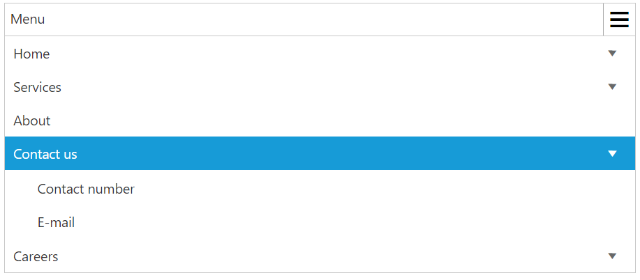
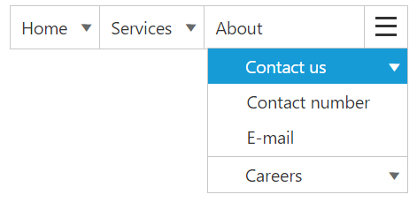
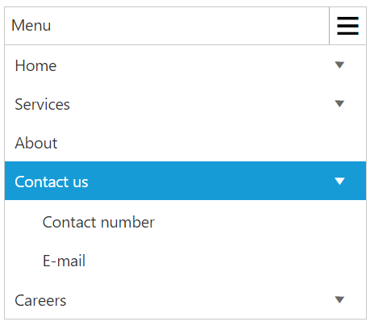

# Responsive Layout

Responsive Layout is aimed at crafting sites to provide an optimal viewing experience—easy reading and navigation with a minimum of resizing, panning, and scrolling—across a wide range of devices (from mobile phones to desktop computer monitors). In order to get responsive layout, you can add **ej.responsive.css** file in this sample. **CDN** link for the responsive CSS file is as follows.

[http://cdn.syncfusion.com/{{ site.releaseversion }}/js/web/responsive-css/ej.responsive.css](http://cdn.syncfusion.com/{{ site.releaseversion }}/js/web/responsive-css/ej.responsive.css)

N> Refer to the ej.responsive.css file after the ej.widgets.all.min.css file

Add the above **css** link in the code sample.         

Add the following code in your **HTML** page.



    <ul id="menu">
        <li id="home">
            <a href="#">Home</a>
            <ul>
                <li><a>Foundation</a></li>
                <li><a>Launch</a></li>
                <li>
                    <a>About</a>
                    <ul>
                        <li><a>Company</a></li>
                        <li><a>Location</a></li>
                    </ul>
                </li>
            </ul>
        </li>
        <li id="Services">
            <a>Services</a>
            <ul>
                <li><a>Consulting</a></li>
                <li><a>Outsourcing</a></li>
            </ul>
        </li>
        <li id="About"><a>About</a></li>
        <li id="Contact">
            <a>Contact us</a>
            <ul>
                <li><a>Contact number</a></li>
                <li><a>E-mail</a></li>
            </ul>
        </li>
        <li id="Careers">
            <a>Careers</a>
            <ul>
                <li>
                    <a>Position</a>
                    <ul>
                        <li><a>Developer</a></li>
                        <li><a>Manager</a></li>
                    </ul>
                </li>
                <li><a>Apply online</a></li>
            </ul>
        </li>
    </ul>





    // Add the following code in your script section.
    jQuery(function ($) {
        $("#menu").ejMenu();
    });



The following screenshot displays the output on executing the above code

## Responsive in Desktop:

When menu width is small and window width is normal as desktop ,only the  overflown menu  items will be moved  inside menu popup.You can also set width and height for popup menu using **overflowHeight** and **overflowWidth** API



    // Add the following code in your script section.
    jQuery(function ($) {
        $("#menu").ejMenu({width:"300px"});
    });



The following output shows the output of the above code

## Responsive in Mobile or Tablet:

Menu will be displayed  in mobile or Tablet as shown in the below image:

N> Window width below  767px is considered as Mobile or Tablet mode in our menu.

