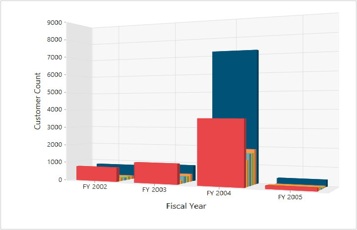

# 3D Visualization

The OlapChart control allows you to view the Cube information in a 3D view with 5 different chart types such as Bar, Column, Stacking Bar, Stocking Column and Pie.

## 3D Column Chart

3D Column Chart is rendered by specifying the chart type as **“Column”** in the **“commonSeriesOptions”** enumeration property as well as by setting the [`enable3D`](/js/api/ejchart#members:enable3d) property to **“true”.**



$("#OlapChart1").ejOlapChart(
{
    url: "../wcf/OlapChartService.svc",
    //Enable 3D Chart
    enable3D: true,
    commonSeriesOptions:
    {
        //Setting chart type to series
        type: ej.olap.OlapChart.ChartTypes.Column
    },
    rotation: 24,
    size:
    {
        height: "450px",
        width: "650px"
    }
});



## 3D Bar Chart

3D Bar Chart is rendered by specifying the chart type as **“Bar”** in the **“commonSeriesOptions”** enumeration property as well as by setting the [`enable3D`](/js/api/ejchart#members:enable3d) property to **“true”.**



$("#OlapChart1").ejOlapChart(
{
    url: "../wcf/OlapChartService.svc",
    //Enable 3D Chart
    enable3D: true,
    commonSeriesOptions:
    {
        //Setting chart type to series
        type: ej.olap.OlapChart.ChartTypes.Bar
    },
    rotation: 24,
    size:
    {
        height: "450px",
        width: "650px"
    }
});



## 3D Stacking Bar Chart
3D Stacking Bar Chart is rendered by specifying the chart type as **“Stacking Bar”** in the **“commonSeriesOptions”** enumeration property as well as by setting the [`enable3D`](/js/api/ejchart#members:enable3d) property to **“true”.**



$("#OlapChart1").ejOlapChart(
{
    url: "../wcf/OlapChartService.svc",
    //Enable 3D Chart
    enable3D: true,
    commonSeriesOptions:
    {
        //Setting chart type to series
        type: ej.olap.OlapChart.ChartTypes.StackingBar
    },
    rotation: 24,
    size:
    {
        height: "450px",
        width: "650px"
    }
});



## 3D Stacking Column Chart
3D Stacking Column Chart is rendered by specifying the chart type as **“Stacking Column”** in the **“commonSeriesOptions”** enumeration property as well as by setting the [`enable3D`](/js/api/ejchart#members:enable3d) property to **“true”.**



$("#OlapChart1").ejOlapChart(
{
    url: "../wcf/OlapChartService.svc",
    //Enable 3D Chart
    enable3D: true,
    commonSeriesOptions:
    {
        //Setting chart type to series
        type: ej.olap.OlapChart.ChartTypes.StackingColumn
    },
    rotation: 24,
    size:
    {
        height: "450px",
        width: "650px"
    }
});



## 3D Pie Chart
3D Pie Chart is rendered by specifying the chart type as **"Pie"** in the **"commonSeriesOptions"** enumeration property as well as by setting the [`enable3D`](/js/api/ejchart#members:enable3d) property to **“true”.**



$("#OlapChart1").ejOlapChart(
{
    url: "../wcf/OlapChartService.svc",
    //Enable 3D Chart
    enable3D: true,
    commonSeriesOptions: {
       //Setting chart type to series
       type: ej.olap.OlapChart.ChartTypes.Pie
    },
    rotation: 24,
    size: {
       height: "450px",
       width: "650px"
    }
});

   

##Rotating 3D Chart
We can rotate the 3D Chart towards left or right by setting an appropriate angle value to the [`rotation`](/js/api/ejchart#members:rotation) property. The direction of the Chart display depends upon the positive or negative angle value.



$("#OlapChart1").ejOlapChart(
{
    url: "../wcf/OlapChartService.svc",
    //Enable 3D Chart
    enable3D: true,
    //Rotates the 3D Chart
    rotation: 40,
    size:
    {
        height: "450px",
        width: "650px"
    }
});

 

