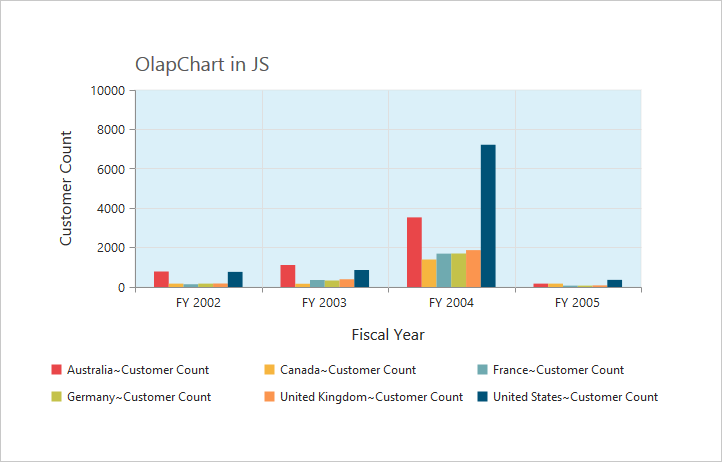

#Appearance

##Built-in Themes

Following are the build-in themes available in the OlapChart.

* flatlight
* flatdark
* gradientlight
* gradientdark
* azure
* azuredark
* lime
* limedark
* saffron
* saffrondark
* gradient-azure
* gradient-azuredark
* gradient-lime
* gradient-limedark
* gradient-saffron
* gradient-saffrondark

By using the [`theme`](/js/api/ejchart#members:theme) property, you can set the desired theme in OlapChart. By default, **“Flat Light”** theme is applied to OlapChart.



$(function()
{
    $("#OlapChart1").ejOlapChart(
    {
        url: "../wcf/OlapChartService.svc",
        //Applying gradient theme
        theme: "gradientlight",
        //....
    });
});



##OlapChart - Area Customization

###Border Customization
To customize the OlapChart border, use [`border`](/js/api/ejchart#members:border) property in OlapChart.



$(function()
{
    $("#OlapChart1").ejOlapChart(
    {
        url: "../wcf/OlapChartService.svc",
        //Customize the Chart border and opacity
        border:
        {
            color: "#FF0000",
            width: 5,
            opacity: 0.35
        },
        //....
    });
});



###Margin Customization
The OlapChart control [`margin`](/js/api/ejchart#members:margin) property is used to add the margin to the Chart area at left, right, top and bottom position.



$(function()
{
    $("#OlapChart1").ejOlapChart(
    {
        url: "../wcf/OlapChartService.svc",
        //Change Chart margin to left, right, top and bottom.
        margin:
        {
            left: 40,
            right: 40,
            top: 40,
            bottom: 40
        },
        //....
    });
});



###Background Customization
The OlapChart control background can be customized by using the [`background`](/js/api/ejchart#members:chartarea-background) property in the Chart area.



$(function()
{
    $("#OlapChart1").ejOlapChart(
    {
        url: "../wcf/OlapChartService.svc",
        chartArea:
        {
            //Setting background for Chart area
            background: "skyblue"
        },
        //....
    });
});



###Grid Bands Customization
By using the [`alternateGridBand`](/js/api/ejchart#members:primaryxaxis-alternategridband) property of the axis, you can provide different color for grid rows and columns formed by the grid lines in the Chart area. The properties [`odd`](/js/api/ejchart#members:primaryyaxis-alternategridband-odd) and [`even`](/js/api/ejchart#members:primaryyaxis-alternategridband-even) are used to customize the grid bands at odd and even positions respectively.



$(function()
{
    $("#OlapChart1").ejOlapChart(
    {
        url: "../wcf/OlapChartService.svc",
        primaryYAxis:
        {
            //....
            //Customizing horizontal grid bands at even position
            alternateGridBand:
            {
                even:
                {
                    fill: "#A7A9AB",
                    opacity: 0.1,
                }
            },
            //....
        },
        //....
    });
});



###Animation
You can enable animation by using the [`enableAnimation`](/js/api/ejchart#members:commonseriesoptions-enableanimation) property under [`commonseriesOptions`](/js/api/ejchart#members:commonseriesoptions) of the OlapChart control. This animates the Chart series on two occasions - when the Chart is loaded for the first time and when you change the series type by using the “type” property.



$(function()
{
    $("#OlapChart1").ejOlapChart(
    {
        url: "../wcf/OlapChartService.svc",
        commonSeriesOptions:
        {
            //Enabling animation in series
            enableAnimation: true,
            //....
        },
        //....
    });
});


