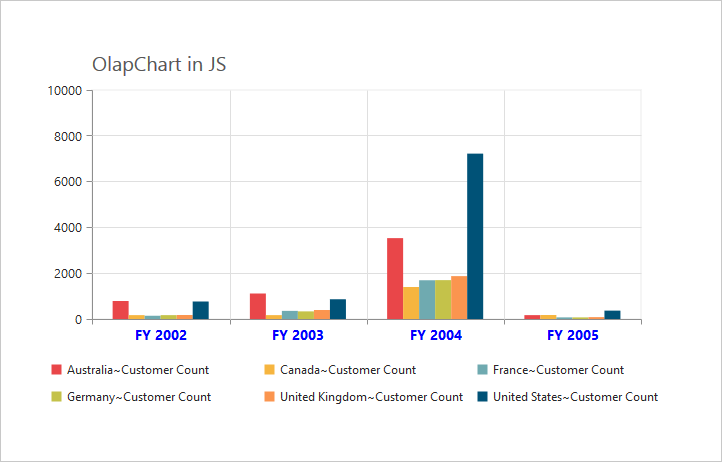
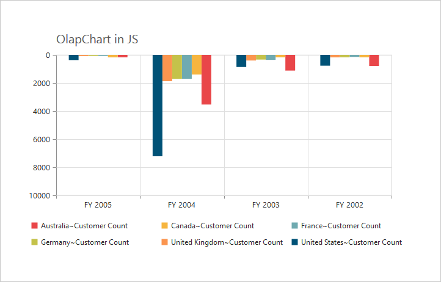
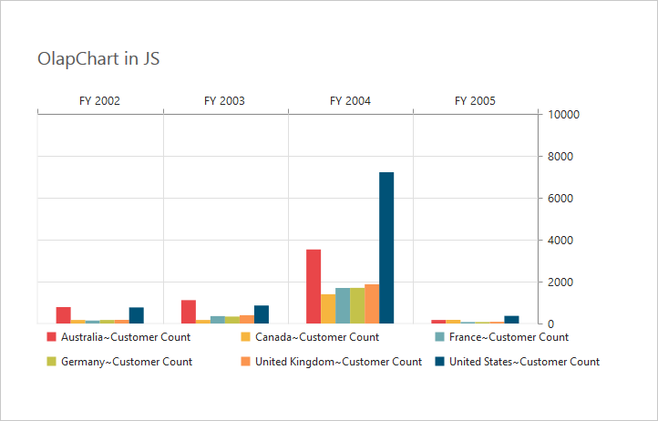

#Axes 

##Label Format

###Format Numeric labels
By using the [`labelFormat`](/js/api/ejchart#members:primaryyaxis-labelformat) property, you can format the numeric labels. Numeric values can be formatted with n (number with decimal points), c (currency) and p (percentage) commands.



$(function()
{
    $("#OlapChart1").ejOlapChart(
    {
        url: "../wcf/OlapChartService.svc",
        //...
        primaryYAxis:
        {
            //... 
            //Applying currency format to Y-Axis labels
            labelFormat: 'c'
        }
    });
});



Following table describes the result on applying some commonly used label formats on numeric values.

<table>
<tr>
<th>
Label Value</th><th>
Label Format Property Value</th><th>
Result</th><th>
Description</th>
</tr>
<tr><td>
1000</td><td>
n1</td><td>    
1000.0</td><td>
The Number is rounded to 1 decimal place</td>
</tr>
<tr><td>
1000</td><td>
n2</td><td>    
1000.00</td><td>
The Number is rounded to 2 decimal place</td>
</tr>
<tr><td>
1000</td><td>
n3</td><td>    
1000.000</td><td>
The Number is rounded to 3 decimal place</td>
</tr>
<tr><td>
0.01</td><td>
p1</td><td>    
1.0%</td><td>
The Number is converted to percentage with 1 decimal place</td>
</tr>
<tr><td>
0.01</td><td>
p2</td><td>    
1.00%</td><td>
The Number is converted to percentage with 2 decimal place</td>
</tr>
<tr><td>
0.01</td><td>
p3</td><td>    
1.000%</td><td>
The Number is converted to percentage with 3 decimal place</td>
</tr>
<tr><td>
1000</td><td>
c1</td><td>    
$1,000.0</td><td>
The Currency symbol is appended to number and number is rounded to 1 decimal place</td>
</tr>
<tr><td>
1000</td><td>
c2</td><td>    
$1,000.00</td><td>
The Currency symbol is appended to number and number is rounded to 2 decimal place</td>
</tr>
</table>

###Label Format Customization 
By using the [`labelFormat`](/js/api/ejchart#members:primaryyaxis-labelformat) property of [`primaryYAxis`](/js/api/ejchart#members:primaryyaxis), you can add the category labels with prefix and/or suffix. 



$(function()
{
    $("#OlapChart1").ejOlapChart(
    {
        url: "../wcf/OlapChartService.svc",
        //...
        primaryYAxis:
        {
            //... 
            //Adding prefix and suffix to Y-axis labels
            labelFormat: '${value} K'
        }
    });
});



##Common Axis Features

###Axis Visibility
Axis visibility can be set by using the [`visible`](/js/api/ejchart#members:primaryyaxis) property of the respective axis. The default value of the [`visible`](/js/api/ejchart#members:primaryyaxis-visible) property is true.



$(function()
{
    $("#OlapChart1").ejOlapChart(
    {
        url: "../wcf/OlapChartService.svc",
        //...
        primaryYAxis:
        {
            //... 
            //Disabling visibility of Y-axis
            visible: false
        }
    });
});



###Label Customization
By using the [`font`](/js/api/ejchart#members:primaryxaxis-font) property of the axis, we can customize the labels – font family, color, opacity, size and font-weight.



$(function()
{
    $("#OlapChart1").ejOlapChart(
    {
        url: "../wcf/OlapChartService.svc",
        //... 
        primaryXAxis:
        {
            //Customizing label appearance
            font:
            {
                fontFamily: 'Segoe UI',
                size: '14px',
                fontWeight: 'bold',
                color: 'blue'
            }
        }
    });
});



###Label and Tick Positioning
Axis labels and ticks can be positioned inside or outside the Chart area by using the [`labelPosition`](/js/api/ejchart#members:primaryxaxis-labelposition) and [`tickLinesPosition`](js/api/ejchart#members:primaryxaxis-ticklinesposition) properties. The labels and ticks are positioned outside the Chart area, by default.



$(function()
{
    $("#OlapChart1").ejOlapChart(
    {
        url: "../wcf/OlapChartService.svc",
        //... 
        primaryXAxis:
        {
            //Customizing label and tick positions
            labelPosition: 'inside',
            tickLinesPosition: 'inside'
        }
    });
});



###Grid Lines Customization
By using the [`majorGridLines`](/js/api/ejchart#members:primaryxaxis-majorgridlines) and [`minorGridLines`](/js/api/ejchart#members:primaryxaxis-minorgridlines) properties of the axis, you can customize the width, color, visibility and opacity of the grid lines. The minor grid lines are not visible by default.



$(function()
{
    $("#OlapChart1").ejOlapChart(
    {
        url: "../wcf/OlapChartService.svc",
        //... 
        primaryXAxis:
        {
            //Customizing Grid Lines
            majorGridLines:
            {
                color: 'blue',
                visible: true,
                width: 5
            },
            minorTicksPerInterval: 1,
            minorGridLines:
            {
                color: 'red',
                visible: true,
                width: 25
            }
        }
    });
});



###Tick Line Customization
By using the [`majorTickLines`](/js/api/ejchart#members:primaryxaxis-majorticklines) and [`minorTickLines`](/js/api/ejchart#members:primaryxaxis-minorgridlines) properties of the axis, you can customize the width, color, visibility, size and opacity of the tick lines. The minor tick lines are not visible by default.



$(function()
{
    $("#OlapChart1").ejOlapChart(
    {
        url: "../wcf/OlapChartService.svc",
        //... 
        primaryXAxis:
        {
            //Customizing Tick Lines
            majorTickLines:
            {
                color: 'blue',
                visible: true,
                width: 10,
                size: 15,
            },
            minorTicksPerInterval: 1,
            minorTickLines:
            {
                color: 'red',
                visible: true,
                width: 15,
                size: 25
            }
        }
    });
});



###Inversing Axis
Axis can be inversed by using the [`isInversed`](/js/api/ejchart#members:primaryxaxis-isinversed) property of the axis. By default, the value of the [`isInversed`](/js/api/ejchart#members:primaryyaxis-isinversed) property is false.



$(function()
{
    $("#OlapChart1").ejOlapChart(
    {
        url: "../wcf/OlapChartService.svc",
        //... 
        primaryXAxis:
        {
            //Inversing the X-axis
            isInversed: true
        },
        primaryYAxis:
        {
            //Inversing the Y-axis
            isInversed: true
        }
    });
});



###Placing Axes at Opposite Side
The [`opposedPosition`](/js/api/ejchart#members:primaryxaxis-opposedposition) property of Chart axis can be used to place the axis at the opposite direction from its default position. By default, the value of [`opposedPosition`](/js/api/ejchart#members:primaryyaxis-opposedposition) property is false.



$(function()
{
    $("#OlapChart1").ejOlapChart(
    {
        url: "../wcf/OlapChartService.svc",
        //... 
        primaryXAxis:
        {
            //Placing X-axis at the opposite side of its normal position
            opposedPosition: true
        },
        primaryYAxis:
        {
            //Placing Y-axis at the opposite side of its normal position
            opposedPosition: true
        }
    });
});



## Smart Axis Labels

When the axis labels overlap with each other based on the Chart dimensions and label size, you can use [`labelIntersection`](/js/api/ejchart#members:primaryxaxis-labelintersectaction) property of the axis to avoid overlapping. The default value of the [`labelIntersection`](/js/api/ejchart#members:primaryxaxis-labelintersectaction) property is none. The other options available are rotate45, rotate90, trim, multiplerows, wrap and hide. 



$(function()
{
    $("#OlapChart1").ejOlapChart(
    {
        url: "../wcf/OlapChartService.svc",
        //... 
        // Avoid overlapping of X-axis labels
        primaryXAxis:
        {
            labelIntersectAction: 'multiplerows'
        }
    });
});



