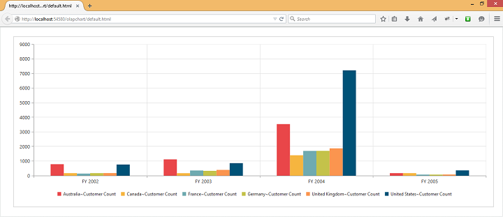

#Dimensions

##Set size in percentage

You can customize the OlapChart dimension by setting the width and height of the widget in percentage.



$(function () {
   $("#OlapChart1").ejOlapChart({
       url: "../wcf/OlapChartService.svc", 
       //Setting size to Chart container
       size: {
         height: "80%",
         width: "80%"
       }
    });
});



##Set size in pixels

You can customize the OlapChart dimension by setting the width and height of the widget in pixels.



$(function()
{
    $("#OlapChart1").ejOlapChart(
    {
        url: "../wcf/OlapChartService.svc",
        //Setting size to Chart container
        size:
        {
            height: "460px",
            width: "950px"
        }
    });
});



 

##Responsive

OlapChart widget supports responsive rendering based on the target device (desktop & tablet) resolution. It supports resolution upto 1024x600. You can enable responsiveness in OlapChart by setting [`isResponsive`](/js/api/ejolapchart#members:isresponsive) property to true.



$(function () {
   $("#OlapChart1").ejOlapChart({
       url: "../wcf/OlapChartService.svc", 
       //Enable responsiveness to change the Chart size dynamically.
       isResponsive: true,
       size: {
         height: "460px",
         width: "950px"
       }
    });
});



_Normal View_

_ResponsiveView_