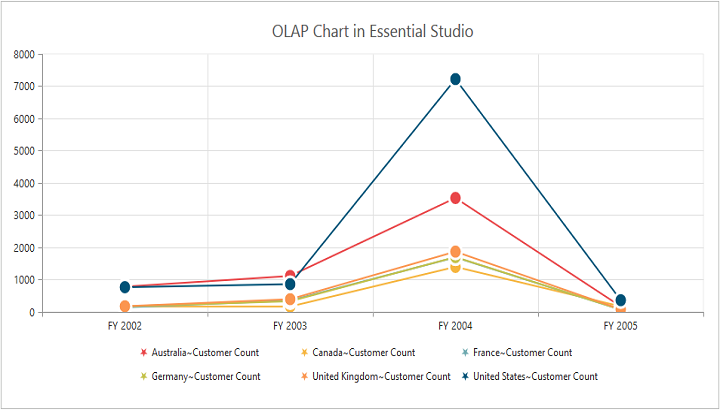
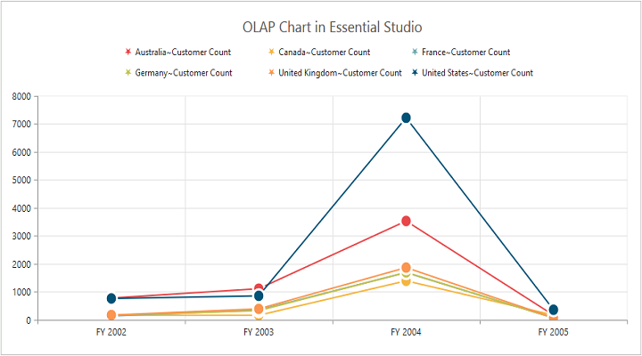
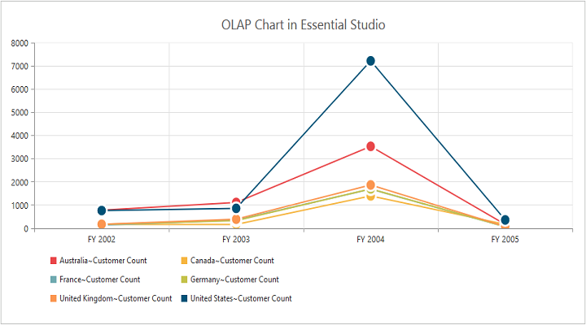
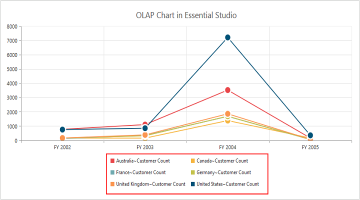
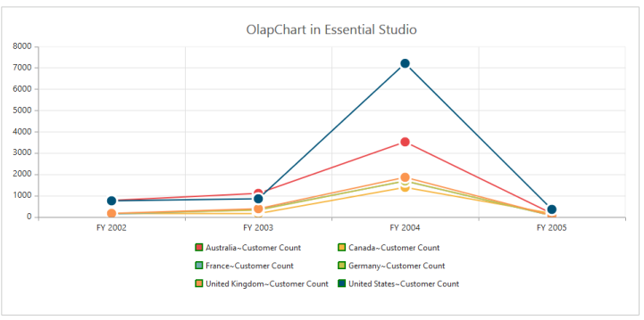
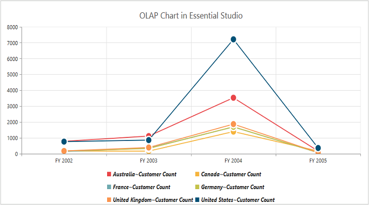
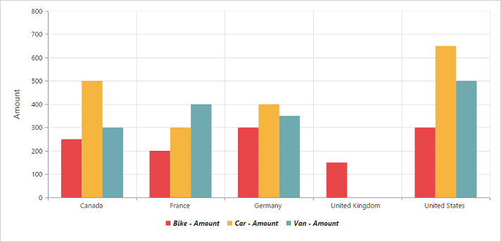

#Legend

##Legend Visibility

You can enable or disable legend using the [`visible`](/js/api/ejchart#members:legend-visible) property inside the [`legend`](/js/api/ejchart#members:legend) object. By default, legend is enabled in OlapChart.



$(function()
{
    $("#OlapChart1").ejOlapChart(
    {
        url: "../wcf/OlapChartService.svc",
        legend:
        {
            //Legend Visibility 
            visible: true
        },
        //....
    });
});



 

##Legend Shape
You can customize the legend [`shape`](/js/api/ejchart#members:legend-shape) in OlapChart widget to rectangle, circle, cross, diamond, pentagon, hexagon, star, ellipse, triangle etc. Default value of legend shape is “Rectangle”.



$(function()
{
    $("#OlapChart1").ejOlapChart(
    {
        url: "../wcf/OlapChartService.svc",
        legend:
        {
            visible: true,
            rowCount: 3,
            //Applying Legend Shape
            shape: "Star"
        },
        //....
    });
});



 

##Legend Position
By using the [`position`](/js/api/ejchart#members:legend-position) property, you can place the legend at top, bottom, left or right of the OlapChart. Default value of legend position is “bottom”.



$(function()
{
    $("#OlapChart1").ejOlapChart(
    {
        url: "../wcf/OlapChartService.svc",
        legend:
        {
            visible: true,
            rowCount: 3,
            shape: "Star",
            //To place the legend at top of the Chart
            position: “top”
        },
        //....
    });
});



 

##Legend Title
To add the legend title, you have to specify the title text in [`title.text`](/js/api/ejchart#members:legend-title-text) property.



$(function()
{
    $("#OlapChart1").ejOlapChart(
    {
        url: "../wcf/OlapChartService.svc",
        legend:
        {
            visible: true,
            //Add title to the Chart legend
            title:
            {
                text: "Countries"
            }
        },
        //....
    });
});



 

##Legend Alignment
You can align the legend to center, far and near based on its position in the Chart area using the [`alignment`](/js/api/ejchart#members:legend-alignment) option.
 


$(function()
{
    $("#OlapChart1").ejOlapChart(
    {
        url: "../wcf/OlapChartService.svc",
        legend:
        {
            visible: true,
            rowCount: 3,
            //Aligning the legend near to the Chart
            alignment: "Near"
        },
        //....
    });
});



##Legend Items - Size and Border
By using the legend [`itemStyle.width`](/js/api/ejchart#members:legend-itemstyle-width), [`itemStyle.height`](/js/api/ejchart#members:legend-itemstyle-height) and [`itemStyle.border`](/js/api/ejchart#members:legend-itemstyle-border) properties, you can change the legend items - size and border.



$(function()
{
    $("#OlapChart1").ejOlapChart(
    {
        url: "../wcf/OlapChartService.svc",
        legend:
        {
            visible: true,
            //Changing legend items border, height and width
            itemStyle:
            {
                height: 12,
                width: 12,
                border:
                {
                    color: 'magenta',
                    width: 1.5
                }
            }
        },
        //....
    });
});



 
##Legend Border
By using the [`border`](/js/api/ejchart#members:legend-border) option in legend, you can customize border color and width.



$(function()
{
    $("#OlapChart1").ejOlapChart(
    {
        url: "../wcf/OlapChartService.svc",
        legend:
        {
            visible: true,
            //Setting border color and width to legend
            border:
            {
                color: "#FFC342",
                width: 2
            }
        },
        //....
    });
});



##Legend Text
By using the [`font`](/js/api/ejchart#members:legend-font) option, you can customize the font family, font style, font weight and size of the legend text. 



$(function()
{
    $("#OlapChart1").ejOlapChart(
    {
        url: "../wcf/OlapChartService.svc",
        legend:
        {
            visible: true,
            //Customizing the legend text
            font:
            {
                fontFamily: 'Segoe UI',
                fontStyle: 'italic',
                fontWeight: 'bold',
                size: '13px'
            },
        },
        //....
    });
});



