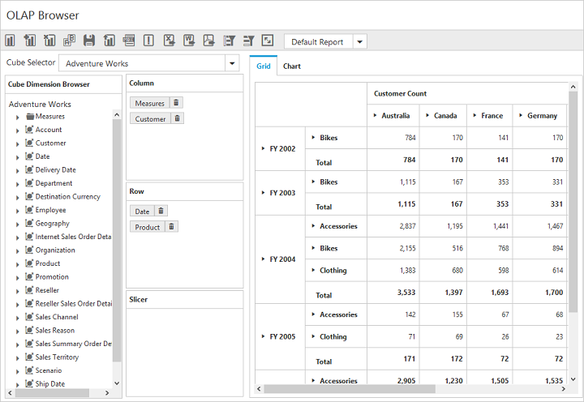

# Defer Update

Defer Update support allows the user to refresh the control on-demand and not during every user interaction. To enable this functionality, set the `enableDeferUpdate` property to true. By default, the value is set to false.



$("#OlapClient").ejOlapClient({
    url: "/OlapClient",
    title: "OLAP Browser",
    enableDeferUpdate: true
});



After enabling this property, an icon for Defer Update will appear inside the toolbar.

On clicking the icon, after making the necessary UI interactions, the PivotGrid and OlapChart controls will be updated according to the OlapReport available at that instant.

