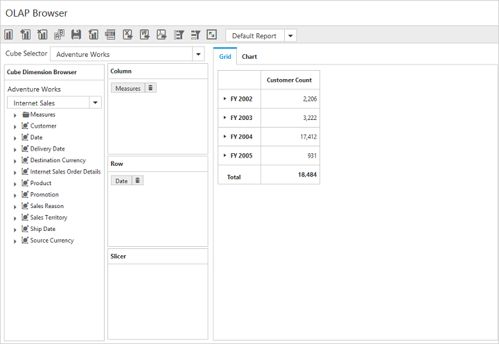

# Measure Groups 

In Cube Dimension Browser, treeview can be viewed in a filtered manner through the Measure Groups option. This feature allows you to view the list of measure groups and dimensions associated with the selected measure group from the cube. For enabling this, the [`enableMeasureGroups`](/js/api/ejpivotclient#members:enablemeasuregroups) property is set to true. By default, its value is set to false.



$("#OlapClient").ejOlapClient({
    url: "/OlapClient",
    title: "OLAP Browser",
    enableMeasureGroups: true
});



On selecting a measure group from the drop-down list, the Cube Dimension Browser treeview displays the related dimensions as follows.

