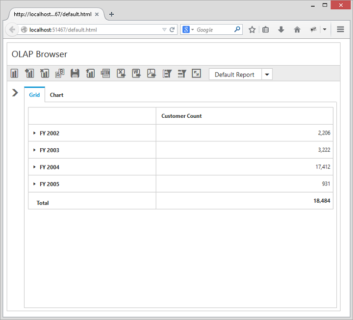

# Responsive Layout

OlapClient widget supports responsive rendering based on the target device (desktop & tablet) resolution. It supports resolution upto 1024x600. You can enable responsiveness in OlapClient by setting [`isResponsive`](/js/api/ejpivotclient#members:displaysettings-isresponsive) property to true.



$("#OlapClient").ejOlapClient({
    url: "/OlapClient",
    title: "OLAP Browser",
    isResponsive: true
});



