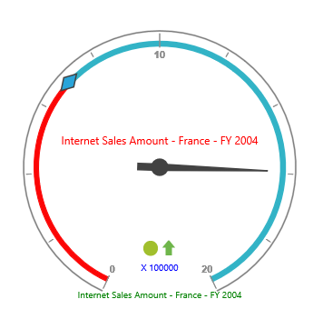

# Custom labels

## Adding Custom Label Collection

Custom label collection can be directly added to the scales option within the OlapGauge widget as an array.



$("#OlapGauge1").ejOlapGauge({
    url: "../OlapGauge",
    //...
    scales: [{
        //...
        customLabels: [{
            position: {
                x: 180,
                y: 290
            }
        }]
    }],
    //...
});



## Appearance Customization

The appearance of the custom labels can be changed through the following properties.

* **position** – used to set the position of the labels.
* **font** – sets the font size, font style and font family of the label text.
* **color** – sets the color of the label text.
* **textAngle** – rotates the label to a specified angle. By default, the value is 0.



$("#OlapGauge1").ejOlapGauge({
    url: "../OlapGauge",
    //...
    scales: [{
        //...
        customLabels: [{
            position: {
                x: 180,
                y: 320
            },
            font: {
                size: "12px",
                fontFamily: "Segoe UI",
                fontStyle: "Normal"
            },
            color: "blue",
            textAngle: 20
        }]
    }],
    //...
});



 

## Multiple Custom Labels

Multiple custom labels can be set to an OlapGauge widget by adding an array of objects within the `customLabels` option. 



$("#OlapGauge1").ejOlapGauge({
    url: "../OlapGauge",
    //...
    scales: [{
        //...
        customLabels: [{
            color: "Red",
            position: {
                x: 180,
                y: 150
            }
        }, {
            color: "Green",
            position: {
                x: 180,
                y: 320
            }
        }, {
            color: "Blue",
            position: {
                x: 180,
                y: 290
            }
        }]
    }],
    //...
});



 
