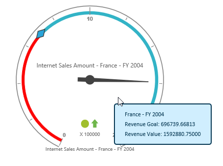

# Tooltip

Tooltip can be enabled by using the [`enableTooltip`](/js/api/ejolapgauge#members:enabletooltip) property. By default, this property is set to "false".



$("#OlapGauge1").ejOlapGauge({
    url: "../OlapGauge",
    enableTooltip: true,
    //...
});



Tooltip appearance can be customized by overriding its CSS class.



.e-olapgauge-tooltip {
    background-color: aqua!important;
    border: 2 px solid red!important;
    color: black!important;
    border-radius: 18 px!important;
    margin-top: 20 px;
    text-align: left;
    font: 12 px Segoe UI;
    line-height: 20 px;
}


    
 

