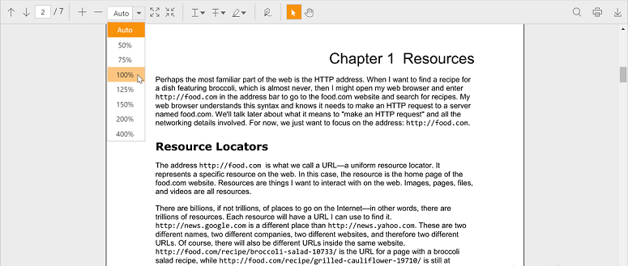

## Appearance

You can apply themes to the ejPdfViewer to match the themes of your application.

Following are the built-in themes available in PDF viewer.

* flat-azure
* flat-azure-dark
* flat-lime
* flat-lime-dark
* flat-saffron
* flat-saffron-dark
* gradient-azure
* gradient-azure-dark
* gradient-lime
* gradient-lime-dark
* gradient-saffron
* gradient-saffron-dark
* bootstrap
* high-contrast-01
* high-contrast-02
* material
* office-365

By default, ‘flat-azure’ theme is applied to PDF viewer. You can change the theme by changing the stylesheet reference. You can apply ‘gradient-saffron’ theme to ejPdfViewer by using the stylesheet reference as follows


<!—style sheet for ‘gradient-saffron’ theme.-->
<link href="https://cdn.syncfusion.com/16.1.0.24/js/web/gradient-saffron/ej.web.all.min.css" rel="stylesheet" />


The following screenshot shows the PDF viewer in ‘gradient-saffron’ theme.

