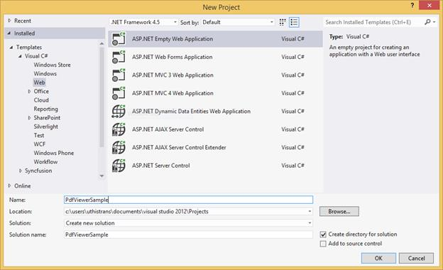
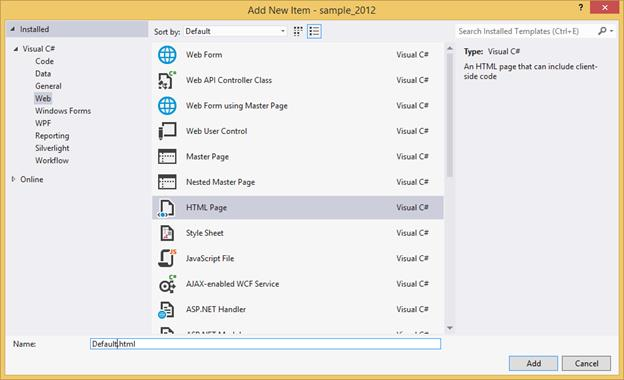
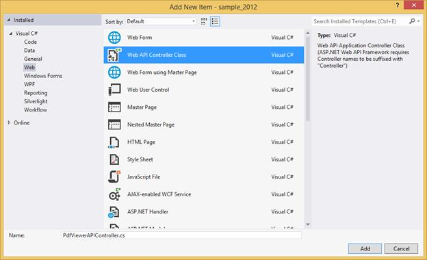
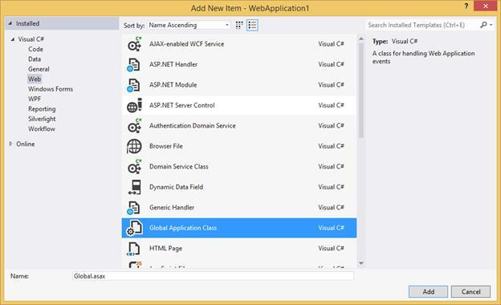
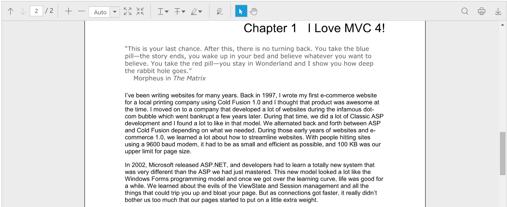

# Getting Started with Javascript PDF viewer

This section explains how to create the PDF viewer in your web application using JavaScript.

**Create your first PDF viewer application in JavaScript**

Create a new project in the Visual Studio by selecting the ASP.NET Empty Web Application template. The following screenshot displays the Project Creation Wizard in Visual Studio 2012.

**Create HTML Page**

Right-click the project and select New Item option from the ‘Add’ menu to add a HTML page to the application. Name the page as **Default.html** and click OK.

### Add References, Scripts, Styles

**Add References**

Add reference to the following assemblies from [NuGet package](https://help.syncfusion.com/extension/syncfusion-nuget-packages/web-nuget-packages-details "Web NuGet Package Details").

* System.Web.Http
* System. Web.Http.WebHost
* System.Net.Http.WebRequest
* System.Net.Http.Formatting

N> The System.Web.Routing and System.Net.Http assemblies are also required, which are referred by default when creating the project.

Add the following references to the project that are necessary for using the ejPdfViewer control.

* Syncfusion.Compression.Base
* Syncfusion.EJ.PdfViewer
* Syncfusion.Pdf.Base

N> Starting with v16.2.0.x, if you reference Syncfusion assemblies from trial setup or from the NuGet feed, you also have to include a license key in your projects. Please refer to this [link](https://help.syncfusion.com/common/essential-studio/licensing/license-key "Syncfusion Licensing Overview") to know about registering Syncfusion license key in your JavaScript application to use our components.

**Add Scripts and Styles**

The PDF viewer has the [JQuery](http://jquery.com/# "JQuery") external dependency.

The following table shows the list of ej widgets required for using the ejPdfViewer.

<table>
<tr>
<td>
{{'**File**'| markdownify }}
</td>
<td>
{{'**Description/Usage**'| markdownify }}
</td>
</tr>
<tr>
<td>
ej.core.min.js
</td>
<td>
Must be referred always before using all the JS widgets.
</td>
</tr>
<tr>
<td>
ej.data.min.js
</td>
<td>
To handle data operation and should be used while binding data to JS widgets.
</td>
</tr>
<tr>
<td>
ej.globalize.min.js
</td>
<td>
To support the globalization.
</td>
</tr>
<tr>
<td>
ej.draggable.js
</td>
<td>
Used for dragging and dropping an element in JS controls.
</td>
</tr>
<tr>
<td>
ej.pdfviewer.min.js
</td>
<td>
Main PDF viewer file
</td>
</tr>
<tr>
<td>
ej.toolbar.min.js
</td>
<td>
To add toolbar in the widget.
</td>
</tr>
<tr>
<td>
ej.button.min.js
</td>
<td>
To add buttons in the toolbar.
</td>
</tr>
<tr>
<td>
ej.dropdownlist.min.js
</td>
<td>
To add dropdownlist in the toolbar.
</td>
</tr>
<tr>
<td>
ej.scroller.min.js
</td>
<td>
To handle scrolling operation in the widget.
</td>
</tr>
<tr>
<td>
ej.waitingpopup.min.js
</td>
<td>
To show waiting popups on loading and rendering.
</td>
</tr>
<tr>
<td>
ej.checkbox.min.js
</td>
<td>
To add checkboxes in the text search toolbar and annotation properties window.
</td>
</tr>
<tr>
<td>
ej.tooltip.min.js
</td>
<td>
To add tooltip in the widget.
</td>
</tr>
<tr>
<td>
ej.colorpicker.min.js
</td>
<td rowspan="2">
To add colorpicker in the text markup annotation tools and the annotation properties window.
</td>
</tr>
<tr>
<td>
ej.splitbutton.min.js
</td>
</tr>
<tr>
<td>
ej.maskedit.min.js
</td>
<td rowspan="5">
To add properties window for annotations in the widget.
</td>
</tr>
<tr>
<td>
ej.dialog.min.js
</td>
</tr>
<tr>
<td>
ej.tab.min.js
</td>
</tr>
<tr>
<td>
ej.menu.min.js
</td>
</tr>
<tr>
<td>
ej.slider.min.js
</td>
</tr>
</table>

Find the scripts and style sheets in any of the following locations:
Local Disk: [Click here](https://help.syncfusion.com/js/installation-and-deployment# "Installation and deployment") to know more about script and style sheets installed in local machine.
CDN Link: [Click here](https://help.syncfusion.com/js/cdn# "CDN scripts and styles links") to know more about script and style sheets available online.
NuGet Package: [Click here](https://help.syncfusion.com/js/installation-and-deployment#configuring-syncfusion-nuget-packages "Configuring Syncfusion NuGet Packages") to know more about script and style sheets available in NuGet package.

Add the script files and CSS files in the <head> tag of the Default.html page.


<link href="https://cdn.syncfusion.com/16.1.0.24/js/web/flat-azure/ej.web.all.min.css" rel="stylesheet" />



N> For getting started, you can use the ej.web.all.min.js file, which encapsulates all the ej widgets and frameworks in a single file. In production, it is highly recommended to use [custom script generator](http://csg.syncfusion.com "Custom Script Generator") to create custom script file with required widgets and its dependencies to reduce the size of the script files.

### Add ejPdfViewer in HTML Page

The ejPdfViewer control must be initialized using the following steps:

**Setting serviceUrl and pdfService**

To initialize the PDF viewer control, use the [serviceUrl](https://help.syncfusion.com/api/js/ejpdfviewer#serviceurl-string "serviceUrl property") property that is necessary to access the service from which the PDF document is loaded and processed for the control. The [pdfService](https://help.syncfusion.com/api/js/ejpdfviewer#pdfservice-enum "pdfService property") property can also be used to specify the location of the supporting PDF service.



    

    



**Provide Web API action methods**

The Web API action methods must be available in the server (Web API controller) to load and process the PDF documents. The available API methods in the controller are Load, FileUpload, Download, and Unload. You can modify the name of the server action methods as used in the controller using the [serverActionSettings](https://help.syncfusion.com/api/js/ejpdfviewer#serveractionsettings-object "serverActionSettings property") property in the PDF viewer control.



    

    



**Load PDF documents from client side**

The PDF documents can be loaded in the PDF viewer control using [load()](https://help.syncfusion.com/api/js/ejpdfviewer#loadfilename "load method") method in the client side. The path of the PDF document and the base64 string of the document can be used to load the PDF document.

N> If the name of the PDF document is only passed as parameter in the load() method, the PDF document must be available in the folder which is specified in the Load action method in the controller.


var pdfviewer=$(“#viewer”).data(“ejPdfViewer”);
pdfviewer.load(“HTTP Succinctly”);


When the PDF document is loaded in the PDF viewer control, the documentLoad event will be triggered. You can define the event method using the [documentLoad](https://help.syncfusion.com/api/js/ejpdfviewer#documentload "documentLoad Event") property of the control.



    

    



**Load the documents during control initialization**

The PDF document can also be loaded during the PDF viewer control initialization using the [documentPath](https://help.syncfusion.com/api/js/ejpdfviewer#documentpath-string "documentPath property") property. The path of the PDF document and the base64 string of the document can be used to load the PDF document.

N> If the name of the PDF document is only set in the documentPath property, the PDF document must be available in the folder which is specified in the Load action method in the controller.



    

    



**Unload the documents from the PDF viewer control**

The PDF document loaded in the PDF viewer control can be unloaded using [unload()](https://help.syncfusion.com/api/js/ejpdfviewer#unload "unload method") method in the client side.


var pdfviewer=$(“#viewer”).data(“ejPdfViewer”);
pdfviewer.unload();


When the PDF document is unloaded from the PDF viewer control, the documentUnload event will be triggered. We can define the event method using [documentUnload](https://help.syncfusion.com/api/js/ejpdfviewer#documentunload "documentUnload Event") property of the control.



    

    



**Notifying the failure of the request in the client**

When the AJAX requests from the client to the API controller is failed, ajaxRequestFailure event will be triggered. You can define the event method using the [ajaxRequestFailure](https://help.syncfusion.com/api/js/ejpdfviewer#ajaxrequestfailure "ajaxRequestFailure Event") property of the control.



    

    



### Getting the Hyperlink from the PDF document

When the hyperlinks available in the PDF document is clicked, the hyperlinkClick event will be triggered. The hyperlink URL will be returned in the event argument. You can define the event method using the [hyperlinkClick](https://help.syncfusion.com/api/js/ejpdfviewer#hyperlinkclick "hyperlinkClick Event") property of the control.



    

    



### Displaying PDF document using Remote Service

Add the following code in the <body> tag in the Default.html page. Here, the PDF viewer uses hosted service in the remote machine to process the PDF.



    <!-- Creating a div tag which will act as a container for ejPdfViewer widget.-->
    

    <!-- initializing ejPdfViewer widget.-->
    



### Displaying PDF document using Web API

**Add Web API controller for PDF viewer**

The PDF viewer uses Web API services to process the PDF file. Right-Click the Project, select Add and Web API Controller Class from the listed templates. Rename it as **PdfViewerAPIController.cs**.

N> While adding WebAPI Controller Class, name it with the suffix “Controller” that is mandatory. For example, in the demo the controller is named as “PdfViewerAPIController”.

Add the following code snippet in the PdfViewerAPIController.cs. The PdfViewerHelper class contains helper methods that helps to post or get request from the ejPdfViewer widget and return the response.


using Newtonsoft.Json;
using Syncfusion.EJ.PdfViewer;
using System.Collections.Generic;
using System.IO;
using System.Web;
using System.Web.Http;
namespace PDFViewerDemo.Api
{
    public class PdfViewerAPIController : ApiController
    {
        //Post action for processing the PDF documents.
        public object Load(Dictionary<string, string> jsonResult)
        {
            PdfViewerHelper helper = new PdfViewerHelper();
            helper.Load(HttpContext.Current.Server.MapPath("~/Data/JavaScript_Succinctly.pdf"));
            object output = helper.ProcessPdf(jsonResult);
            return JsonConvert.SerializeObject(output);
        }

        //Post action for processing the PDF documents when uploading to the ejPdfviewer widget.
        public object FileUpload(Dictionary<string, string> jsonResult)
        {
            PdfViewerHelper helper = new PdfViewerHelper();
            if (jsonResult.ContainsKey("uploadedFile"))
            {
                var fileUrl = jsonResult["uploadedFile"];
                byte[] byteArray = Convert.FromBase64String(fileUrl);
                MemoryStream stream = new MemoryStream(byteArray);
                helper.Load(stream);
            }
            return JsonConvert.SerializeObject(helper.ProcessPdf(jsonResult));
        }

        //Post action for downloading the PDF documents from the ejPdfviewer widget.
        public object Download(Dictionary<string, string> jsonResult)
        {
            PdfViewerHelper helper = new PdfViewerHelper();
            return helper.GetDocumentData(jsonResult);
        }

        //Post action for unloading and disposing the PDF document resources in the server side from the ejPdfviewer widget.
        public void Unload()
        {
            PdfViewerHelper helper = new PdfViewerHelper();
            helper.UnLoad();
        }
    }
}


N> Create a folder named Data in the project location and add the PDF document to be viewed in PDF viewer.

**Web API Routing**

Right-Click the Project, select Add and Global.asax file from the listed templates.

You can route the Web API in the Application_Start event into Global.asax file as follows.


using System;
using System.Web.Http;
namespace PDFViewerDemo
{
    public class Global : System.Web.HttpApplication
    {
        protected void Application_Start(object sender, EventArgs e)
        {
            System.Web.Http.GlobalConfiguration.Configuration.Routes.MapHttpRoute(
            name: "DefaultApi",
            routeTemplate: "api/{controller}/{action}/{id}",
            defaults: new { id = RouteParameter.Optional });
        }
        protected void Application_BeginRequest(object sender, EventArgs e)
        {
            if (Request.Url.AbsolutePath.EndsWith("/"))
            {
                Server.Transfer(Request.Url.AbsolutePath + "Default.html");
            }
        }
    }
}


Add the following code in the <body> tag in the Default.html page. Here, PDF viewer uses the web API controller to process the PDF.



    <!-- Creating a div tag which will act as a container for ejPdfViewer widget.-->
    

    <!-- initializing ejPdfViewer widget.-->
    



**Output**

Run the sample application and you can see the PDF Viewer on the page as displayed in the following screenshot.

**Sample:**

<http://www.syncfusion.com/downloads/support/directtrac/general/ze/PdfViewer_GettingStarted-67533367>

**Destroy**

When closing a window containing the ejPdfViewer, you can also remove the ejPdfViewer and the related objects at runtime by calling the “destroy” function as follows.


var pdfviewerObj = $("#container").data("ejPdfViewer");
pdfviewerObj.destroy();


When the PDF viewer control is destroyed, the destroy event will be triggered. You can define the event method using the [destroy](https://help.syncfusion.com/api/js/ejpdfviewer#destroy "destroy Event") property of the control.



    

    


