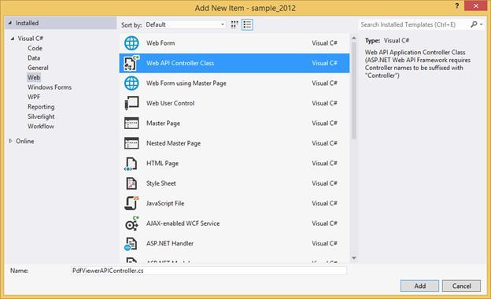
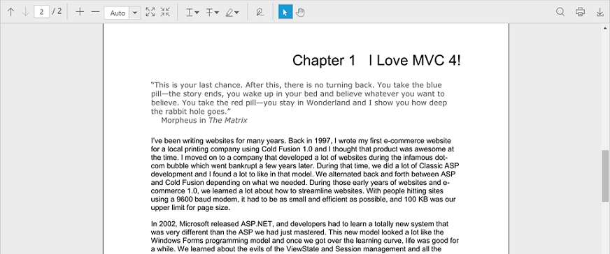

## Getting Started

This section explains briefly about how to create a PDF viewer in your web application with JavaScript.

**Create your first PDF viewer application in JavaScript**

Create a new project in the Visual Studio by selecting the ASP.NET Empty Web Application template. The following screenshot displays the Project Creation Wizard in Visual Studio 2012.

**Create HTML Page**

Add a HTML page to the application by Right-Clicking on the project and selecting new item option from the ‘Add’ menu.

Name the page as Default.html and click OK.

**Add References**

* Add reference to the following list of assemblies from ASP.NET Web API NuGet package.

* System.Web.Http

* System. Web.Http.WebHost

* System.Net.Http.WebRequest

* System.Net.Http.Formatting

N> The System.Web.Routing, System.Net.Http assemblies are also required, which are referred by default when creating the project.

* The following Syncfusion assemblies has to be added as reference to the project for using the ejPdfViewer.

* Syncfusion.Compression.Base

* Syncfusion.EJ.PdfViewer

* Syncfusion.Pdf.Base

**Add Scripts and Styles**

PDF viewer have the following external dependencies.

* [JQuery](http://jquery.com/# "JQuery")

* [JQuery.easing](http://gsgd.co.uk/sandbox/jquery/easing/# "JQuery.easing")

The following table shows the list of ej widgets required for using the ejPdfViewer.

<table>
<tr>
<td>
{{'**File**'| markdownify }}
</td>
<td>
{{'**Description/Usage**'| markdownify }}
</td>
</tr>
<tr>
<td>
ej.core.min.js
</td>
<td>
Must be referred always before using all the JS widgets.
</td>
</tr>
<tr>
<td>
ej.data.min.js
</td>
<td>
To handle data operation and should be used while binding data to JS widgets.
</td>
</tr>
<tr>
<td>
ej.pdfviewer.min.js
</td>
<td>
Main PDF viewer file
</td>
</tr>
<tr>
<td>
ej.toolbar.min.js
</td>
<td>
To add toolbar in the widget.
</td>
</tr>
<tr>
<td>
ej.button.min.js
</td>
<td>
To add the buttons in the toolbar.
</td>
</tr>
<tr>
<td>
ej.dropdownlist.min.js
</td>
<td>
To add dropdownlist in the toolbar.
</td>
</tr>
<tr>
<td>
ej.scroller.min.js
</td>
<td>
To handle scrolling operation in the widget.
</td>
</tr>
<tr>
<td>
ej.waitingpopup.min.js
</td>
<td>
To show waiting popups on loading and rendering.
</td>
</tr>
</table>
You can find the scripts listed above and style sheets in any of the following locations:
Local Disk: [Click here](https://help.syncfusion.com/js/installation-and-deployment# "Installation and deployment") to know more about script and style sheets installed in local machine.
CDN Link: [Click here](https://help.syncfusion.com/js/cdn# "CDN scripts and styles links") to know more about script and style sheets available online.
NuGet Package: [Click here](https://help.syncfusion.com/js/installation-and-deployment#configuring-syncfusion-nuget-packages "Configuring Syncfusion NuGet Packages") to know more about script and style sheets available in NuGet package.
Add the script files and CSS files in the <head> tag of the Default.html page.



<link href="assets/css/web/default-theme/ej.widgets.all.min.css" rel="stylesheet" type="text/css" />


N> For getting started, you can use the ej.web.all.min.js file, which encapsulates all the ej widgets and frameworks in one single file. In production, we highly recommend you to use our [custom script generator](https://help.syncfusion.com/js/include-only-the-needed-widgets# "custom script generator") to create custom script file with required widgets and its dependencies, to reduce the size of the script file.

**Add ejPdfViewer in HTML Page**

Add the following code in the <body> tag in the Default.html page. Set the desired service URL to PDF viewer.



    <!-- Creating a div tag which will act as a container for ejPdfViewer widget.-->
    

    <!-- initializing ejPdfViewer widget.-->
    



**Add Web API controller for PDF viewer**

The PDF viewer uses Web API services to process the PDF file. Right-Click the Project, select Add and select Web API Controller Class from the listed templates. Rename it as PdfViewerAPIController.cs.

N> While adding WebAPI Controller Class, name it with the suffix “Controller” which is mandatory. For example, in the demo the controller is named as “PdfViewerAPIController”.

Add the following code snippet in the PdfViewerAPIController.cs. The PdfViewerHelper class contains helper methods that helps to post/get request from the ejPdfViewer widget and return the response.


using Newtonsoft.Json;
using Syncfusion.EJ.PdfViewer;
using System.Collections.Generic;
using System.IO;
using System.Web;
using System.Web.Http;
namespace PDFViewerDemo.Api
{
    public class PdfViewerAPIController : ApiController
    {
        //Post action for processing the PDF file
        public object PostViewerAction(Dictionary<string, string> jsonResult)
        {
            PdfViewerHelper helper = new PdfViewerHelper();     
            helper.Load(Helper.GetFilePath ("JavaScript_Succinctly.pdf"));       
            object output = helper.ProcessPdf(jsonResult);
            string response = JsonConvert.SerializeObject(output);
            return response;
        }
    }
    public class Helper
    {
        public static string GetFilePath(string path)
        {
            string _dataPath = GetCommonFolder(new DirectoryInfo(HttpContext.Current.Request.PhysicalApplicationPath));
            _dataPath += @"\" + path;
            return _dataPath;
        }
        static string GetCommonFolder(DirectoryInfo dtInfo)
        {
            var _folderNames = dtInfo.GetDirectories("Data");
            if (_folderNames.Length > 0)
            {
                return _folderNames[0].FullName;
            }
            return dtInfo.Parent != null ? GetCommonFolder(dtInfo.Parent) : string.Empty;
        }
    }
}


N> Please create a folder named Data in the project location and add the PDF document to be viewed in PDF viewer.

**Web API Routing**

Right-Click the Project, select Add and select Global.asax file from the listed templates.

You can route the Web API in Application_Start event into Global.asax file as follows.


using System;
using System.Web.Http;
namespace PDFViewerDemo
{
    public class Global : System.Web.HttpApplication
    {
        protected void Application_Start(object sender, EventArgs e)
        {
            System.Web.Http.GlobalConfiguration.Configuration.Routes.MapHttpRoute(
            name: "DefaultApi",
            routeTemplate: "api/{controller}/{action}/{id}",
            defaults: new { id = RouteParameter.Optional });
        }
        protected void Application_BeginRequest(object sender, EventArgs e)
        {
            if (Request.Url.AbsolutePath.EndsWith("/"))
            {
                Server.Transfer(Request.Url.AbsolutePath + "Default.html");
            }
        }
    }
}


**Run the Application**

Run the sample application and you can see the PDF Viewer on the page as displayed in the following screenshot.

**Destroy**

When closing a window containing the ejPdfViewer, you can also remove the ejPdfViewer and the related objects at runtime by calling the “destroy” function as below


var pdfviewerObj = $("#container").data("ejPdfViewer");
pdfviewerObj.destroy();


