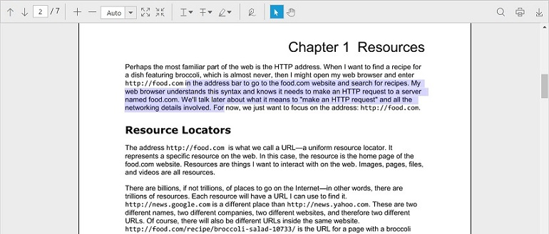
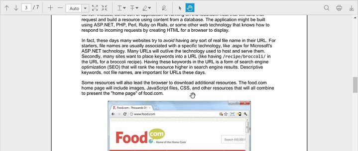

## Interaction Mode

The ejPdfViewer control provides interaction modes for easy interaction with the PDF documents in the control. Selection mode and Panning mode are the two interaction modes.

**Selection Mode**

In this mode, the text selection can be performed in the PDF document loaded in the ejPdfViewer control. The panning and scrolling of the pages by touch cannot be performed in this mode.

**Enable or disable the Text selection**

The text selection in the PDF viewer control can be enabled or disabled using the [enableTextSelection](https://help.syncfusion.com/api/js/ejpdfviewer#members:enabletextselection "enableTextSelection property") property.


$(function () {
    $("#viewer").ejPdfViewer({ serviceUrl: "https://js.syncfusion.com/ejServices/api/PdfViewer", enableTextSelection: true});
});


**Panning Mode**

In this mode, the panning and scrolling of the pages by touch can be performed in the PDF document loaded in the ejPdfViewer control, but the text selection cannot be performed.

**Changing the interaction mode**

The interaction mode of the PDF viewer control can be set using the [interactionMode](https://help.syncfusion.com/api/js/ejpdfviewer#interactionmode-enum "interactionMode property") property.


$(function () {
    $("#viewer").ejPdfViewer({ serviceUrl: "https://js.syncfusion.com/ejServices/api/PdfViewer", interactionMode: 1});
});

