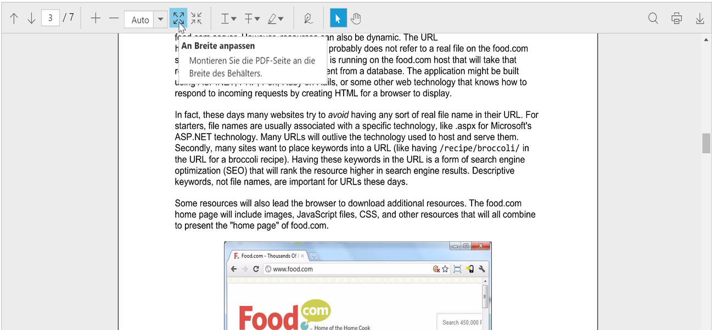

## Localization

The text labels provided in the ejPdfViewer control can be localized using the collection of localized strings using ej.PdfViewer.Locale for different cultures. By default, ejPdfViewer is localized in “**en-US**” culture.

The different locale value for the ejPdfViewer control can be specified using the [locale](https://help.syncfusion.com/api/js/ejpdfviewer#locale-string "locale property") property.





Following table shows the default values for the components in the ejPdfViewer widget in ‘en-US’ culture

<table>
<tr>
<td>
{{'**Component**' | markdownify}}
</td>
<td>
{{'**Function**'| markdownify }}
</td>
<td>
{{'**Keywords**'| markdownify }}
</td>
<td>
{{'**Values**'| markdownify }}
</td>
</tr>
<tr>
<td colspan="1" rowspan="38">
toolbar
</td>
<td colspan="1" rowspan="2">
first
</td>
<td>
headerText
</td>
<td>
First
</td>
</tr>
<tr>
<td>
contentText
</td>
<td>
Go to the first page of the PDF document.
</td>
</tr>
<tr>
<td colspan="1" rowspan="2">
previous
</td>
<td>
headerText
</td>
<td>
Previous
</td>
</tr>
<tr>
<td>
contentText
</td>
<td>
Go to the previous page of the PDF document.
</td>
</tr>
<tr>
<td colspan="1" rowspan="2">
next
</td>
<td>
headerText
</td>
<td>
Next
</td>
</tr>
<tr>
<td>
contentText
</td>
<td>
Go to the next page of the PDF document.
</td>
</tr>
<tr>
<td colspan="1" rowspan="2">
last
</td>
<td>
headerText
</td>
<td>
Last
</td>
</tr>
<tr>
<td>
contentText
</td>
<td>
Go to the last page of the PDF document.
</td>
</tr>
<tr>
<td colspan="1" rowspan="2">
zoomIn
</td>
<td>
headerText
</td>
<td>
Zoom-In
</td>
</tr>
<tr>
<td>
contentText
</td>
<td>
Zoom in to the PDF document.
</td>
</tr>
<tr>
<td colspan="1" rowspan="2">
zoomOut
</td>
<td>
headerText
</td>
<td>
Zoom-Out
</td>
</tr>
<tr>
<td>
contentText
</td>
<td>
Zoom out of the PDF document.
</td>
</tr>
<tr>
<td colspan="1" rowspan="2">
pageIndex
</td>
<td>
headerText
</td>
<td>
Page Number
</td>
</tr>
<tr>
<td>
contentText
</td>
<td>
Current page number in view.
</td>
</tr>
<tr>
<td colspan="1" rowspan="2">
zoom
</td>
<td>
headerText
</td>
<td>
Zoom
</td>
</tr>
<tr>
<td>
contentText
</td>
<td>
Zoom in or out of the PDF document.
</td>
</tr>
<tr>
<td colspan="1" rowspan="2">
fitToWidth
</td>
<td>
headerText
</td>
<td>
Fit to Width
</td>
</tr>
<tr>
<td>
contentText
</td>
<td>
Fit the PDF page to the width of the container.
</td>
</tr>
<tr>
<td colspan="1" rowspan="2">
fitToPage
</td>
<td>
headerText
</td>
<td>
Fit to Page
</td>
</tr>
<tr>
<td>
contentText
</td>
<td>
Fit the PDF page to the container.
</td>
</tr>
<tr>
<td colspan="1" rowspan="2">
print 
</td>
<td>
headerText
</td>
<td>
Print
</td>
</tr>
<tr>
<td>
contentText
</td>
<td>
Print the PDF document.
</td>
</tr>
<tr>
<td colspan="1" rowspan="2">
download
</td>
<td>
headerText
</td>
<td>
Download
</td>
</tr>
<tr>
<td>
contentText
</td>
<td>
Download the PDF document.
</td>
</tr>
<tr>
<td colspan="1" rowspan="2">
search
</td>
<td>
headerText
</td>
<td>
Search Text
</td>
</tr>
<tr>
<td>
contentText
</td>
<td>
Search text in the PDF pages.
</td>
</tr>
<tr>
<td colspan="1" rowspan="2">
highlight
</td>
<td>
headerText
</td>
<td>
Highlight Text
</td>
</tr>
<tr>
<td>
contentText
</td>
<td>
Highlight text in the PDF pages.
</td>
</tr>
<tr>
<td colspan="1" rowspan="2">
strikeout
</td>
<td>
headerText
</td>
<td>
Strikethrough Text
</td>
</tr>
<tr>
<td>
contentText
</td>
<td>
Strikethrough text in the PDF pages.
</td>
</tr>
<tr>
<td colspan="1" rowspan="2">
underline
</td>
<td>
headerText
</td>
<td>
Underline Text
</td>
</tr>
<tr>
<td>
contentText
</td>
<td>
Underline text in the PDF pages.
</td>
</tr>
<tr>
<td colspan="1" rowspan="2">
signature
</td>
<td>
headerText
</td>
<td>
Signature
</td>
</tr>
<tr>
<td>
contentText
</td>
<td>
Add or create the hand-written signature.
</td>
</tr>
<tr>
<td colspan="1" rowspan="2">
select
</td>
<td>
headerText
</td>
<td>
Selection
</td>
</tr>
<tr>
<td>
contentText
</td>
<td>
Selection tool for text.
</td>
</tr>
<tr>
<td colspan="1" rowspan="2">
scroll
</td>
<td>
headerText
</td>
<td>
Panning
</td>
</tr>
<tr>
<td>
contentText
</td>
<td>
Click to pan around the document.
</td>
</tr>
<tr>
<td colspan="1" rowspan="8">
contextMenu
</td>
<td>
copy
</td>
<td>
contentText
</td>
<td>
Copy
</td>
</tr>
<tr>
<td>
googleSearch
</td>
<td>
contentText
</td>
<td>
Search Google
</td>
</tr>
<tr>
<td>
openPopup
</td>
<td>
contentText
</td>
<td>
Open Pop-Up Note
</td>
</tr>
<tr>
<td>
Delete
</td>
<td>
contentText
</td>
<td>
Delete
</td>
</tr>
<tr>
<td>
properties
</td>
<td>
contentText
</td>
<td>
Properties
</td>
</tr>
<tr>
<td>
Find
</td>
<td>
contentText
</td>
<td>
Find
</td>
</tr>
<tr>
<td>
matchCase
</td>
<td>
contentText
</td>
<td>
Match Case
</td>
</tr>
<tr>
<td>
auto
</td>
<td>
contentText
</td>
<td>
Auto
</td>
</tr>
<tr>
<td colspan="1" rowspan="14">
propertyWindow
</td>
<td>
underlineProperties
</td>
<td>
contentText
</td>
<td>
Underline Properties
</td>
</tr>
<tr>
<td>
strikeOutProperties
</td>
<td>
contentText
</td>
<td>
StrikeOut Properties
</td>
</tr>
<tr>
<td>
highlightProperties
</td>
<td>
contentText
</td>
<td>
Highlight Properties
</td>
</tr>
<tr>
<td>
signatureProperties
</td>
<td>
contentText
</td>
<td>
Signature Properties
</td>
</tr>
<tr>
<td>
appearance
</td>
<td>
contentText
</td>
<td>
Appearance
</td>
</tr>
<tr>
<td>
general
</td>
<td>
contentText
</td>
<td>
General
</td>
</tr>
<tr>
<td>
color
</td>
<td>
contentText
</td>
<td>
Color
</td>
</tr>
<tr>
<td>
opacity
</td>
<td>
contentText
</td>
<td>
Opacity
</td>
</tr>
<tr>
<td>
author
</td>
<td>
contentText
</td>
<td>
Author
</td>
</tr>
<tr>
<td>
subject
</td>
<td>
contentText
</td>
<td>
Subject
</td>
</tr>
<tr>
<td>
modified
</td>
<td>
contentText
</td>
<td>
Modified
</td>
</tr>
<tr>
<td>
ok
</td>
<td>
contentText
</td>
<td>
OK
</td>
</tr>
<tr>
<td>
cancel
</td>
<td>
contentText
</td>
<td>
Cancel
</td>
</tr>
<tr>
<td>
locked
</td>
<td>
contentText
</td>
<td>
Locked
</td>
</tr>
<tr>
<td colspan="1" rowspan="3">
signatureWindow
</td>
<td>
Signature
</td>
<td>
contentText
</td>
<td>
Add Signature
</td>
</tr>
<tr>
<td>
Add
</td>
<td>
contentText
</td>
<td>
Add
</td>
</tr>
<tr>
<td>
clear
</td>
<td>
contentText
</td>
<td>
Clear
</td>
</tr>
<tr>
<td colspan="1" rowspan="1">
waitingPopup
</td>
<td>
print
</td>
<td>
contentText
</td>
<td>
Preparing document for printing...
</td>
</tr>
</table>

The following code snippet illustrates you to change the localization to German culture “**de-DE**”


<!DOCTYPE html>
<html xmlns="http://www.w3.org/1999/xhtml">
//--
<body>
    

        

            

                <table style="width:100%">
                    <tr>
                        <td>
                            

                                

                            

                        </td>
                    </tr>
                </table>
            

        

    

    
</body>
</html>


The following screenshot shows the PDF viewer with tooltip in German language.

**Sample:**

<http://www.syncfusion.com/downloads/support/directtrac/general/ze/PdfViewer_Localization338521894>

