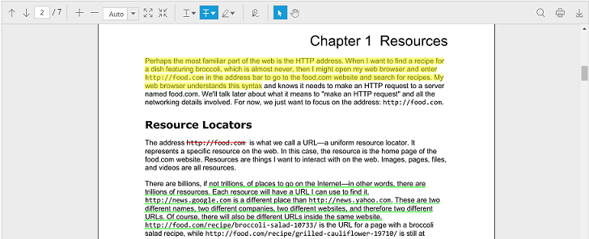
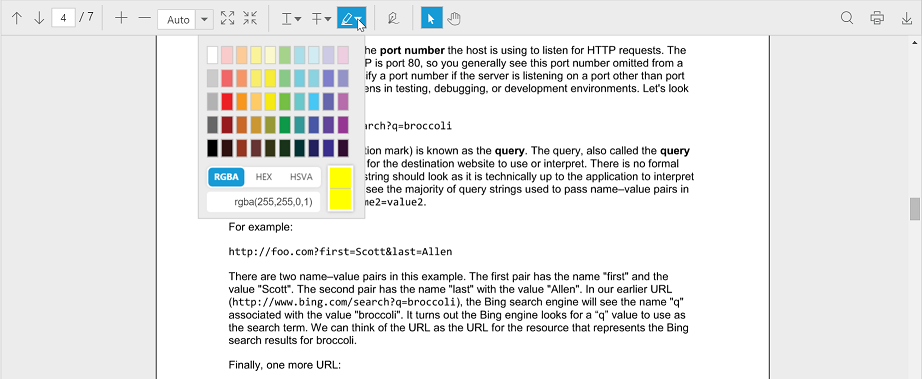
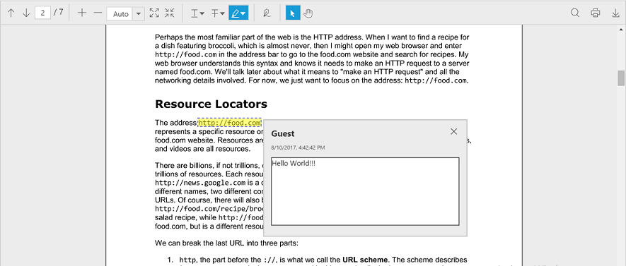
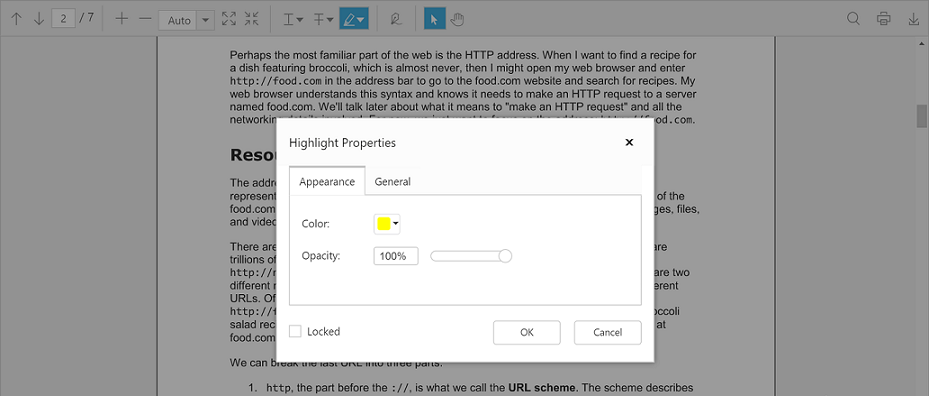

## Text Markup Annotation

The ejPdfViewer control supports adding text markup annotations in the PDF documents. The control also renders the existing text markup annotations from the PDF document when the document is loaded in it.

The text markup annotation tools in the default toolbar can be enabled or disabled using the [toolbarSettings](https://help.syncfusion.com/api/js/ejpdfviewer#toolbarsettings-object "toolbarSettings property") property.

The following code snippet describes how to show only the text markup annotation tools in the control.


$(function () { 
    var pdfviewerObject = $("#container").ejPdfViewer({serviceUrl: "../api/PdfViewerAPI", toolbarSettings: {toolbarItems : ej.PdfViewer.ToolbarItems.TextMarkupAnnotationTools}}); 
});


The following screenshot shows the PDF viewer with the PDF documents containing text markup annotations:

**Enable or Disable the text markup annotations**

The adding and modifying of the text markup annotations can be enabled or disabled using the [enableTextMarkupAnnotations](https://help.syncfusion.com/api/js/ejpdfviewer#enabletextmarkupannotations-boolean "enableTextMarkupAnnotations property") property.


$(function () { 
    $("#container").ejPdfViewer({serviceUrl: "../api/PdfViewerAPI", enableTextMarkupAnnotations: true}); 
});


The adding and modifying of the highlight annotations can be enabled or disabled using the [enableHighlightAnnotation](https://help.syncfusion.com/api/js/ejpdfviewer#enablehighlightannotation-boolean "enableHighlightAnnotation property") property.


$(function () { 
    $("#container").ejPdfViewer({serviceUrl: "../api/PdfViewerAPI", enableHighlightAnnotation: true}); 
});


The adding and modifying of the strikethrough annotations can be enabled or disabled using the [enableStrikethroughAnnotation](https://help.syncfusion.com/api/js/ejpdfviewer#enablestrikethroughannotation-boolean "enableStrikethroughAnnotation property") property.


$(function () { 
    $("#container").ejPdfViewer({serviceUrl: "../api/PdfViewerAPI", enableStrikethroughAnnotation: true}); 
});


The adding and modifying of the underline annotations can be enabled or disabled using the [enableUnderlineAnnotation](https://help.syncfusion.com/api/js/ejpdfviewer#enableunderlineannotation-boolean "enableUnderlineAnnotation property") property.


$(function () { 
    $("#container").ejPdfViewer({serviceUrl: "../api/PdfViewerAPI", enableUnderlineAnnotation: true}); 
});


**Providing settings for text markup annotations**

You can get or set the settings of the highlight annotations using the [highlightSettings](https://help.syncfusion.com/api/js/ejpdfviewer#members:highlightsettings "highlightSettings property") property. The highlightSettings property is used to set the [color](https://help.syncfusion.com/api/js/ejpdfviewer#highlightsettingscolor-string "Highlight color property"), [opacity](https://help.syncfusion.com/api/js/ejpdfviewer#highlightsettingsopacity-number "Highlight opacity property"), [author](https://help.syncfusion.com/api/js/ejpdfviewer#highlightsettingsauthor-string "Highlight author property"), [subject](https://help.syncfusion.com/api/js/ejpdfviewer#highlightsettingssubject-string "Highlight subject property"), [modifiedDate](https://help.syncfusion.com/api/js/ejpdfviewer#highlightsettingsmodifieddate-string "Highlight modifiedDate property"), and [isLocked](https://help.syncfusion.com/api/js/ejpdfviewer#highlightsettingsislocked-boolean "Highlight isLocked property") properties of the highlight annotations.


$(function () { 
    $("#container").ejPdfViewer({serviceUrl: "../api/PdfViewerAPI", highlightSettings: { color: "#ffff00", author: "Guest", opacity: 0.5, subject: "highlight", modifiedDate: "2017-03-27 12:00:51", isLocked: true }}); 
});


You can get or set the settings of the strikethrough annotations using the [strikethroughSettings](https://help.syncfusion.com/api/js/ejpdfviewer#strikethroughsettings-object "strikethroughSettings property") property. The strikethroughSettings property is used to set the [color](https://help.syncfusion.com/api/js/ejpdfviewer#strikethroughsettingscolor-string "Strikethrough color property"), [opacity](https://help.syncfusion.com/api/js/ejpdfviewer#strikethroughsettingsopacity-number "Strikethrough opacity property"), [author](https://help.syncfusion.com/api/js/ejpdfviewer#strikethroughsettingsauthor-string "Strikethrough author property"), [subject](https://help.syncfusion.com/api/js/ejpdfviewer#strikethroughsettingssubject-string "Strikethrough subject property"), [modifiedDate](https://help.syncfusion.com/api/js/ejpdfviewer#strikethroughsettingsmodifieddate-string "Strikethrough modifiedDate property"), and [isLocked](https://help.syncfusion.com/api/js/ejpdfviewer#strikethroughsettingsislocked-boolean "Strikethrough isLocked property") properties of the strikethrough annotations.


$(function () { 
    $("#container").ejPdfViewer({serviceUrl: "../api/PdfViewerAPI", strikethroughSettings: { color: "#ff0000", author: "Guest", opacity: 0.5, subject: "strikethrough", modifiedDate: "2017-03-27 12:00:51", isLocked: true}}); 
});


You can get or set the settings of the underline annotations using the [underlineSettings](https://help.syncfusion.com/api/js/ejpdfviewer#underlinesettings-object "underlineSettings property") property. The underlineSettings property is used to set the [color](https://help.syncfusion.com/api/js/ejpdfviewer#underlinesettingscolor-string "Underline color property"), [opacity](https://help.syncfusion.com/api/js/ejpdfviewer#underlinesettingsopacity-number "Underline opacity property"), [author](https://help.syncfusion.com/api/js/ejpdfviewer#underlinesettingsauthor-string "Underline property"), [subject](https://help.syncfusion.com/api/js/ejpdfviewer#underlinesettingssubject-string "Underline subject property"), [modifiedDate](https://help.syncfusion.com/api/js/ejpdfviewer#underlinesettingsmodifieddate-string "Underline modifiedDate property"), and [isLocked](https://help.syncfusion.com/api/js/ejpdfviewer#underlinesettingsislocked-boolean "Underline isLocked property") properties of the underline annotations.


$(function () { 
    $("#container").ejPdfViewer({serviceUrl: "../api/PdfViewerAPI", underlineSettings: { color: "#00ff00", author: "Guest", opacity: 0.5, subject: "underline", modifiedDate: "2017-03-27 12:00:51", isLocked: true}}); 
});


**Adding text markup annotations**

The text markup annotations are added to the PDF document using the text markup annotation tools provided in the toolbar of the ejPdfViewer control.

The annotations can be added to the PDF document from the client side using the [annotationType](https://help.syncfusion.com/api/js/ejpdfviewer#annotationtype-enum "annotationType property") property and [addAnnotation](https://help.syncfusion.com/api/js/ejpdfviewer#methods:addannotation "addAnnotation method") method.


var pdfviewerObj = $("#container").data("ejPdfViewer");
pdfviewerObj.addAnnotation(ej.PdfViewer.AnnotationType.Underline);


The colorpicker control is provided in the text markup annotation tools to select the desired color for the text markup annotation to be added in the document.

When the text markup annotation is added in the PDF document, the annotationAdd event will be triggered in the control. The event method can be defined using the [annotationAdd](https://help.syncfusion.com/api/js/ejpdfviewer#annotationadd "annotationAdd Event") property of the control.


$(function () { 
    $("#container").ejPdfViewer({serviceUrl: "../api/PdfViewerAPI", annotationAdd: "annotationAdded" }); 
});
function annotationAdded(args) {
    alert("A text markup annotation is added in the PDF document”);
}


**Adding notes to the text markup annotation**

The notes can be added to the text markup annotations using the context menu in the ejPdfViewer widget.

Right click the text markup annotation in the PDF document, the context menu will be opened in the ejPdfViewer control. You can select the option **Open Pop-up Note** to add the note to the annotation.

The following screenshot shows that the notes have been added to a text markup annotation in the PDF document.

**Editing the text markup annotation**

The properties of the text markup annotations in the PDF document can be edited using the properties window provided in the ejPdfViewer control. The color, opacity, author, and subject of the text markup annotation can be modified. The properties of the text markup annotation can also be locked using the locked checkbox in the properties window.

N> The isLocked property of the text markup annotation will lock the properties of the selected annotation. The property of the text markup annotation can be modified once the isLocked property is disabled.

When a property of the text markup annotation is changed in the PDF viewer control, annotationPropertiesChange event will be triggered in the control. The event method can be defined using the [annotationPropertiesChange](https://help.syncfusion.com/api/js/ejpdfviewer#annotationpropertieschange "annotationPropertiesChange property") property of the control.


$(function () { 
    $("#container").ejPdfViewer({serviceUrl: "../api/PdfViewerAPI", annotationPropertiesChange: "annotationPropertiesChanged"}); 
});
function annotationPropertiesChanged(args) {
    alert("The properties of a text markup annotation is modified in the PDF viewer”);
}


The following screenshot shows the properties window used for editing the properties of a text markup annotation:

The text markup annotations in the PDF document can also be deleted from the PDF document.

The annotationDelete event will be triggered in the control when the text markup annotation in the PDF document is deleted. The event method can be defined using the [annotationDelete](https://help.syncfusion.com/api/js/ejpdfviewer#annotationremove "annotationDelete property") property of the control.


$(function () { 
    $("#container").ejPdfViewer({serviceUrl: "../api/PdfViewerAPI", annotationDelete: "annotationDeleted"}); 
});
function annotationDeleted(args) {
    alert("A text markup annotation is deleted in the PDF document”);
}


You can undo and redo the changes made to text markup annotations included in the PDF documents using the [undo()](https://help.syncfusion.com/api/js/ejpdfviewer#undo "undo method") and the [redo()](https://help.syncfusion.com/api/js/ejpdfviewer#redo "redo method") methods.


function undoChanges() {
    $(“#pdfviewer”).data(“ejPdfViewer”).undo();
}

function redoChanges() {
    $(“#pdfviewer”).data(“ejPdfViewer”).redo();
}


**Saving the text markup annotation**

When the download tool is selected in the toolbar, the text markup annotations will be saved in the PDF document. This action will not affect the original document.

**Printing the text markup annotation**

When the print tool is selected in the toolbar, the PDF document will be printed along with the text markup annotations added to the pages. This action will not affect the original document.
