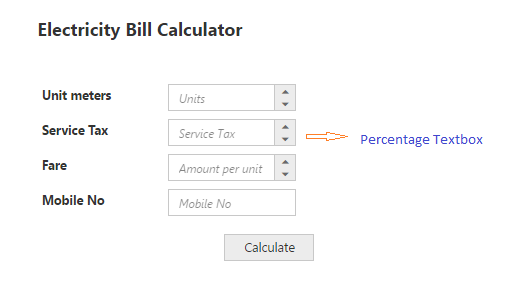
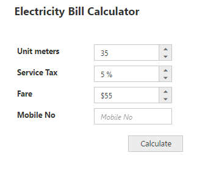
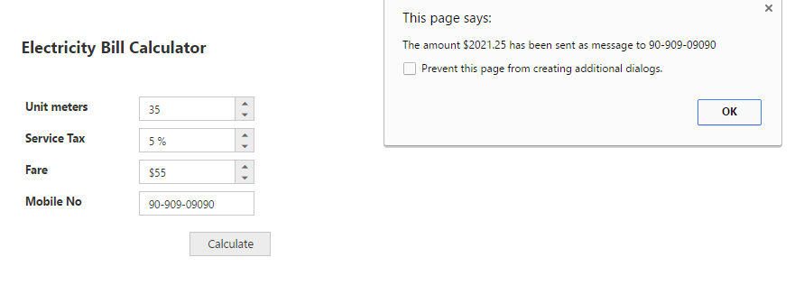

# Getting Started

This section explains briefly about how to create a **Editors** control in your application with **JavaScript**. From the following steps you can learn how to create and use **PercentageTextBox** in your application. Here we have showcased, a small Electric bill calculator application using **Editors** widgets. The **Essential JavaScript Editors** control includes Numeric, Percentage and Currency textbox controls. You will learn how to use our JS textboxes widgets in the Electric bill calculator Application from the following documentation. This will guide you to use the wide range functionalities of textbox widgets features to complete this application. 

 

## Create Textboxes Widgets

Create an **HTML** file and add the following template to the HTML file for Textbox widget creation.



<!DOCTYPE html>
<html>
<head>
    <meta name="viewport" content="width=device-width, initial-scale=1.0" charset="utf-8" />
    <!-- style sheet for default theme(flat azure) -->
    <link href="http://cdn.syncfusion.com/{{ site.releaseversion }}/js/web/flat-azure/ej.web.all.min.css" rel="stylesheet" />

    <!--scripts-->
    
    
</head>
<body>
    <!--adds Textboxes elements here -->
</body>
</html>



Add necessary input elements to render **Textbox widget**.



Electricity Bill Calculator

 
<table class="editors">
    <tbody>
        <tr>
            <td>
                <label>Unit meters</label>
            </td>
            <td>
                <input id="unitCalc" type="text" />
            </td>
        </tr>
        <tr>
            <td>
                <label>Service Tax</label>
            </td>
            <td>
                <input id="service" type="text" />
            </td>
        </tr>
        <tr>
            <td>
                <label>Fare</label>
            </td>
            <td>
                <input id="amountPerUnit" type="text" />
            </td>
        </tr>
        <tr>
            <td>
                <label>Mobile No</label>
            </td>
            <td>
                <input id="mobileNo" type="text" />
            </td>
        </tr>
    </tbody>
</table>

    <button class="e-btn" id="calcBill">Calculate</button>



Initialize the **Textboxes widget** as shown in the following section.



        // Declares Necessary variable creation 
        $(function () {
            // document ready
            // simple Numeric creation
            $("#unitCalc").ejNumericTextbox({
                watermarkText: "Units" // set watermark in numeric
            });
            // simple Percentage creation
            $("#service").ejPercentageTextbox({
                watermarkText: "Service Tax" // sets watermark in percentage
            });
            // simple Currency creation
            $("#amountPerUnit").ejCurrencyTextbox({
                watermarkText: "Amount per unit" // sets watermark in currency                       
            });
            // simple MaskEdit creation
            $("#mobileNo").ejMaskEdit({
                watermarkText: "Mobile No" // sets watermark in mask edit
            });

            // simple Button creation
            $("#calcBill").ejButton({
                width: "100px",
                height: "30px",
            });
        });







The following screenshot displays the output when the above code is executed. 

 

## Set the MinValue, MaxValue and value in Textboxes

You can set the **“MinValue”,** **“MaxValue”** and **“Value”** in Numeric, Percentage and Currency text boxes for maintaining the range in Textboxes widgets. In this scenario, you have to enter the values between the given ranges.The following code example illustrates how to achieve this.



        // Declares the Necessary variable creation 
        $(function () {
            // document ready
            // simple Numeric creation
            $("#unitCalc").ejNumericTextbox({
                watermarkText: "Units", // sets watermark in numeric
                value: 35, // sets value in the numeric
                minValue: 1,// sets min value for range 
                maxValue: 10000 // sets max value for range
            });
            // simple Percentage creation
            $("#service").ejPercentageTextbox({
                watermarkText: " Service Tax", // sets watermark in percentage
                value: 3, // sets value by default 
                minValue: 5, // sets min value for calculation
                maxValue: 100// sets max value for calculation
            });
            // simple Currency creation
            $("#amountPerUnit").ejCurrencyTextbox({
                watermarkText: " Amount per unit", //sets watermark in currency
                value: 55, // sets value by default
                minValue: 5, // sets min value for amount
                maxValue: 55// sets max value for amount
            });
            // simple MaskEdit creation
            $("#mobileNo").ejMaskEdit({
                watermarkText: "Mobile No", // sets watermark in mask edit
                maskFormat: "99-999-99999"// sets the mask format in mask edit
            });
            // simple Button creation
            $("#calcBill").ejButton({
                width: "100px",
                height: "30px",
            });
        });



The following screenshot illustrates the output of the above code examples.

 

## Set the Strict Mode Option

You can set the “**enableStrictMode” option** to restrict entering values defined outside the range. The following code example illustrates how to set **enableStrictMode** option. 



        // Declares Necessary variable creation 
        $(function () {
            // simple Numeric creation
            $("#unitCalc").ejNumericTextbox({
                watermarkText: "Units", // sets watermark in numeric
                value: 35, // sets value in the numeric
                minValue: 1, // sets min value for range 
                maxValue: 10000, // sets max value for range
            });
            // simple Percentage creation
            $("#service").ejPercentageTextbox({
                watermarkText: " Service Tax", // sets watermark in percentage
                value: 5, // sets value by default 
                minValue: 3, // sets min value for calculation
                maxValue: 100// sets max value for calculation
                enableStrictMode: true // sets strict mode to true will set the value 
            });
            // simple Currency creation
            $("#amountPerUnit").ejCurrencyTextbox({
                watermarkText: " Amount per unit", // sets watermark in currency
                value: 55, // sets value by default
                minValue: 5, // sets min value for amount
                maxValue: 55// sets max value for amount
            });
            // simple MaskEdit creation
            $("#mobileNo").ejMaskEdit({
                watermarkText: "Mobile No", // sets watermark in MaskEdit
                maskFormat: "99-999-99999"// sets the mask format
            });
            // Simple Button creation
            $("#calcBill").ejButton({
                width: "100px",
                height: "30px",
            });
        });



Run the above code example and you can see that it restricts entering a value exceeding the **minValue** and **maxValue** range mentioned in the Numeric textbox. 

## Set Calculation process with Textboxes Widgets

You can use events to calculate the total and display the value. You can achieve this with the help of “click” event in the button widget. The calculation steps have to be written in the call back function of button’s “click” event.



        // Declares Necessary variable creation 
        var unitMeter, serviceTax, amountPerKm;
        $(function () {
            // Refers to the Textboxes customization section
            // Simple Button creation
            $("#calcBill").ejButton({
                click: "calculateBill",
                width: "100px",
                height: "30px",
            });
            unitMeter = $("#unitCalc").data("ejNumericTextbox");// Object of Numeric 
            serviceTax = $("#service").data("ejPercentageTextbox");// Object of Percentage
            amountPerKm = $("#amountPerUnit").data("ejCurrencyTextbox"); // Object of Currency
            mobileNumber = $("#mobileNo").data("ejMaskEdit"); // Object of MaskEdit
        });
        // Simple Bill amount calculation.
        function calculateBill() {
            // This is used to calculate the Net amount
            var netAmount = unitMeter.model.value * amountPerKm.model.value;
            // This is used to calculate the service tax amount
            var sTax = (netAmount * serviceTax.model.value) / 100;
            // This shows the calculated amount for the units
            alert("The amount $" + (netAmount + sTax) + " has been sent as message to " + mobileNumber.model.value + ".");
        }



Run the above code example, fill the required Textbox fields and click the Calculate button. The values are displayed and an alert message is shown. The following screenshot illustrates the final output of the Electricity bill calculator. 

 