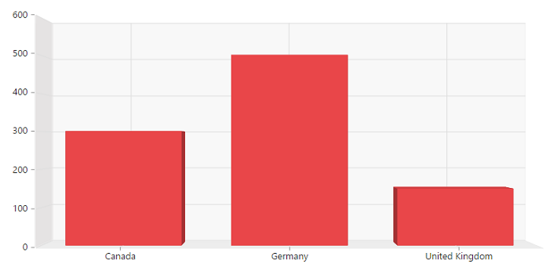
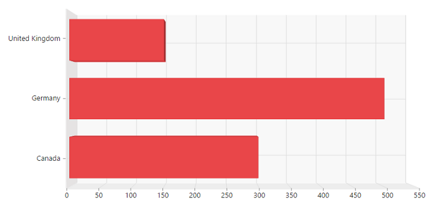
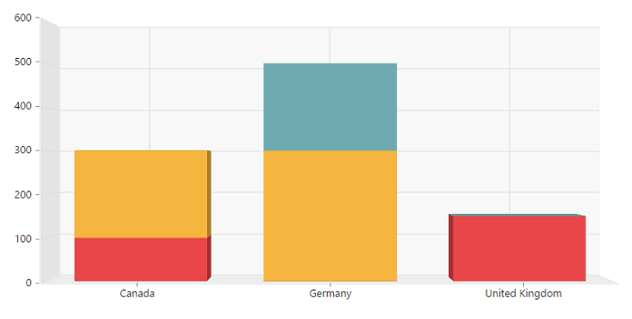
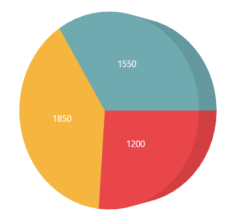
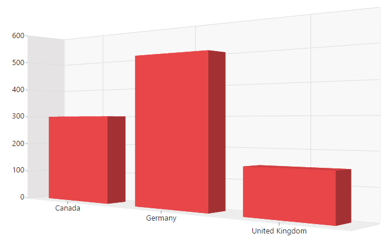

# 3D visualization in PivotChart

The pivot chart control allows you to view the data in a 3D view. The following are the chart types that are supported:

* Bar
* Column
* Stacking bar
* Stacking column
* Pie

## 3D column chart

The 3D column chart is rendered by specifying the chart type as **“Column”** in the **“type”** enumeration property of [`commonSeriesOptions`](/api/js/ejpivotchart#members:commonseriesoptions) and setting the [`enable3D`](/api/js/ejpivotchart#members:enable3d) property to **“true”.**



    $("#PivotChart1").ejPivotChart(
    {
        .....
        .....
        //Enable 3D Chart
        enable3D: true,
        commonSeriesOptions:
        {
            //Setting chart type to column
            type: ej.PivotChart.ChartTypes.Column
        }
    });


## 3D bar chart

The 3D bar chart is rendered by specifying the chart type as **“Bar”** in the **“type”** enumeration property of [`commonSeriesOptions`](/api/js/ejpivotchart#members:commonseriesoptions) and setting the  [`enable3D`](/api/js/ejpivotchart#members:enable3d) property to **“true”.**



    $("#PivotChart1").ejPivotChart(
    {
        .....
        .....
        //Enable 3D Chart
        enable3D: true,
        commonSeriesOptions:
        {
            //Setting chart type to bar
            type: ej.PivotChart.ChartTypes.Bar
        }
    });


## 3D stacking bar chart
The 3D stacking bar chart is rendered by specifying the chart type as **“Stacking Bar”** in the **“type”** enumeration property of [`commonSeriesOptions`](/api/js/ejpivotchart#members:commonseriesoptions) and setting the [`enable3D`](/api/js/ejpivotchart#members:enable3d) property to **“true”.**



    $("#PivotChart1").ejPivotChart(
    {
        .....
        .....
        //Enable 3D Chart
        enable3D: true,
        commonSeriesOptions:
        {
            //Setting chart type to stacking bar
            type: ej.PivotChart.ChartTypes.StackingBar
        }
    });


## 3D stacking column chart
The 3D stacking column chart is rendered by specifying the chart type as **“Stacking Column”** in the **“type”** enumeration property of [`commonSeriesOptions`](/api/js/ejpivotchart#members:commonseriesoptions) and setting the [`enable3D`](/api/js/ejpivotchart#members:enable3d) property to **“true”.**



    $("#PivotChart1").ejPivotChart(
    {
        .....
        .....
        //Enable 3D Chart
        enable3D: true,
        commonSeriesOptions:
        {
            //Setting chart type to stacking column
            type: ej.PivotChart.ChartTypes.StackingColumn
        }
    });


## 3D pie chart
Th 3D pie chart is rendered by specifying the chart type as **"Pie"** in the **“type”** enumeration property of [`commonSeriesOptions`](/api/js/ejpivotchart#members:commonseriesoptions) and setting the [`enable3D`](/api/js/ejpivotchart#members:enable3d) property to **“true”.**



    $("#PivotChart1").ejPivotChart(
    {
        .....
        .....
        //Enable 3D Chart
        enable3D: true,
        commonSeriesOptions:
        {
            //Setting chart type to pie
            type: ej.PivotChart.ChartTypes.Pie
        }
    });


## Rotating 3D chart
You can rotate the 3D chart towards left or right by setting an appropriate angle value to the [`rotation`](/api/js/ejpivotchart#members:rotation) property. The direction of the chart display depends on the positive or negative angle value.



    $("#PivotChart1").ejPivotChart(
    {
        .....
        .....
        //Enable 3D Chart
        enable3D: true,
        //Rotates the 3D Chart
        rotation: 40
    });



