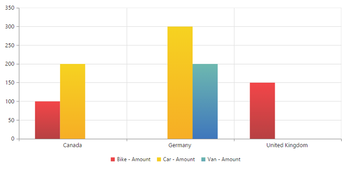
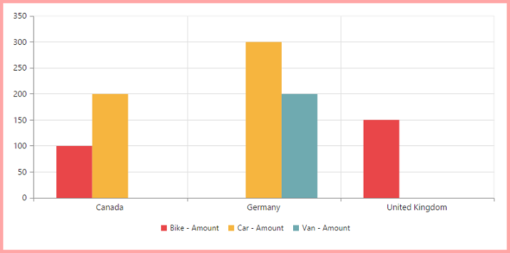
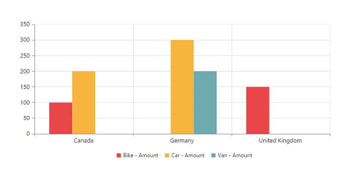
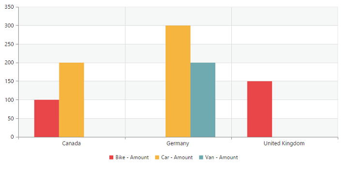

# Appearance

## Built-in themes

The following are the built-in themes available in the pivot chart:

* flatlight
* gradientlight
* gradientdark
* azure
* azuredark
* lime
* limedark
* saffron
* saffrondark
* gradientlight
* gradientdark
* highcontrast01
* highcontrast02
* material
* office365
* bootstrap

By using the [`theme`](/api/js/ejchart#members:theme) property, you can set the desired theme in the pivot chart. By default, the **“flatlight”** theme is applied to the pivot chart.



    $(function()
    {
        $("#PivotChart1").ejPivotChart(
        {
            //....
            //Applying gradient theme
            theme: "gradientlight",
            //....
        });
    });


## Pivot chart - area customization

### Border customization
To customize the pivot chart border, use the [`border`](/api/js/ejchart#members:border) property in the pivot chart.



    $(function()
    {
        $("#PivotChart1").ejPivotChart(
        {
            //....
            //Customize the Chart border and opacity
            border:
            {
                color: "#FF0000",
                width: 5,
                opacity: 0.35
            },
            //....
        });
    });


### Margin customization
The [`margin`](/api/js/ejchart#members:margin) property of the pivot chart control is used to add a margin to the chart area at the left, right, top, and bottom of the chart.



    $(function()
    {
        $("#PivotChart1").ejPivotChart(
        {
            //....
            //Change Chart margin to left, right, top and bottom.
            margin:
            {
                left: 40,
                right: 40,
                top: 40,
                bottom: 40
            },
            //....
        });
    });


### Background customization
The pivot chart control background can be customized by using the [`background`](/api/js/ejchart#members:chartarea-background) property in the chart area.



    $(function()
    {
        $("#PivotChart1").ejPivotChart(
        {
            //....
            chartArea:
            {
                //Setting background for Chart area
                background: "skyblue"
            },
            //....
        });
    });


### Grid bands customization
By using the [`alternateGridBand`](/api/js/ejchart#members:primaryxaxis-alternategridband) property of the axis, you can provide different colors for grid rows and columns that are formed by the grid lines in the chart area. The [`odd`](/api/js/ejchart#members:primaryyaxis-alternategridband-odd) and [`even`](/api/js/ejchart#members:primaryyaxis-alternategridband-even) properties are used to customize the grid bands at odd and even positions respectively.



    $(function()
    {
        $("#PivotChart1").ejPivotChart(
        {
            //....
            primaryYAxis:
            {
                //....
                //Customizing horizontal grid bands at even position
                alternateGridBand:
                {
                    even:
                    {
                        fill: "#A7A9AB",
                        opacity: 0.1,
                    }
                },
                //....
            },
            //....
        });
    });


### Animation
You can enable the animation by using the [`enableAnimation`](/api/js/ejchart#members:commonseriesoptions-enableanimation) property under the [`commonSeriesOptions`](/api/js/ejchart#members:commonseriesoptions) of the pivot chart control. It animates the chart series on two occasions - when the chart is loaded for the first time, and when the series type is changed by using the “type” property.



    $(function()
    {
        $("#PivotChart1").ejPivotChart(
        {
            ....
            commonSeriesOptions:
            {
                //Enabling animation in series
                enableAnimation: true,
                //....
            },
            //....
        });
    });

