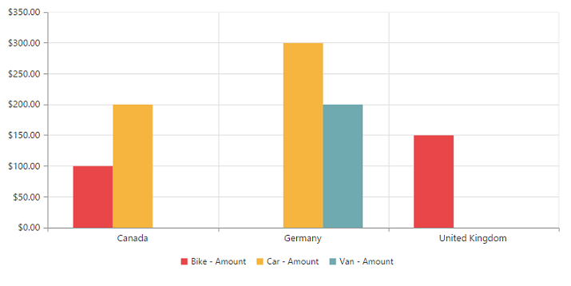
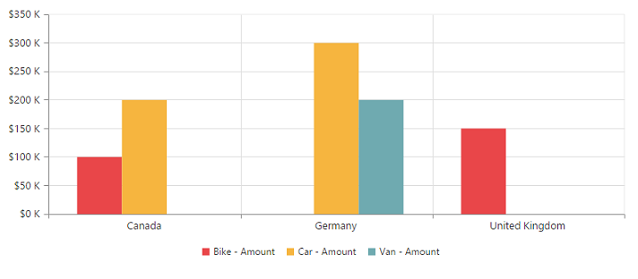
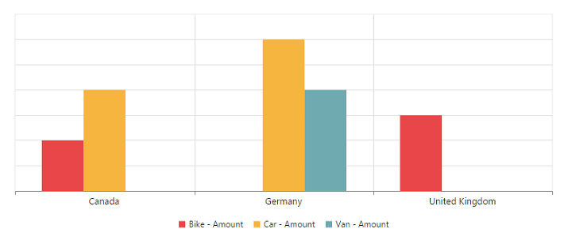
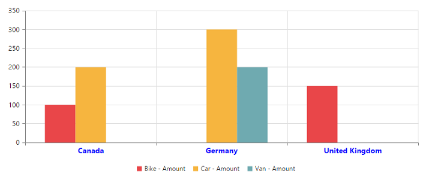
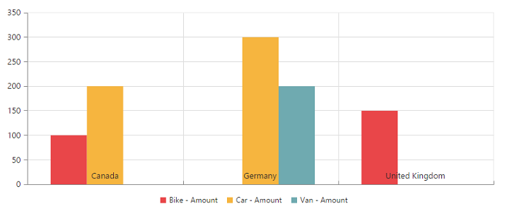
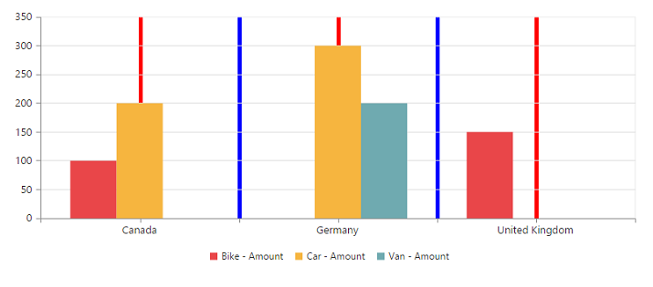
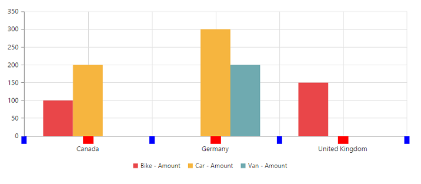
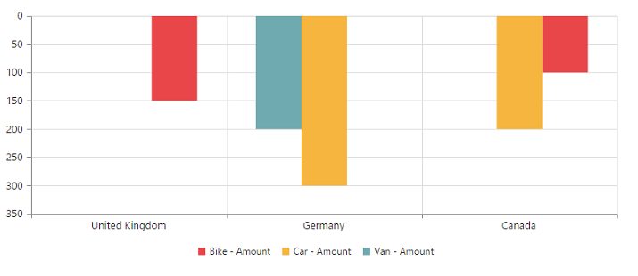
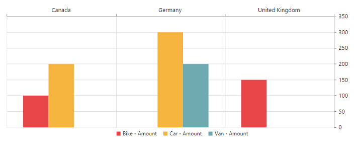
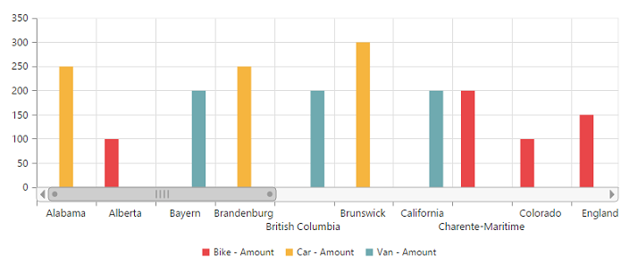

# Axes

## Label format

### Format numeric labels
By using the [`labelFormat`](/api/js/ejchart#members:primaryyaxis-labelformat) property, you can format the numeric labels. Numeric values can be formatted with n (number with decimal points), c (currency), and p (percentage) commands.



    $(function()
    {
        $("#PivotChart1").ejPivotChart(
        {
            //...
            primaryYAxis:
            {
                //...
                //Applying currency format to Y-Axis labels
                labelFormat: 'c'
            }
        });
    });


The following table describes the result of applying some commonly used label formats to numeric values.

<table>
<tr>
<th>Label Value</th>
<th>Label Format Property Value</th>
<th>Result</th>
<th>Description</th>
</tr>
<tr>
<td>1000</td>
<td>n1</td>
<td>1000.0</td>
<td>The Number is rounded to 1 decimal place</td>
</tr>
<tr>
<td>1000</td>
<td>n2</td>
<td>1000.00</td>
<td>The Number is rounded to 2 decimal place</td>
</tr>
<tr>
<td>1000</td>
<td>n3</td>
<td>1000.000</td>
<td>The Number is rounded to 3 decimal place</td>
</tr>
<tr>
<td>0.01</td>
<td>p1</td>
<td>1.0%</td>
<td>The Number is converted to percentage with 1 decimal place</td>
</tr>
<tr>
<td>0.01</td>
<td>p2</td>
<td>1.00%</td>
<td>The Number is converted to percentage with 2 decimal place</td>
</tr>
<tr>
<td>0.01</td>
<td>p3</td>
<td>1.000%</td>
<td>The Number is converted to percentage with 3 decimal place</td>
</tr>
<tr>
<td>1000</td>
<td>c1</td>
<td>$1,000.0</td>
<td>The Currency symbol is appended to number and number is rounded to 1 decimal place</td>
</tr>
<tr>
<td>1000</td>
<td>c2</td>
<td>$1,000.00</td>
<td>The Currency symbol is appended to number and number is rounded to 2 decimal place</td>
</tr>
</table>

### Label format customization
By using the [`labelFormat`](/api/js/ejchart#members:primaryyaxis-labelformat) property of the [`primaryYAxis`](/api/js/ejpivotchart#members:primaryyaxis), you can add the category labels with prefix and/or suffix.



    $(function()
    {
        $("#PivotChart1").ejPivotChart(
        {
            //...
            primaryYAxis:
            {
                //...
                //Adding prefix and suffix to Y-axis labels
                labelFormat: '${value} K'
            }
        });
    });


## Common axis features

### Axis visibility
The axis visibility can be set by using the [`visible`](/api/js/ejchart#members:primaryyaxis-visible) property of the respective axis.

N> By default, the value of the [`visible`](/api/js/ejchart#members:primaryyaxis-visible) property is true in the pivot chart.



    $(function()
    {
        $("#PivotChart1").ejPivotChart(
        {
            //...
            primaryYAxis:
            {
                //...
                //Disabling visibility of Y-axis
                visible: false
            }
        });
    });


### Label customization
By using the [`font`](/api/js/ejchart#members:primaryxaxis-font) property of the [`axis`](/api/js/ejpivotchart#members:primaryxaxis), you can customize the font family, color, opacity, size, and font weight of labels.



    $(function()
    {
        $("#PivotChart1").ejPivotChart(
        {
            //...
            primaryXAxis:
            {
                //Customizing label appearance
                font:
                {
                    fontFamily: 'Segoe UI',
                    size: '14px',
                    fontWeight: 'bold',
                    color: 'blue'
                }
            }
        });
    });


### Label and tick positioning
Axis labels and ticks can be positioned inside or outside the chart area by using the [`labelPosition`](/api/js/ejchart#members:primaryxaxis-labelposition) and [`tickLinesPosition`](/api/js/ejchart#members:primaryxaxis-ticklinesposition) properties. The labels and ticks are positioned outside the chart area, by default.



    $(function()
    {
        $("#PivotChart1").ejPivotChart(
        {
            //...
            primaryXAxis:
            {
                //Customizing label and tick positions
                labelPosition: 'inside',
                tickLinesPosition: 'inside'
            }
        });
    });


### Grid lines customization
By using the [`majorGridLines`](/api/js/ejchart#members:primaryxaxis-majorgridlines) and the [`minorGridLines`](/api/js/ejchart#members:primaryxaxis-minorgridlines) properties of the axis, you can customize the width, color, visibility, and opacity of the grid lines.

N> By default, minor grid lines are not visible in the pivot chart.



    $(function()
    {
        $("#PivotChart1").ejPivotChart(
        {
            //...
            primaryXAxis:
            {
                //Customizing Grid Lines
                majorGridLines:
                {
                    color: 'blue',
                    visible: true,
                    width: 5
                },
                minorTicksPerInterval: 1,
                minorGridLines:
                {
                    color: 'red',
                    visible: true,
                    width: 5
                }
            }
        });
    });


### Tick lines customization
By using the [`majorTickLines`](/api/js/ejchart#members:primaryxaxis-majorticklines) and the [`minorTickLines`](/api/js/ejchart#members:primaryxaxis-minorgridlines) properties of the axis, you can customize the width, color, visibility, size, and opacity of the tick lines.

N> By default, minor tick lines are not visible in the pivot chart.



    $(function()
    {
        $("#PivotChart1").ejPivotChart(
        {
            //...
            primaryXAxis:
            {
                //Customizing Tick Lines
                majorTickLines:
                {
                    color: 'blue',
                    visible: true,
                    width: 10,
                    size: 15,
                },
                minorTicksPerInterval: 1,
                minorTickLines:
                {
                    color: 'red',
                    visible: true,
                    width: 20,
                    size: 15
                }
            }
        });
    });


### Inversing axes
Axes can be inversed by using the [`isInversed`](/api/js/ejchart#members:primaryxaxis-isinversed) property of the respective axis.

N> By default, the [`isInversed`](/api/js/ejchart#members:primaryyaxis-isinversed) property is false in the pivot chart.



    $(function()
    {
        $("#PivotChart1").ejPivotChart(
        {
            //...
            primaryXAxis:
            {
                //Inversing the X-axis
                isInversed: true
            },
            primaryYAxis:
            {
                //Inversing the Y-axis
                isInversed: true
            }
        });
    });


### Placing axes at opposite side
The [`opposedPosition`](/api/js/ejchart#members:primaryxaxis-opposedposition) property of the chart axis can be used to place the axis in the opposite direction from its default position.

N> By default, the [`opposedPosition`](/api/js/ejchart#members:primaryyaxis-opposedposition) property is false in the pivot chart.



    $(function()
    {
        $("#PivotChart1").ejPivotChart(
        {
            //...
            primaryXAxis:
            {
                //Placing X-axis at the opposite side of its normal position
                opposedPosition: true
            },
            primaryYAxis:
            {
                //Placing Y-axis at the opposite side of its normal position
                opposedPosition: true
            }
        });
    });


## Smart axis labels

When the axis labels overlap with each other based on the chart dimensions and label size, you can use the [`labelIntersectAction`](/api/js/ejchart#members:primaryxaxis-labelintersectaction) property of the axis to avoid overlapping.

N> By default, the [`labelIntersectAction`](/api/js/ejchart#members:primaryxaxis-labelintersectaction) property is none in the pivot chart.

The following options are supported for the `labelIntersectAction` property:

* rotate45
* rotate90
* trim
* multipleRows
* wrap
* hide.



    $(function()
    {
        $("#PivotChart1").ejPivotChart(
        {
            //...
            // Avoid overlapping of X-axis labels
            primaryXAxis:
            {
                labelIntersectAction: 'multipleRows'
            }
        });
    });



