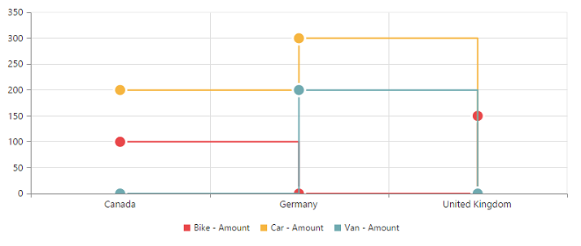

# Chart Types

Essential **PivotChart JS** supports 17 different types of chart as follows:

   * Column
   * Stacking Column
   * Bar
   * Stacking Bar
   * Line
   * Step Line
   * Spline
   * Area
   * Step Area
   * Spline Area
   * Stacking Area
   * Pie
   * Doughnut
   * Pyramid
   * Funnel
   * Scatter
   * Bubble

## Column Chart

**Column Chart** is the most commonly used chart type. It uses vertical bars (called columns) to display different values of one or more items. Points from adjacent series are drawn as bars next to each other. It is used to compare the frequency, count, total or average of data in different categories. It is ideal to show the variations in the value of an item over a period of time.


    
    $("#PivotChart1").ejPivotChart({
        //...
        commonSeriesOptions: {
            type: ej.PivotChart.ChartTypes.Column
        }
    });


The following screenshot displays a **Column Chart**.

## Stacking Column Chart

**Stacking Column** Chart is similar to column charts except the Y-values. These Y-values stack on top of each other in a specified series order. This helps to visualize the relationship of parts to whole across categories.



    $("#PivotChart1").ejPivotChart({
        //...
        commonSeriesOptions: {
            type: ej.PivotChart.ChartTypes.StackingColumn
        }
    });


The following screenshot displays the **Stacking Column Chart**.

## Bar Chart

The **Bar Chart** displays horizontal bars for each point in the series and points from adjacent series. Bar charts are used to compare values across categories, for displaying the variations in the value of an item over time or for comparing the values of several items at a single point in time.



    $("#PivotChart1").ejPivotChart({
        //...
        commonSeriesOptions: {
            type: ej.PivotChart.ChartTypes.Bar
        }
    });


The following screenshot displays a **Bar Chart**.

## Stacking Bar Chart

**Stacking Bar Chart** is a regular **bar** chart with the X-values stacked on top of each other in the specified series order.



    $("#PivotChart1").ejPivotChart({
        //...
        commonSeriesOptions: {
            type: ej.PivotChart.ChartTypes.StackingBar
        }    
    });


The following screenshot displays the **Stacking Bar Chart.**

 

## Line Chart

The **Line Chart** joins the data points on a plot using straight lines that show trends in data at equal intervals.



    $("#PivotChart1").ejPivotChart({
        //...
        commonSeriesOptions: {
            type: ej.PivotChart.ChartTypes.Line
        }  
    });


The following screenshot displays the **Line Chart**.

## Step Line Chart

**Step Line Chart** uses horizontal and vertical lines to connect the data points resulting in a step like progression. 



    $("#PivotChart1").ejPivotChart({
        //...
        commonSeriesOptions: {
            type: ej.PivotChart.ChartTypes.StepLine
        }
    });


The following screenshot displays the **Step Line Chart.**

## Spline Chart

The **Spline Chart** is similar to line chart where as it connects different data points using curved lines instead of straight lines.



    $("#PivotChart1").ejPivotChart({
        //...
        commonSeriesOptions: {
            type: ej.PivotChart.ChartTypes.Spline
        }   
    });


The following screenshot displays the **Spline Chart**.

## Area Chart

**Area Chart** emphasizes the degree of change of values over a period of time. Instead of rendering data as discrete bars or columns, an area chart renders it in a continuous ebb-and-flow pattern as defined against the y-axis.



    $("#PivotChart1").ejPivotChart({
        //...
        commonSeriesOptions: {
            type: ej.PivotChart.ChartTypes.Area
        }   
    });


The following screenshot displays the **Area Chart**.

## Step Area Chart

**Step Area** chart is similar to the regular area chart except for a straight line tracing the shortest path between the data points. The values are connected by continuous vertical and horizontal lines forming a step like progression.



    $("#PivotChart1").ejPivotChart({
        //...
        commonSeriesOptions: {
            type: ej.PivotChart.ChartTypes.StepArea
        }   
    });


The following screenshot displays a **Step Area Chart.**

## Spline Area Chart

**Spline Area** chart is similar to Area Chart with the difference in which the data points of a series are connected. It connects each series of points by a smooth **spline curve**.



    $("#PivotChart1").ejPivotChart({
        //...
        commonSeriesOptions: {
            type: ej.PivotChart.ChartTypes.SplineArea
        }    
    });


The following Screenshot displays a **Spline Area Chart.**

## Stacking Area Chart

**Stacking Area** chart is similar to regular area chart except the “Y-values”. These “Y-values” stack on top of each other in the specified series order. This helps to visualize the relationship of parts to whole across categories.



    $("#PivotChart1").ejPivotChart({
        //...
        commonSeriesOptions: {
            type: ej.PivotChart.ChartTypes.StackingArea
        }  
    });


The following screenshot displays a **Stacking Area Chart.**

## Pie Chart

A **Pie chart** is used to summarize a set of categorical data or displaying different values of a given variable (e.g., percentage distribution). This type of chart is a circle divided into a series of segments. Each segment represents a particular category.



    $("#PivotChart1").ejPivotChart({
        //...
        commonSeriesOptions: {
            type: ej.PivotChart.ChartTypes.Pie
        }
    });


The following screenshot displays a **Pie Chart**.

## Doughnut Chart

A **Doughnut chart** is also used to summarize a set of categorical data which possesses a doughnut like structure divided into a series of segments. Each segment represents a particular category.



    $("#PivotChart1").ejPivotChart({
        //...
        commonSeriesOptions: {
            type: ej.PivotChart.ChartTypes.Doughnut
        }
    });


The following screenshot displays a **Doughnut Chart**.

## Pyramid Chart

The **Pyramid Chart** type displays the data in the form of a triangle. It helps you to visualize data in a hierarchical structure without any axes.



    $("#PivotChart1").ejPivotChart({
        //...
        commonSeriesOptions: {
            type: ej.PivotChart.ChartTypes.Pyramid
        }    
    });


The following screen shot displays the **Pyramid Chart.**

## Funnel Chart

The **Funnel Chart**  type displays the data in the form of an inverted triangle. It helps you to visualize data in a hierarchical structure without any axes.



    $("#PivotChart1").ejPivotChart({
        //...
        commonSeriesOptions: {
            type: ej.PivotChart.ChartTypes.Funnel
        }   
    });


The following screen shot displays the **Funnel Chart.**

## Scatter Chart

The **Scatter Chart**  type displays the data as a collection of points corresponding to the associated values.



    $("#PivotChart1").ejPivotChart({
        //...
        commonSeriesOptions: {
            type: ej.PivotChart.ChartTypes.Scatter
        }   
    });


The following screen shot displays the **Scatter Chart.**

 

## Bubble Chart

The **Bubble Chart**  type displays the data as a collection of bubbles.



    $("#PivotChart1").ejPivotChart({
        //...
        commonSeriesOptions: {
            type: ej.PivotChart.ChartTypes.Bubble
        }   
    });


The following screen shot displays the **Bubble Chart.**

##Combination Chart

A **combination Chart** combines two or more series types in a single Chart. But there are some limitations in the combination Chart. They are:

   1. Can’t combine Column and Bar series.
   2. Pie Chart can’t be used with other series types.



    $(function() {
        $("#PivotChart1").ejPivotChart({
            //...
            commonSeriesOptions: {
                type: ej.PivotChart.ChartTypes.Line
            },
            seriesRendering: "onSeriesRenders"
        });
    });

    function onSeriesRenders(args) {
        this.model.series[5].type = ej.PivotChart.ChartTypes.Column;
        this.model.series[5].marker.visible = true;
    }


