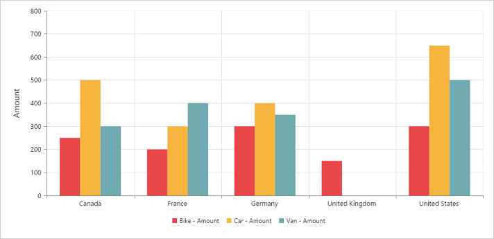
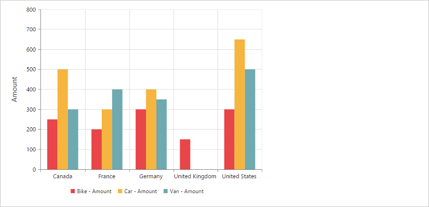

# Dimensions

## Set size in percentage

You can customize the pivot chart dimension under [`size`](/api/js/ejpivotchart#members:size) property by setting the width and height of the widget in percentage.



<body>
    

    
</body>



## Set size in pixels

You can customize the pivot chart dimension under [`size`](/api/js/ejpivotchart#members:size) property by setting the width and height of the widget in pixels.



<body>
    

    
</body>



 

## Responsive

The pivot chart widget supports responsive rendering based on the target device (desktop & tablet) resolution. It supports resolution upto 1024x600. You can enable responsiveness in pivot chart by setting [`isResponsive`](/api/js/ejpivotchart#members:isresponsive) property to true.



<body>
    

    
</body>



_Normal View_

_ResponsiveView_