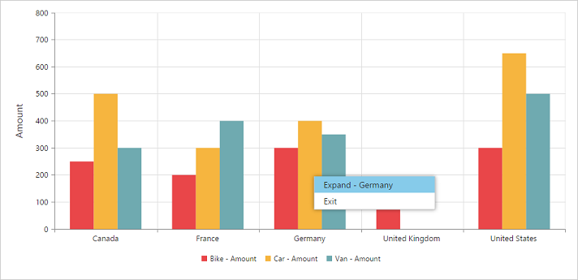
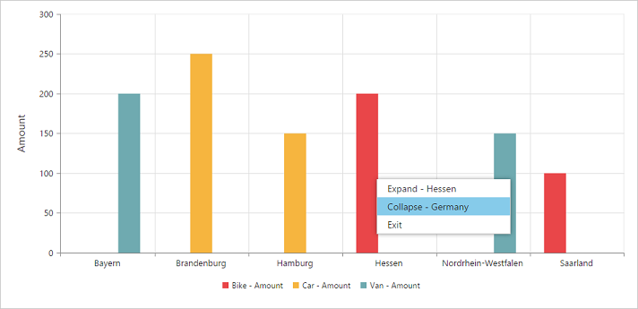

# Drill operation in PivotChart

This is a basic feature of the pivot chart control through which the amount of information can be limited for a better view. It allows you to drill down to access the detailed level of data or drill up to see the summarized data by using the context menu present in the pivot chart.

Drill up, also called roll up, navigates from the inner most level (having detailed information about member) to any other outer levels by climbing up a concept hierarchy for a dimension.

Drill down, also called roll down, is the reverse of drill up. It navigates from the outer level to inner most level by climbing down the concept hierarchy for the dimension.

The "drillSuccess" event is triggered when you right-click the pivot chart and select any option available from the context menu to perform drill up or drill down operation.



$(function()
{
    $("#PivotChart1").ejPivotChart(
    {
        ....
        drillSuccess: "drillSuccess"
    });
});

function drillSuccess(args)
{
    alert("Drill Success");
}



