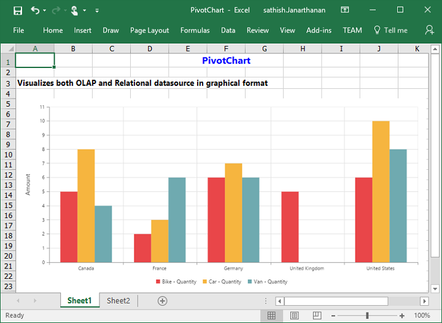

# Exporting

The pivot chart control can be exported to the following file formats:

* Microsoft Excel
* Microsoft Word
* PDF
* Image

The pivot chart control can be exported by invoking the [`exportPivotChart`](/api/js/ejpivotchart#methods:exportpivotchart) method with an appropriate export option as parameter.



<html>
    //...
<body>
    //...
    

    <button id="btnExport">Export</button>
    
</body>
</html>



When the pivot chart is rendered in the server mode, a service method should be added to the WCF/WebAPI for server side operations.

For WebAPI controller, the following method should be added:



[System.Web.Http.ActionName("Export")]
[System.Web.Http.HttpPost]
public void Export() {
    string args = HttpContext.Current.Request.Form.GetValues(0)[0];
    string fileName = "Sample";
    htmlHelper.ExportPivotChart(args, fileName, System.Web.HttpContext.Current.Response);
}



For WCF service, the following method should be added:



public void Export(System.IO.Stream stream) {
    System.IO.StreamReader sReader = new System.IO.StreamReader(stream);
    string args = System.Web.HttpContext.Current.Server.UrlDecode(sReader.ReadToEnd()).Remove(0, 5);
    string fileName = "Sample";
    htmlHelper.ExportPivotChart(args, fileName, System.Web.HttpContext.Current.Response);
}



## Excel export

You can export the contents of the pivot chart to an Excel document for future archival, references, and analysis purposes.

### Client mode

To achieve Excel export, the service URL and the file name are set as parameters.



function exportBtnClick(args)
{
    var chartObj = $('#PivotChart1').data("ejPivotChart ");
    chartObj.exportPivotChart("https://js.syncfusion.com/ejservices/api/PivotChart/Olap/ExcelExport","fileName");
}



### Server mode

To achieve Excel export, you should add the following dependency libraries to the application:

* Syncfusion.Compression.Base
* Syncfusion.XlsIO.Base

For Excel export, the **“ej.PivotChart.ExportOptions.Excel”** enumeration value is set as the parameter.



function exportBtnClick(args)
{
    var chartObj = $('#PivotChart1').data("ejPivotChart");
    //Setting export option as Excel in the exportPivotChart method for ServerMode
    chartObj.exportPivotChart(ej.PivotChart.ExportOptions.Excel);
}



## Word export

You can export the contents of the pivot chart to a Word document for future archival, references, and analysis purposes.

### Client mode

To achieve Word export, the service URL and the file name are set as parameters.



function exportBtnClick(args)
{
    var chartObj = $('#PivotChart1').data("ejPivotChart ");
    chartObj.exportPivotChart("https://js.syncfusion.com/ejservices/api/PivotChart/Olap/WordExport","fileName");
}



### Server mode

 To achieve Word export, you can add the following dependency libraries to the application.

* Syncfusion.Compression.Base
* Syncfusion.DocIo.Base

For Word export, the **“ej.PivotChart.ExportOptions.Word”** enumeration value is set as the parameter.



function exportBtnClick(args)
{
    var chartObj = $('#PivotChart1').data("ejPivotChart");
    //Setting export option as Word in the exportPivotChart method
    chartObj.exportPivotChart(ej.PivotChart.ExportOptions.Word);
}



## PDF export

You can export the contents of the pivot chart to PDF document for future archival, references, and analysis purposes.

### Client mode

To achieve PDF export, the service URL and the file name are set as parameters.



function exportBtnClick(args)
{
    var chartObj = $('#PivotChart1').data("ejPivotChart ");
    chartObj.exportPivotChart("https://js.syncfusion.com/ejservices/api/PivotChart/Olap/PDFExport","fileName");
}



### Server mode

To achieve PDF export, you should add the following dependency libraries to the application.

* Syncfusion.Compression.Base
* Syncfusion.Pdf.Base

For PDF export, the **“ej.PivotChart.ExportOptions.PDF”** enumeration value is set as the parameter.



function exportBtnClick(args)
{
    var chartObj = $('#PivotChart1').data("ejPivotChart ");
    //Setting export option as PDF in the exportPivotChart method
    chartObj.exportPivotChart(ej.PivotChart.ExportOptions.PDF);
}



## Image export

You can export the contents of the pivot chart to image format for future archival, references, and analysis purposes. You can export the pivot chart to the following image formats:

* PNG
* EMF
* JPG
* GIF
* BMP

### Client mode

To export the pivot chart in PNG format, the service URL, the file name, and the **“ej.PivotChart.ExportOptions.PNG”** enumeration value are set as parameters. It is similar to other image formats.



function exportBtnClick(args)
{
    var chartObj = $('#PivotChart1').data("ejPivotChart ");
    chartObj.exportPivotChart("https://js.syncfusion.com/ejservices/api/PivotChart/Olap/ImageExport","fileName", ej.PivotChart.ExportOptions.PNG);
}



### Server mode

To export the pivot chart in PNG format, the **“ej.PivotChart.ExportOptions.PNG”** enumeration value is set as the parameter. This is similar to other image formats.



function exportBtnClick(args)
{
    var chartObj = $('#PivotChart1').data("ejPivotChart ");
    //Setting export option as PNG in the exportPivotChart method
    chartObj.exportPivotChart(ej.PivotChart.ExportOptions.PNG);
}



## Pivot chart - exporting format

I> This option is applicable only for the pivot chart specifically when it is exported to an Excel document.

You can set an option to export the pivot chart to an Excel document, and you can export it as either an image or pivot chart format itself by setting the Boolean property `exportChartAsImage` in the `beforeExport` event.

N> By default, the pivot chart will be exported in image format to an Excel document.



        $("#PivotChart1").ejPivotChart(
            {
               //...
               beforeExport:"Exporting",
        });

        function Exporting(args) {
            args.exportChartAsImage = false; //you can set the chart format here
        }

 

The following screenshot illustrates the control exported to an Excel document by showing its own format (pivoting chart).

## Exporting customization

You can add the title and description to the exporting document by using the title and description property in the "beforeExport" event.

N> The title and description cannot be added to image formats.



<html>
    //...
<body>
    //...
    

    <button id="btnExport">Export</button>
    
</body>
</html>



You can also edit the exporting document by using a server-side event for the required exporting option.



//...
using Syncfusion.EJ.Export;
using Syncfusion.Compression.Base;
using Syncfusion.XlsIO;
using Syncfusion.DocIO.Base;
using Syncfusion.Pdf.Base;

 //Following service method needs to be added in WebAPI for JSON export.
[System.Web.Http.ActionName("ExcelExport")]
[System.Web.Http.HttpPost]
public void ExcelExport()
{
    PivotChartExcelExport pivotChartExcelExport = new PivotChartExcelExport();
    string args = HttpContext.Current.Request.Form.GetValues(0)[0];
    pivotChartExcelExport.ExcelExport += pivotChartExcelExport_ExcelExport;
    Dictionary<string, string> chartParams = serializer.Deserialize<Dictionary<string, string>>(args);
    pivotChartExcelExport.ExportToExcel(chartParams);
}

void pivotChartExcelExport_ExcelExport(object sender, Syncfusion.XlsIO.IWorkbook workBook)
{
    //You can customize exporting document here.
}

[System.Web.Http.ActionName("WordExport")]
[System.Web.Http.HttpPost]
public void WordExport()
{
    PivotChartWordExport pivotChartWordExport = new PivotChartWordExport();
    string args = HttpContext.Current.Request.Form.GetValues(0)[0];
    pivotChartWordExport.WordExport += pivotChartWordExport_WordExport;
    Dictionary<string, string> chartParams = serializer.Deserialize<Dictionary<string, string>>(args);
    pivotChartWordExport.ExportToWord(chartParams);
}

void pivotChartWordExport_WordExport(object sender, Syncfusion.DocIO.DLS.WordDocument document)
{
    //You can customize exporting document here.
}

[System.Web.Http.ActionName("PdfExport")]
[System.Web.Http.HttpPost]
public void PdfExport()
{
    PivotChartPDFExport pivotChartPDFExport = new PivotChartPDFExport();
    string args = HttpContext.Current.Request.Form.GetValues(0)[0];
    pivotChartPDFExport.AddPDFHeaderFooter += pivotChartPDFExport_AddPDFHeaderFooter;
    pivotChartPDFExport.PDFExport += pivotChartPDFExport_PDFExport;
    Dictionary<string, string> chartParams = serializer.Deserialize<Dictionary<string, string>>(args);
    pivotChartPDFExport.ExportToPDF(chartParams);
}

void pivotChartPDFExport_PDFExport(object sender, Syncfusion.Pdf.PdfDocument pdfDoc)
{
    //You can customize exporting document here.
}

void pivotChartPDFExport_AddPDFHeaderFooter(object sender, Syncfusion.Pdf.PdfDocument pdfDoc)
{
    //You can add header/footer information to the PDF document.
}

 //Following service method needs to be added in WCF/WebAPI for PivotEngine export.

[System.Web.Http.ActionName("Export")]
[System.Web.Http.HttpPost]
public void Export()
{
    string args = HttpContext.Current.Request.Form.GetValues(0)[0];
    string fileName = "Sample";
    htmlHelper.ExcelExport += htmlHelper_ExcelExport;
    htmlHelper.WordExport += htmlHelper_WordExport;
    htmlHelper.AddPDFHeaderFooter += htmlHelper_AddPDFHeaderFooter;
    htmlHelper.PDFExport += htmlHelper_PDFExport;
    htmlHelper.ExportPivotChart(args, fileName, System.Web.HttpContext.Current.Response);
}

void htmlHelper_PDFExport(object sender, Syncfusion.Pdf.PdfDocument pdfDoc)
{
    //You can customize exporting document here.
}

void htmlHelper_AddPDFHeaderFooter(object sender, Syncfusion.Pdf.PdfDocument pdfDoc)
{
    //You can add header/footer information to the PDF document.
}

void htmlHelper_WordExport(object sender, Syncfusion.DocIO.DLS.WordDocument document)
{
    //You can customize exporting document here.
}

void htmlHelper_ExcelExport(object sender, Syncfusion.XlsIO.IWorkbook workBook)
{
    //You can customize exporting document here.
}



The name of the document can be customized per the user's requirements.

For client mode, you can set the file name as a parameter in the **“exportPivotChart”** method along with the service URL.



function exportBtnClick(args)
{
    var chartObj = $('#PivotChart1').data("ejPivotChart ");
    chartObj.exportPivotChart("https://js.syncfusion.com/ejservices/api/PivotChart/Olap/ExcelExport", "fileName");
}


For server mode, the exporting document name is provided in the WebAPI controller as shown in the following code snippet:



[System.Web.Http.ActionName("Export")]
[System.Web.Http.HttpPost]
public void Export() {
    string args = HttpContext.Current.Request.Form.GetValues(0)[0];
    string fileName = "File name is customized here";
    htmlHelper.ExportPivotChart(args, fileName, System.Web.HttpContext.Current.Response);
}



For customizing names in the WCF Service, the following code snippet is used:



public void Export(System.IO.Stream stream) {
    System.IO.StreamReader sReader = new System.IO.StreamReader(stream);
    string args = System.Web.HttpContext.Current.Server.UrlDecode(sReader.ReadToEnd()).Remove(0, 5);
    string fileName = " File name is customized here ";
    htmlHelper.ExportPivotChart(args, fileName, System.Web.HttpContext.Current.Response);
}



The following screenshot shows the pivot chart control exported to an Excel document:

The following screenshot shows the pivot chart control exported to a Word document:

The following screenshot shows the pivot chart control exported to a PDF document:

The following screenshot shows the pivot chart control exported to a PNG format:

