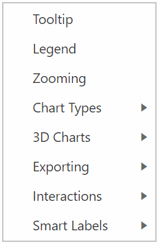
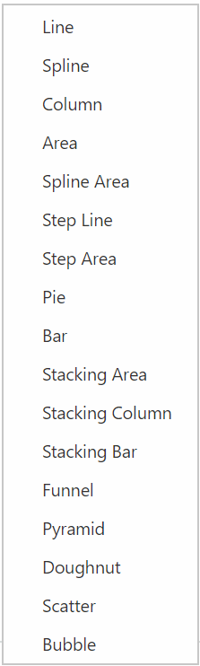
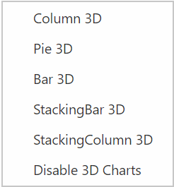
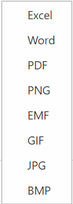
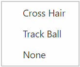
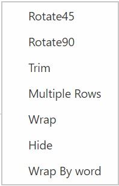

# How to

## Public methods

### Refresh the pivot grid with modified report
The [`refreshControl`](/api/js/ejpivotchart#methods:refreshcontrol) method is used to re-render the pivot chart component with specified data source and properties initially.





### Generate JSON object from OLAP cube
The [`generateJSON`](/api/js/ejpivotchart#methods:generatejson) method is used to render the pivot chart component with the pivot engine from the OLAP cube.





### Refresh the pivot chart with paging
The [`refreshPagedPivotChart`](/api/js/ejpivotchart#methods:refreshpagedpivotchart) method is used to render the pivot chart control with the given axis and the page number.





### Explicit asynchronous invoke
The [`doAjaxPost`](/api/js/ejpivotchart#methods:doajaxpost) method is used to post an asynchronous HTTP (AJAX) request.





### Destroying the object of pivot chart
The [`destroy`](/api/js/ejpivotchart#methods:destroy) method is used to destroy the pivot chart widget associated events that are bound using "this._on" and bring the control to pre-init state.





### Getting JSON records from control object
The [`getJSONRecords`](/api/js/ejpivotchart#methods:getjsonrecords) method is used to return the JSON records that are formed to render the pivot chart control.





### Setting JSON records to control object
The [`setJSONRecords`](/api/js/ejpivotchart#methods:setjsonrecords) method is used to set the JSON records to render the pivot chart control.





## Events

### Invoking event in client-side after service invoke
The [`afterServiceInvoke`](/api/js/ejpivotchart#events:afterserviceinvoke) event is triggered when it is reached the client-side after any AJAX request.



$("#PivotChart1").ejPivotChart({

            // after service invoke event
            afterServiceInvoke: function (args) {

            },

            //...
        });



### Invoking event in client-side before service invoke
The [`beforeServiceInvoke`](/api/js/ejpivotchart#events:beforeserviceinvoke) event is triggered before any AJAX request is passed from the pivot chart to service methods.



$("#PivotChart1").ejPivotChart({

            // before service invoke event
            beforeServiceInvoke: function (args) {

            },

            //...
        });



### Triggering event after performing drill operation
The [`drillSuccess`](/api/js/ejpivotchart#events:drillsuccess) event is triggered when performing the drill up/down operation in the pivot chart control.



$("#PivotChart1").ejPivotChart({

            // drill success event
            drillSuccess: function (args) {

            },

            //...
        });



### Triggering event before exporting
The [`beforeExport`](/api/js/ejpivotchart#events:beforeexport) event is triggered before performing the export operation in the the pivot chart.


$("#PivotChart1").ejPivotChart({

            // before export event
            beforeExport: function (args) {

            },

            //...
        });



### Triggering event before the pivot chart loaded
The [`load`](/api/js/ejpivotchart#events:load) event is triggered when the pivot chart is started to render.


$("#PivotChart1").ejPivotChart({

            // load event
            load: function (args) {

            },

            //...
        });



## Members

### Enabling XMLHttpRequest object for CORS
Allows you to enable “withCredentials” property inside XMLHttpRequest object for CORS(Cross-Origin Resource Sharing) request. This feature can be enabled by [`enableXHRCredentials`](/api/js/ejpivotchart#members:enableXHRCredentials) property.



    



### Enabling context menu in pivot chart
To improve user action, the context menu option in the pivot chart allows you to enable/disable the features with UI operations. This feature can be enabled by the [`enableContextMenu`](/api/js/ejpivotchart#members:enablecontextmenu) property.



    



The following are the available features in the context menu:

* [`Tooltip`](/api/js/ejchart#members:commonseriesoptions-tooltip-visible): It allows you to enable/disable the tooltip.
* [`Legend`](/api/js/ejpivotchart#members:legend): It allows you to show/hide the legend in the pivot chart component.
* [`Zooming`](/api/js/ejchart#members:zooming-enable): It allows you to zoom the chart by using the rubber band selection.

* [`Chart types`](/api/js/ejpivotchart#members:commonseriesoptions-type): You can choose different 2D charts by UI operations.

* [`3D Charts`](/api/js/ejpivotchart#members:enable3d): You can choose different 3D chart types. The **"Disable 3D Charts"** option is available to disable the 3D chart, and it is rendered as the respective 2D chart.

* `Exporting`: You can export the chart in different formats given in the following image. You have to mention the export settings through the[`beforeExport`](/api/js/ejpivotchart#events:beforeexport) event.

* `Interactions`: Different types of interactions are available in the context menu to view the datum in the chart.

For more on this topic, [click here](https://help.syncfusion.com/js/pivotchart/user-interactions)

* [`Smart Labels`](/api/js/ejchart#members:primaryxaxis-labelintersectaction): You can customize the labels in a different view by giving the options mentioned in the following image:

## Setting custom name to service methods
The [`serviceMethodSettings`](/api/js/ejpivotchart#members:servicemethodsettings) allows you to set the custom name for methods in the WebAPI/WCF, communicated during the AJAX post. The following table will explain the service methods:

| Service methods | Description |
|---|---|
|[initialize](/api/js/ejpivotchart#members:servicemethodsettings-initialize)|It fetches the data required to initialize the control.|
|[drillDown](/api/js/ejpivotchart#members:servicemethodsettings-drilldown)|It allows the drilling up/down action in the pivot chart.|
|[paging](/api/js/ejpivotchart#members:servicemethodsettings-paging)|It fetches the data while navigating between pages in the pivot chart data.|
|[exportPivotChart](/api/js/ejpivotchart#members:servicemethodsettings-exportpivotchart)|It exports the pivot chart control at the instant to the specified format.|

