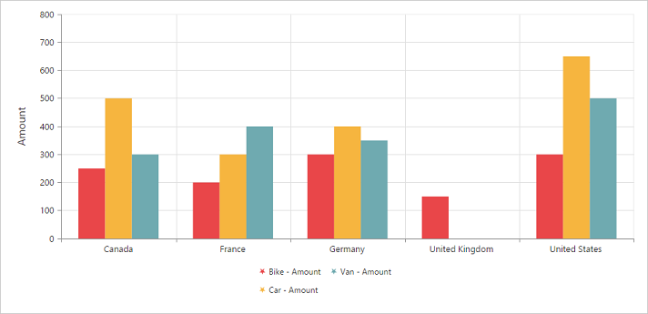
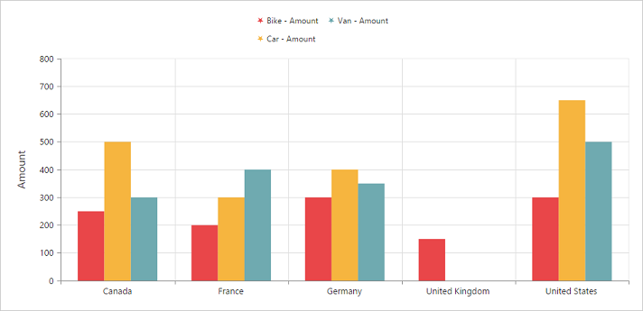
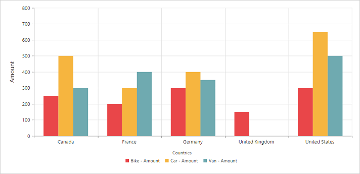
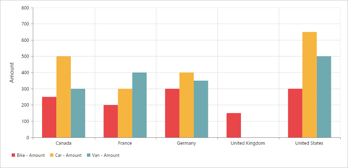
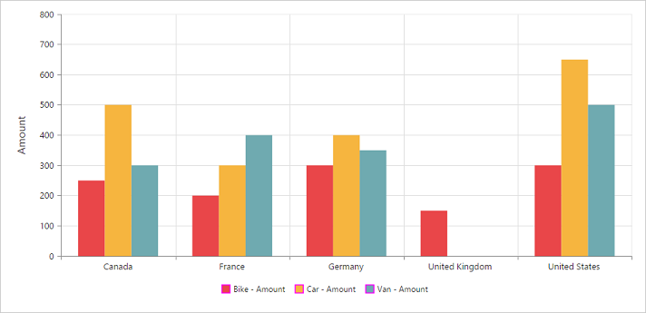
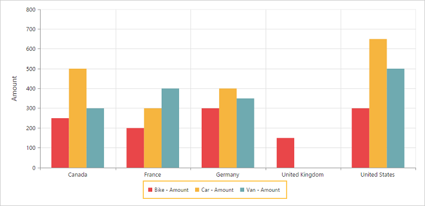
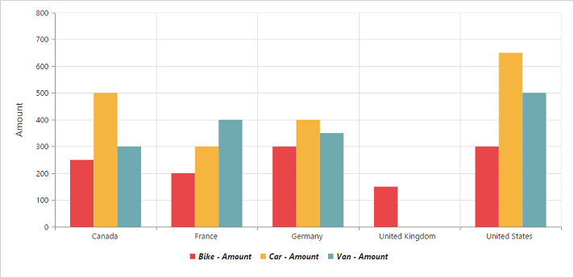

# Legend

## Legend visibility

You can enable or disable the legend by using the [`visible`](/api/js/ejpivotchart#members:legend) property in the [`legend`](/api/js/ejpivotchart#members:legend) object. By default, the legend is enabled in the pivot chart.

N> By default, the legend is visible in the pivot chart.



$(function()
{
    $("#PivotChart1").ejPivotChart(
    {
        ....
        legend:
        {
            //Legend Visibility
            visible: true
        },
        ....
    });
});



## Legend shape
You can customize the legend [`shape`](/api/js/ejchart#members:legend-shape) in the pivot chart widget. The default value of legend shape is “Rectangle”. The following are the supported legend shapes:

* Rectangle
* Circle
* Cross
* Diamond
* Pentagon
* Hexagon
* Star
* Ellipse
* Triangle.



    $("#PivotChart1").ejPivotChart(
    {
        ....
        legend:
        {
            //Legend Visibility
            visible: true,
            //Applying Legend Shape
            shape: "Star"
        },
        ....
    });



## Legend position
By using the [`position`](/api/js/ejchart#members:legend-position) property, you can place the legend at top, bottom, left, or right of the pivot chart.

N> The default value of the legend position is bottom in the pivot chart.



    $("#PivotChart1").ejPivotChart(
    {
        ....
        legend:
        {
            //Legend Visibility
            visible: true,
            //To place the legend at top of the Chart
            position: "top"
        },
        ....
    });



## Legend title
To add a legend title, you should specify the title text in the [`title.text`](/api/js/ejchart#members:legend-title-text) property.



    $("#PivotChart1").ejPivotChart(
    {
        ....
        legend:
        {
            //Legend Visibility
            visible: true,
            //Add title to the Chart legend
            title:
            {
                text: "Countries"
            }
        },
        ....
    });



## Legend alignment
You can align the legend to center, far, and near based on its position in the chart area by using the [`alignment`](/api/js/ejchart#members:legend-alignment) .



    $("#PivotChart1").ejPivotChart(
    {
        ....
        legend:
        {
            //Legend Visibility
            visible: true,
            //Aligning the legend near to the Chart
            alignment: "Near"
        },
        ....
    });



## Legend items - size and border
By using the [`itemStyle.width`](/api/js/ejchart#members:legend-itemstyle-width), [`itemStyle.height`](/api/js/ejchart#members:legend-itemstyle-height), and [`itemStyle.border`](/api/js/ejchart#members:legend-itemstyle-border) properties of the legend, you can change the size and border of legend items.



    $("#PivotChart1").ejPivotChart(
    {
        ....
        legend:
        {
            //Legend Visibility
            visible: true,
            //Changing legend items border, height and width
            itemStyle:
            {
                height: 12,
                width: 12,
                border:
                {
                    color: 'magenta',
                    width: 1.5
                }
            }
        },
        ....
    });



## Legend border
By using the [`border`](/api/js/ejchart#members:legend-border) in the legend, you can customize the color and width of the border.



    $("#PivotChart1").ejPivotChart(
    {
        ....
        legend:
        {
            //Legend Visibility
            visible: true,
            //Setting border color and width to legend
            border:
            {
                color: "#FFC342",
                width: 2
            }
        },
        ....
    });



## Legend text
By using the [`font`](/api/js/ejchart#members:legend-font), you can customize the font family, font style, font weight, and size of the legend text.



    $("#PivotChart1").ejPivotChart(
    {
        ....
        legend:
        {
            //Legend Visibility
            visible: true,
            //Customizing the legend text
            font:
            {
                fontFamily: 'Segoe UI',
                fontStyle: 'italic',
                fontWeight: 'bold',
                size: '13px'
            },
        },
        ....
    });



