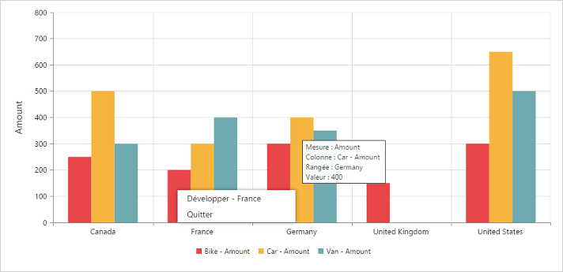
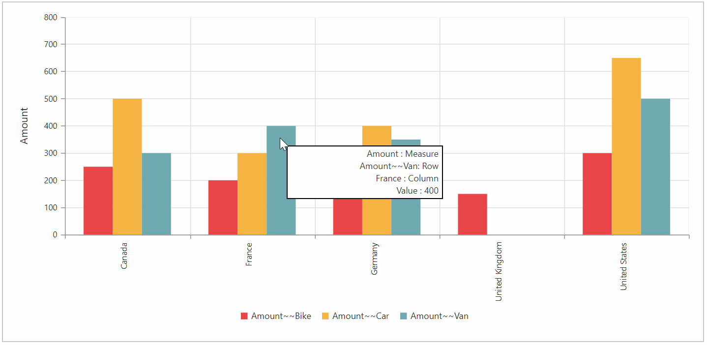

# Localization

## Localization in pivot chart

You can localize the pivot chart controls text with a collection of localized strings using [`ej.PivotChart.Locale`](/api/js/ejpivotchart#members:locale) for different cultures. By default, the pivot chart control is localized in **“en-US”.**

The following code example illustrates the steps to localize the pivot chart based on the **“French”** culture.



<html>
  //...

<body>
    <!--Create a tag which acts as a container for PivotChart-->
    

    
</body>

</html>



The following table localizes the in-built keywords to **“French”** culture for the pivot chart.

<table>
<tr>
<th>
Keywords</th><th>
Values</th>
</tr>
<tr><td>
Measure</td><td>
“Mesure”</td>
</tr>
<tr><td>
Row</td><td>
"Rangée "</td>
</tr>
<tr><td>
Column</td><td>
"Colonne”</td>
</tr>
<tr><td>
Value</td><td>
"Valeur "</td>
</tr>
<tr><td>
Expand</td><td>
"Développer "</td>
</tr>
<tr><td>
Collapse</td><td>
"Effondrement "</td>
</tr>
<tr><td>
Exit</td><td>
“Quitter "</td>
</tr>
</table>

## Localization and globalization of cube info (client mode)

The content displayed within the pivot chart control is obtained from the OLAP cube. The following are the steps that should be done to get the localized and globalized cube content.

* To get the localized data from the OLAP cube, set the **"Locale Identifier"** in the connection string to a specific culture in the **"data"** property present in the **"dataSource"**.
* To bind the globalized content in the pivot chart control, set the **"locale"** property to a specific culture and refer the specific culture file in the sample.

N> Culture files are present under **"[installed drive]:\Users\ [user name]\AppData\Local\Syncfusion\EssentialStudio\X.X.X.X\JavaScript\samples\web\scripts\cultures".**



//1036 refers to “fr-FR” culture.
 $("#PivotChart1").ejPivotChart({
      dataSource: {
            data: "https://bi.syncfusion.com/olap/msmdpump.dll; Locale Identifier=1036;",
            ......
            },
            locale: "fr-FR",
            .....
 });



## Localization and globalization of cube info (server mode)

The content displayed within the pivot chart control is obtained from the OLAP cube. The following are the steps that should be done to get the localized and globalized cube content:

* To get the localized string based on different cultures, set the **"Locale Identifier"** in the connection string to a specific culture in the OLAP cube.
* To bind the globalized content in the pivot chart control, you can set the **"Culture"** and **"OverrideDefaultFormatStrings"** properties in the OlapDataManager class to a specific culture.



//1036 refers to “fr-FR” culture.
string connectionString = "Data Source=localhost; Initial Catalog=Adventure Works DW; Locale Identifier=1036;";
DataManager = new OlapDataManager(connectionString);
DataManager.Culture = new System.Globalization.CultureInfo(1036);
DataManager.OverrideDefaultFormatStrings = true;



## RTL

You can enable or disable the right to left alignment by using the [`enableRTL`](/api/js/ejpivotchart#members:enablertl) property in the pivot chart.



$("#PivotChart1").ejPivotChart({
      enableRTL: true
 });



N> RTL is applicable only for the tooltip of the pivot chart.

