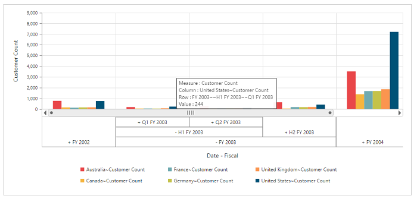

# Multi-level labels

Multi-level labels allow you to drill down to access the detailed level of data or drill up to see the summarized data by using the expander present in the OLAP chart. You can enable this option by setting the [`enableMultiLevelLabels`](/api/js/ejpivotchart#members:enablemultilevellabels) property to **“true”.**



    $("#PivotChart1").ejPivotChart(
    {
        //..
        //Enable Multi-level Labels
        enableMultiLevelLabels: true,
        //..
    });


## Relational

## OLAP

