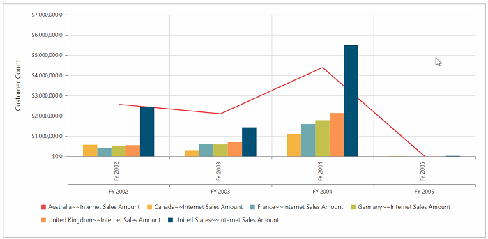
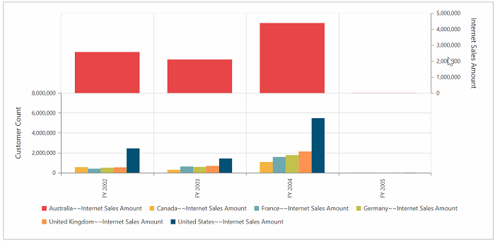
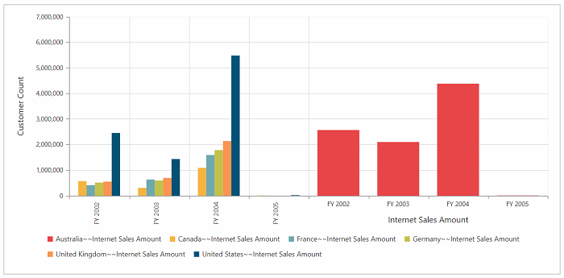

# Multiple Axis

You can split the pivot chart and its area into multiple panes to draw multiple series with multiple axes. Additional vertical/ horizontal axis in pivot chart can be created by [`axes`](/api/js/ejpivotchart#members:axes) property.

Before rendering multiple axis in pivot chart, you should know some important properties of axes and series of pivot chart.

### Properties of Axes

* **rowIndex**: Specifies the index of the row where the axis is associated.
* **columnIndex**: Specifies the index of the column where the axis is associated.
* **opposedPosition**: Specifies whether to render the axis at the opposite side of its default position.
* **labelFormat**: Custom formatting for axis label and supports all standard formatting type of numerical and date time values.
* **title**: You can customize the title of the axis by the following properties.
       * **enableTrim**: Specifies whether to trim the axis title when it exceeds the chart area or the maximum width of the title.
       * **maximumTitleWidth**: Maximum width of the title, when the title exceeds this width, the title gets trimmed, when enableTrim is true.
       * **visible**: Controls the visibility of the axis title.
* **name**: Unique name of the axis. To associate an axis with the series, you have to set this name to the xAxisName/yAxisName property of the series.

To know more about axes properties, [`Click Here`](https://help.syncfusion.com/api/js/ejchart#members:axes)

### Properties of Series

* **xAxisName**: Specifies the name of the x-axis that has to be associated with this series. Add an axis instance with this name to axes collection.
* **yAxisName**: Specifies the name of the y-axis that has to be associated with this series. Add an axis instance with this name to axes collection.

## Customizing Axes at row index of zero
You can customize the axes in the primary pivot chart itself. To achieve this you should give the following properties.



   $("#PivotChart").ejPivotChart({
axes:[{
 rowIndex: 0,
 name: 'yaxisConfig',
 //…
  }],
 beforeSeriesRender :"onBeforeRender"

});

function onBeforeRender(args) {
 for (var i = 0; i < args.series.length; i++) {
    if (args.series[i].name.indexOf("Australia") != -1) {
       args.series[i].yAxisName = "yaxisConfig";
       args.series[i].type = "line";
  }
 }
return args;
}



## Customizing Axes at row Index one



  $("#PivotChart").ejPivotChart({
axes:[{
 rowIndex: 1,
 name: 'yaxisConfig',
 //…
  }],
beforeSeriesRender :"onBeforeRender"

});

function onBeforeRender(args) {
 for (var i = 0; i < args.series.length; i++) {
    if (args.series[i].name.indexOf("Australia") != -1) {
       args.series[i].yAxisName = "yaxisConfig";
       args.series[i].type = "line";
  }
 }
return args;
}



## Customizing Axes at column Index of zero



$("#PivotChart").ejPivotChart({
axes:[{
 columnIndex: 0,
 name: 'xaxisConfig',
 //…
  }],
beforeSeriesRender :"onBeforeRender"

});

function onBeforeRender(args) {
 for (var i = 0; i < args.series.length; i++) {
    if (args.series[i].name.indexOf("Australia") != -1) {
       args.series[i].xAxisName = "xaxisConfig";
       args.series[i].type = "line";
  }
 }
return args;
}



## Customizing Axes at column Index of one



$("#PivotChart").ejPivotChart({
axes:[{
 columnIndex: 1,
 name: 'xaxisConfig',
 //…
  }],
beforeSeriesRender :"onBeforeRender"

});

function onBeforeRender(args) {
 for (var i = 0; i < args.series.length; i++) {
    if (args.series[i].name.indexOf("Australia") != -1) {
       args.series[i].xAxisName = "xaxisConfig";
       args.series[i].type = "line";
  }
 }
return args;
}



## Customizing Series
You can customize the series in multiple axis support with the help of **beforeSeriesRender** event. You can change the series type through **onBeforeRender** event.



$("#PivotChart").ejPivotChart({
axes:[{
 name: 'yaxisConfig',
//…
  }],
beforeSeriesRender :"onBeforeRender"
});

function onBeforeRender(args) {
 for (var i = 0; i < args.series.length; i++) {
    if (args.series[i].name.indexOf("Australia") != -1) {
       args.series[i].yAxisName = "yaxisConfig";
       args.series[i].type = "line";
  }
 }
return args;
}



**Note:** You have to use the same name in both name property of axes and xAxisName/yAxisName property of series in the above **beforeSeriesRender** event.

To know more about series properties [`Click Here`](https://help.syncfusion.com/api/js/ejchart#members:series)

## Multiple Axis Support by series index

You can render pivot chart with multiple axis by series index.

**Note:** This is the default behavior of multiple axis support, if you are not triggering beforeSeriesRender event.



$("#PivotChart").ejPivotChart({
axes: [
   {
     name:'y:0' // you can create separate y axes for the series which you want
                  // y indicates(yAxisName) axis in which series needs to be added.
                  // 0 indicates the series index of pivot chart.
                  // you can also use pass multiple series index separated by comma(y:0,2)
   },
   {
     name:'x:1'//you can create separate x axes for the series which you want
              // x indicates(xAxisName) axis in which series needs to be added.
              // 0 indicates the series index of pivot chart.
              // you can also use pass multiple series index separated by comma(x:0,2)
   }]});



### For Y axes



$("#PivotChart").ejPivotChart({
axes: [
   {
name:'y:0'
}]



### For X Axes



$("#PivotChart").ejPivotChart({
axes: [
   {
name:'x:0'
}]


## Customizing PrimaryYAxis and Axes properties

### labelFormat
You can customize the **labelFormat** for both PrimaryYAxis and custom axes.



$("#PivotChart").ejPivotChart({
axes:[{
   //…
   labelFormat:'n1'
 }],
primaryYAxis: { labelFormat: 'c1' }
});



### title
You can customize the title for axes by **title** property.



$("#PivotChart").ejPivotChart({
axes:[{
 //…
 title: {text: "Internet Sales Amount"},
  }],
primaryYAxis: { title: { text: "Customer Count" }}
});



