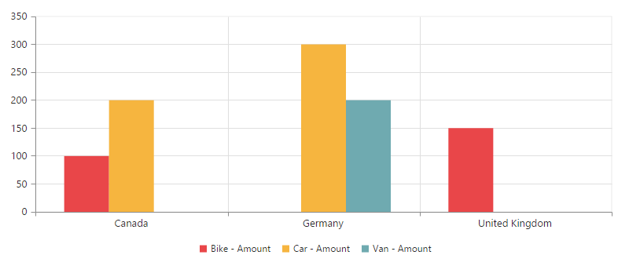
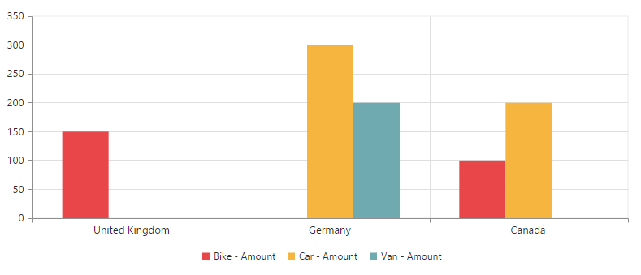
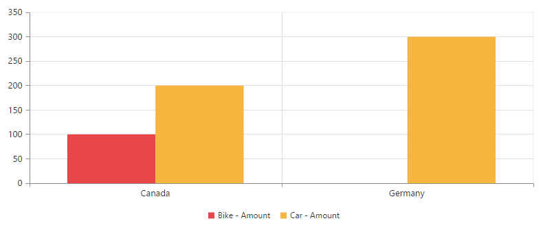
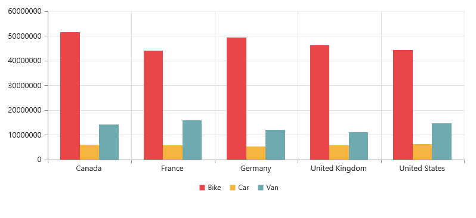

# Getting started with JavaScript PivotChart

## Creating a simple application with pivot chart and relational data source (client mode)

This section covers the basic information required to populate a simple pivot chart with relational data completely on the client-side.

### Scripts and CSS references

Create an HTML page and add scripts and style sheets that are required to render a pivot chart widget which are highlighted below in an appropriate order:

1. ej.web.all.min.css
2. jQuery-3.0.0.min.js
4. ej.web.all.min.js

### Initialize pivot chart

Place a "div" tag in the HTML page which acts as a container for the pivot chart widget.  Then, initialize the widget by using the "ejPivotChart" method.



<!DOCTYPE html>
<html>
    <head>
        <title>PivotChart - Getting Started</title>
        <link href="http://cdn.syncfusion.com/{{ site.releaseversion }}/js/web/flat-azure/ej.web.all.min.css" rel="stylesheet" type="text/css" />
        
        
    </head>
    <body>
        <!--Create a tag which acts as a container for ejPivotChart widget.-->
        

        
    </body>
</html>



### Populate pivot chart with data

This section illustrates how to populate the pivot chart control using a sample JSON data as shown below:



var pivotData = [
    { Amount: 100, Country: "Canada", Product: "Bike" },
    { Amount: 200, Country: "Germany", Product: "Van" },
    { Amount: 300, Country: "Germany", Product: "Car" },
    { Amount: 150, Country: "United Kingdom", Product: "Bike" },
    { Amount: 200, Country: "Canada", Product: "Car" }
];


Now, set the JSON data to the **"data"** property available in the **"dataSource"** object. The **"dataSource"** object allows you to set the raw data input and the fields that should be displayed in the row, column, value, and filter section of the pivot chart control.



<!DOCTYPE html>
<html>

    //....
   <body>
        

        
   </body>
</html>


The above code will generate a simple pivot chart with sales amount over a range of products across different locations.

The following table will explain the [`relational`](/api/js/ejpivotchart#members:analysismode) [`datasource`](/api/js/ejpivotchart#members:datasource) properties at [`client-side`](/api/js/ejpivotchart#members:operationalmode) in detail:

<table>
    <tr>
        <th>
            Properties
        </th>
        <th>
            Description
        </th>
    </tr>
    <tr>
        <td>
            {{'[`columns`](https://help.syncfusion.com//api/js/ejpivotchart#members:datasource-columns "columns")'| markdownify }}
        </td>
        <td>
            Lists out the items to be arranged in the columns section of the PivotGrid.
             <table class="params">
            <thead>
            <tr>
            <th>Properties</th>
            <th>Description</th>
            </tr>
            </thead>
            <tbody>
            <tr>
            <td>{{'[`fieldName`](https://help.syncfusion.com//api/js/ejpivotchart#members:datasource-columns-fieldname "fieldName")'| markdownify }} </td>
            <td>Allows you to bind the item by using its unique name as field name.</td>
            </tr>
            <tr>
            <td>{{'[`fieldCaption`](https://help.syncfusion.com//api/js/ejpivotchart#members:datasource-columns-fieldcaption "fieldCaption")'| markdownify }}</td>
            <td>Allows you to set the display caption for an item.</td>
            </tr>
            <tr>
            <td>{{'[`sortOrder`](https://help.syncfusion.com//api/js/ejpivotchart#members:datasource-columns-sortorder "sortOrder")'| markdownify }}</td>
            <td>Allows you to set the sorting order of members of the field.</td>
            </tr>
            <tr>
            <td>{{'[`filterItems`](https://help.syncfusion.com//api/js/ejpivotchart#members:datasource-columns-filteritems "filterItems")'| markdownify }}</td>
            <td>Applies the filter to field members.
            <table class="params">
            <thead>
            <tr>
            <th>Properties</th>
            <th>Description</th>
            </tr>
            </thead>
            <tbody>
            <tr>
            <td>
                {{'[`filterType`](https://help.syncfusion.com//api/js/ejpivotchart#members:datasource-columns-filteritems-filtertype "filterType")'| markdownify }} </td>
            <td>Sets the type of filter to include/exclude the mentioned values.</td>
            </tr>
            <tr>
            <td>
                {{'[`values`](https://help.syncfusion.com//api/js/ejpivotchart#members:datasource-columns-filteritems-values "values")'| markdownify }} </td>
            <td>Contains the collection of items to be included/excluded among the field members.</td>
            </tr>
            </tbody>
            </table>
            </td>
            </tr>
            </tbody>
            </table>
            </td>
            </tr>
            <tr>
        <td>
            {{'[`rows`](https://help.syncfusion.com//api/js/ejpivotchart#members:datasource-rows "rows")'| markdownify }}
        </td>
        <td>
            Lists out the items to be arranged in the rows section of the PivotGrid.
             <table class="params">
            <thead>
            <tr>
            <th>Properties</th>
            <th>Description</th>
            </tr>
            </thead>
            <tbody>
            <tr>
            <td>{{'[`fieldName`](https://help.syncfusion.com//api/js/ejpivotchart#members:datasource-rows-fieldname "fieldName")'| markdownify }} </td>
            <td>Allows you to bind the item by using its unique name as field name.</td>
            </tr>
            <tr>
            <td>{{'[`fieldCaption`](https://help.syncfusion.com//api/js/ejpivotchart#members:datasource-rows-fieldcaption "fieldCaption")'| markdownify }}</td>
            <td>Allows you to set the display caption for an item.</td>
            </tr>
            <tr>
            <td>{{'[`sortOrder`](https://help.syncfusion.com//api/js/ejpivotchart#members:datasource-rows-sortorder "sortOrder")'| markdownify }}</td>
            <td>Allows you to set the sorting order of members of the field.</td>
            </tr>
            <tr>
            <td>{{'[`filterItems`](https://help.syncfusion.com//api/js/ejpivotchart#members:datasource-rows-filteritems "filterItems")'| markdownify }}</td>
            <td>Applies the filter to field members.
            <table class="params">
            <thead>
            <tr>
            <th>Properties</th>
            <th>Description</th>
            </tr>
            </thead>
            <tbody>
            <tr>
            <td>
                {{'[`filterType`](https://help.syncfusion.com//api/js/ejpivotchart#members:datasource-rows-filteritems-filtertype "filterType")'| markdownify }} </td>
            <td>Sets the type of filter to include/exclude the mentioned values.</td>
            </tr>
            <tr>
            <td>
                {{'[`values`](https://help.syncfusion.com//api/js/ejpivotchart#members:datasource-rows-filteritems-values "values")'| markdownify }} </td>
            <td>Contains the collection of items to be included/excluded among the field members.</td>
            </tr>
            </tbody>
            </table>
            </td>
            </tr>
            </tbody>
            </table>
            </td>
            </tr>
            <tr>
        <td>
            {{'[`values`](https://help.syncfusion.com//api/js/ejpivotchart#members:datasource-values "values")'| markdownify }}
        </td>
        <td>
            Lists out the items that support calculation in the PivotGrid.
             <table class="params">
            <thead>
            <tr>
            <th>Properties</th>
            <th>Description</th>
            </tr>
            </thead>
            <tbody>
            <tr>
            <td>{{'[`fieldName`](https://help.syncfusion.com//api/js/ejpivotchart#members:datasource-values-fieldname "fieldName")'| markdownify }} </td>
            <td>Allows you to bind the item by using its unique name as field name for the relational datasource.</td>
            </tr>
            <tr>
            <td>{{'[`fieldCaption`](https://help.syncfusion.com//api/js/ejpivotchart#members:datasource-values-fieldcaption "fieldCaption")'| markdownify }}</td>
            <td>Allows you to set the display caption for the item in the relational datasource.</td>
            </tr>
            <tr>
            <td>{{'[`isCalculatedField`](https://help.syncfusion.com//api/js/ejpivotchart#members:datasource-values-iscalculatedfield "isCalculatedField")'| markdownify }}</td>
            <td>Indicates whether the field is a calculated field with the relational datasource or not.</td>
            </tr>
            <tr>
            <td>{{'[`formula`](https://help.syncfusion.com//api/js/ejpivotchart#members:datasource-values-formula "formula")'| markdownify }}</td>
            <td>Allows to set the formula for calculation of values for calculated members.</td>
            </tr>
            </tbody>
            </table>
            </td>
            </tr>
            <tr>
        <td>
            {{'[`filters`](https://help.syncfusion.com//api/js/ejpivotchart#members:datasource-filters "filters")'| markdownify }}
        </td>
        <td>
            Lists out the items which supports filtering of values without displaying the members in UI of the PivotGrid.
            <table class="params">
            <thead>
            <tr>
            <th>Properties</th>
            <th>Description</th>
            </tr>
            </thead>
            <tbody>
            <tr>
            <td>{{'[`fieldName`](https://help.syncfusion.com//api/js/ejpivotchart#members:datasource-filters-fieldname "fieldName")'| markdownify }} </td>
            <td>Allows you to bind the item by using its unique name as field name.</td>
            </tr>
            <tr>
            <td>{{'[`fieldCaption`](https://help.syncfusion.com//api/js/ejpivotchart#members:datasource-filters-fieldcaption "fieldCaption")'| markdownify }} </td>
            <td>Allows you to set the display name for the item.</td>
            </tr>
            <tr>
            <td>{{'[`filterItems`](https://help.syncfusion.com//api/js/ejpivotchart#members:datasource-filters-filteritems "filterItems")'| markdownify }}</td>
            <td>Applies the filter to field members.
            <table class="params">
            <thead>
            <tr>
            <th>Property</th>
            <th>Description</th>
            </tr>
            </thead>
            <tbody>
            <tr>
            <td>
                {{'[`filterType`](https://help.syncfusion.com//api/js/ejpivotchart#members:datasource-filters-filteritems-filtertype "filterType")'| markdownify }} </td>
            <td>Sets the type of filter to include/exclude the mentioned values.</td>
            </tr>
            <tr>
            <td>
                {{'[`values`](https://help.syncfusion.com//api/js/ejpivotchart#members:datasource-filters-filteritems-values "values")'| markdownify }} </td>
            <td>Sets the type of filter to include/exclude the mentioned values.</td>
            </tr>
            </td>
            </tr>
            </tbody>
            </table>
            </td>
            </tr>
            </tbody>
            </table>
        </td>
        </tr>
            </table>

### Apply sorting

You can sort a field either in ascending or descending order by using the **"sortOrder"** property. The sorting is applicable only for the fields in rows and columns.

You can sort a field either in ascending or descending order by using the **"sortOrder"** property. Sorting is applicable only for fields in rows and columns.

N> By default, the values in all fields are arranged in ascending order.



$(function () {
    $("#PivotChart1").ejPivotChart({
        dataSource: {
            //....
            rows: [
                {
                    fieldName: "Country",
                    fieldCaption: "Country",
                    sortOrder: ej.PivotAnalysis.SortOrder.Descending
                }
            ],
            //....
        },
    });
});


### Apply filtering

The filtering option allows you to show or hide a set of values. The filtering option is applicable only for the row, column, and filter areas.

**"filterItems"** object allows you to apply filtering to fields by using the following properties:

* filterType -  indicates whether the values should be included or excluded.
* values -  specify an array of values that need to be included or excluded within the particular field.



$(function () {
    $("#PivotChart1").ejPivotChart({
        dataSource: {
            data: pivotData,
            rows: [
                {
                    fieldName: "Country",
                    fieldCaption: "Country",
                    filterItems: {
                        filterType: ej.PivotAnalysis.FilterType.Exclude,
                        values: ["United Kingdom"]
                    }
                }
            ],
            columns: [
                {
                    fieldName: "Product",
                    fieldCaption: "Product",
                    filterItems: {
                        filterType: ej.PivotAnalysis.FilterType.Include,
                        values: ["Bike", "Car"]
                    }
                }
            ],
            //....
        },
    });
});


## Creating a simple application with pivot chart and relational data source (server mode)

This section covers the information required to create a simple pivot chart bound with [`Relational`](/api/js/ejpivotchart#members:analysismode) data source from the [`server-side`](/api/js/ejpivotchart#members:operationalmode).

N>This section illustrates creating a simple web application through the Visual Studio IDE since the pivot chart in server mode requires .NET dependency. The web application contains an HTML page and a service that transfers data to server-side, processes, and returns back the data to the client-side for control rendering. The service utilized for communication can be either a WebAPI controller class or a WCF service based on user requirement. Here, both are illustrated for user convenience.

### Project initialization

Create a new **ASP.NET Empty Web Application** by using the Visual Studio IDE and name the project as **“PivotChartDemo.”**

Next, you can add an HTML page. To add an HTML page in your web application, right-click the project in the solution explorer and select **Add > New Item**. In the **Add New Item** window, select **HTML Page** and name it “GettingStarted.html”, and then click **Add.**

Now, you can set the “GettingStarted.html” page as start-up page. To do so, right-click the “GettingStarted.html” page and select **“Set As Start Page”**.

### Scripts and CSS initialization
The scripts and style sheets that are required to render a pivot chart widget inside an HTML page that are highlighted below in an appropriate order:

1. ej.web.all.min.css
2. jQuery-3.0.0.min.js
3. ej.web.all.min.js

The scripts and style sheets listed above can be found in any of the following locations:

Local disk: [Click here](https://help.syncfusion.com/js/installation-and-upgrade/install-using-the-web-installer) to know more about script and style sheets installed on the local machine.

CDN link: [Click here](https://help.syncfusion.com/js/cdn) to know more about script and style sheets available in online.

NuGet package: [Click here](https://help.syncfusion.com/js/installation-and-upgrade/install-using-the-web-installer#configuring-syncfusion-nuget-packages) to know more about script and style sheets available in the NuGet package.

### Control initialization

To initialize a pivot chart widget, first you can define a “div” tag with an appropriate “id” attribute which acts as a container for the pivot chart widget. Then, you can initialize the widget by using the `ejPivotChart` method.



<!DOCTYPE html>
<html xmlns="http://www.w3.org/1999/xhtml">

    <head>
        <title>PivotChart - Getting Started</title>
        <link href="http://cdn.syncfusion.com/{{ site.releaseversion }}/js/web/flat-azure/ej.web.all.min.css" rel="stylesheet" type="text/css" />
        
        
    </head>

    <body>
        <!--Create a tag which acts as a container for ejPivotChart widget.-->
        
 

        
    </body>
</html>


The [`url`](/api/js/ejpivotchart#members:url) property in the pivot chart widget points the service endpoint, where the data is processed and fetched in the form of JSON. The services used for the pivot chart widget as endpoint are WebAPI and WCF.

N> The above "GettingStarted.html" contains WebAPI URL, which is **“/Relational”**. If you are using the WCF service, then the URL will look like **"/RelationalService.svc"**.

### WebAPI

**Adding a WebAPI controller**

To add a WebAPI controller in your existing web application, right-click the project in the solution explorer and select **Add > New Item**. In the **Add New Item** window, select **WebAPI Controller Class** and name it “RelationalController.cs,” and then click **Add**.

Now, the WebAPI controller is added to your application, which, in-turn, comprises the following file. The utilization of this file will be explained in the immediate sections.

* RelationalController.cs

N> While adding the WebAPI controller class, add the mandatory suffix “Controller”. For example, in the demo, the controller is named as “RelationalController”.

Next, remove all the existing methods such as “Get”, “Post”, “Put”, and “Delete” present in the `RelationalController.cs` file.



namespace PivotChartDemo
{
    public class RelationalController: ApiController
    {

    }
}



**List of dependency libraries**

Next, you should add the below mentioned dependency libraries to your web application. These libraries can be found in the GAC (Global Assembly Cache).

To add them to your web application, right-click **References** in the solution explorer and select **Add Reference.** Now, in the **Reference Manager** dialog, under **Assemblies > Extension**, the following Syncfusion libraries are found.

N> If you have installed any version of Essential Studio, then the location of Syncfusion libraries is [system drive:\Program Files (x86)\Syncfusion\Essential Studio\{{ site.releaseversion }}\Assemblies].

* Syncfusion.Compression.Base
* Syncfusion.Linq.Base
* Syncfusion.Olap.Base
* Syncfusion.PivotAnalysis.Base
* Syncfusion.XlsIO.Base
* Syncfusion.Pdf.Base
* Syncfusion.DocIO.Base
* Syncfusion.EJ
* Syncfusion.EJ.Web
* Syncfusion.EJ.Export
* Syncfusion.EJ.Pivot

**List of namespaces**

Following are the list of namespaces to be added on top of the main class in the `RelationalController.cs` file.



using System.Web.Script.Serialization;
using Syncfusion.JavaScript;
using Syncfusion.PivotAnalysis.Base;

namespace PivotChartDemo
{
    public class RelationalController : ApiController
    {

    }
}


**Data source initialization**

A simple collection is provided as a data source for the pivot chart in this demo section. This data source is placed inside a separate class “ProductSales” in the `RelationalController.cs` file. Refer to the following code example:



namespace PivotChartDemo
{
    //....
    //....

    internal class ProductSales
    {
        public string Product { get; set; }

        public string Date { get; set; }

        public string Country { get; set; }

        public string State { get; set; }

        public int Quantity { get; set; }

        public double Amount { get; set; }

        public static ProductSalesCollection GetSalesData()
        {
            /// Geography
            string[] countries = new string[] { "Australia", "Canada", "France", "Germany", "United Kingdom", "United States" };
            string[] ausStates = new string[] { "New South Wales", "Queensland", "South Australia", "Tasmania", "Victoria" };
            string[] canadaStates = new string[] { "Alberta", "British Columbia", "Brunswick", "Manitoba", "Ontario", "Quebec" };
            string[] franceStates = new string[] { "Charente-Maritime", "Essonne", "Garonne (Haute)", "Gers", };
            string[] germanyStates = new string[] { "Bayern", "Brandenburg", "Hamburg", "Hessen", "Nordrhein-Westfalen", "Saarland" };
            string[] ukStates = new string[] { "England" };
            string[] ussStates = new string[] { "New York", "North Carolina", "Alabama", "California", "Colorado", "New Mexico", "South Carolina" };

            /// Time
            string[] dates = new string[] { "FY 2005", "FY 2006", "FY 2007", "FY 2008", "FY 2009" };

            /// Products
            string[] products = new string[] { "Bike", "Van", "Car" };
            Random r = new Random(123345345);

            int numberOfRecords = 2000;
            ProductSalesCollection listOfProductSales = new ProductSalesCollection();
            for (int i = 0; i < numberOfRecords; i++)
            {
                ProductSales sales = new ProductSales();
                sales.Country = countries[r.Next(1, countries.GetLength(0))];
                sales.Quantity = r.Next(1, 12);
                /// 1 percent discount for 1 quantity
                double discount = (30000 * sales.Quantity) * (double.Parse(sales.Quantity.ToString()) / 100);
                sales.Amount = (30000 * sales.Quantity) - discount;
                sales.Date = dates[r.Next(r.Next(dates.GetLength(0) + 1))];
                sales.Product = products[r.Next(r.Next(products.GetLength(0) + 1))];
                switch (sales.Product)
                {
                    case "Car":
                    {
                        sales.Date = "FY 2005";
                        break;
                    }
                }
                switch (sales.Country)
                {
                    case "Australia":
                    {
                        sales.State = ausStates[r.Next(ausStates.GetLength(0))];
                        break;
                    }
                    case "Canada":
                    {
                        sales.State = canadaStates[r.Next(canadaStates.GetLength(0))];
                        break;
                    }
                    case "France":
                    {
                        sales.State = franceStates[r.Next(franceStates.GetLength(0))];
                        break;
                    }
                    case "Germany":
                    {
                        sales.State = germanyStates[r.Next(germanyStates.GetLength(0))];
                        break;
                    }
                    case "United Kingdom":
                    {
                        sales.State = ukStates[r.Next(ukStates.GetLength(0))];
                        break;
                    }
                    case "United States":
                    {
                        sales.State = ussStates[r.Next(ussStates.GetLength(0))];
                        break;
                    }
                }
                listOfProductSales.Add(sales);
            }
            return listOfProductSales;
        }

        public override string ToString()
        {
            return string.Format("{0}-{1}-{2}", this.Country, this.State, this.Product);
        }

        public class ProductSalesCollection : List<ProductSales>
        {
        }
    }
}


**Service methods in WebAPI controller**

Now, you can define the service methods in the RelationalController class, find the `RelationalController.cs` file which was created while adding the WebAPI controller class to your web application.



namespace PivotChartDemo
{
    public class RelationalController : ApiController
    {
        PivotChart pivotChart = new PivotChart();
        JavaScriptSerializer serializer = new JavaScriptSerializer();

        [System.Web.Http.ActionName("InitializeChart")]
        [System.Web.Http.HttpPost]
        public Dictionary<string, object> InitializeChart(Dictionary<string, object> jsonResult)
        {
            this.BindData();
            return pivotChart.GetJsonData(jsonResult["action"].ToString(), ProductSales.GetSalesData());
        }

        [System.Web.Http.ActionName("DrillChart")]
        [System.Web.Http.HttpPost]
        public Dictionary<string, object> DrillChart(Dictionary<string, object> jsonResult)
        {
            this.BindData();
            return pivotChart.GetJsonData(jsonResult["action"].ToString(), ProductSales.GetSalesData(), jsonResult["drilledSeries"].ToString());
        }

        private void BindData()
        {
            this.pivotChart.PivotEngine.PivotRows.Add(new PivotItem { FieldMappingName = "Country", FieldHeader = "Country", TotalHeader = "Total" });
            this.pivotChart.PivotEngine.PivotRows.Add(new PivotItem { FieldMappingName = "State", FieldHeader = "State", TotalHeader = "Total" });
            this.pivotChart.PivotEngine.PivotRows.Add(new PivotItem { FieldMappingName = "Date", FieldHeader = "Date", TotalHeader = "Total" });
            this.pivotChart.PivotEngine.PivotColumns.Add(new PivotItem { FieldMappingName = "Product", FieldHeader = "Product", TotalHeader = "Total" });
            this.pivotChart.PivotEngine.PivotCalculations.Add(new PivotComputationInfo { CalculationName = "Amount", Description = "Amount", FieldHeader = "Amount", FieldName = "Amount", Format = "C", SummaryType = Syncfusion.PivotAnalysis.Base.SummaryType.DoubleTotalSum });
        }
    }
    .....
    ..... // Datasource initialization
    .....
}


**Configure routing in global application class**

To add a Global.asax in your existing web application, right-click the project in the solution explorer and select **Add > New** item. In the **Add New Item** window, select **Global Application** class and name it **“Global.asax,”** and then click **Add.**

After adding the **Global.asax** file, delete all methods in the **Global** class and add the namespace **“using System.Web.Http;”**, and then configure the routing as shown in the following code example:



public class Global : System.Web.HttpApplication
{
    protected void Application_Start(object sender, EventArgs e)
    {
        GlobalConfiguration.Configuration.Routes.MapHttpRoute(
            name: "DefaultApi",
            routeTemplate: "{controller}/{action}/{id}",
            defaults: new { id = RouteParameter.Optional });
        AppDomain.CurrentDomain.SetData("SQLServerCompactEditionUnderWebHosting", true);
    }
}


Now, the pivot chart is rendered with sales amount details over a set of products across different countries.

### WCF

This section demonstrates the utilization of WCF service as endpoint binding the relational data source to a simple pivot chart. For more details on this topic, [click here](https://help.syncfusion.com/js/pivotchart/relational-connectivity#wcf).

