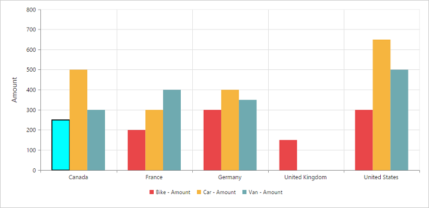

# Series in JavaScript PivotChart

## Series point customization
By using the [`fill`](/api/js/ejchart#members:series-fill) and [`border`](/api/js/ejchart#members:series-border) properties of the chart series, you can customize the series color, border color, and border width of the pivot chart.


$(function()
{
    $("#PivotChart1").ejPivotChart(
    {
        ....
        commonSeriesOptions:
        {
            type: ej.PivotChart.ChartTypes.Column
        },
        seriesRendering: "onSeriesRender"
    });
});

function onSeriesRender(args)
{
    this.model.series[0].points[0].fill = "aqua";
    this.model.series[0].points[0].border = {
        color: "black",
        width: 2
    };
}



