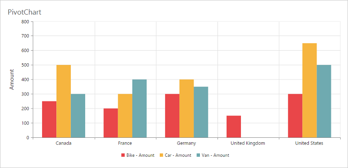
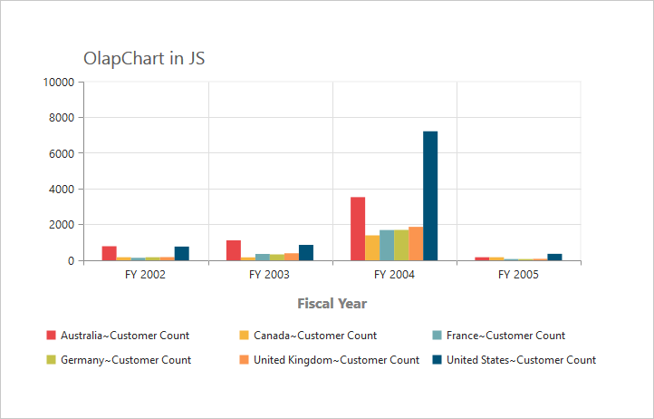

# Title

## Title text
By using the [`title.text`](/api/js/ejpivotchart#members:title-text) property, you can add the title text for the pivot chart.



$(function () {
    $("#PivotChart1").ejPivotChart(
       ....
       //Adding Chart title
       title: {
          text: "PivotChart"
       },
       //....
    });
});



## Title alignment

By using the [`title.textAlignment`](/api/js/ejchart#members:title-textalignment) property, you can align the title text of the pivot chart control to center, far, or near.



$(function () {
    $("#PivotChart1").ejPivotChart(
       ....
       title: {
            text: "PivotChart",
            //Change title text alignment
            textAlignment: "near"
       },
       //....
    });
});



## Title customization
By using the [`title`](/api/js/ejpivotchart#members:title) property, you can add the title text for X-axis and Y-axis. The title text can be customized by using the [`text`](/api/js/ejchart#members:title-text) and [`font`](/api/js/ejchart#members:title-font) properties. By setting the [`enableTrim`](/api/js/ejchart#members:primaryyaxis-enabletrim) to true, the title text can be trimmed based on its length.



$(function () {
       $("#PivotChart1").ejPivotChart(
            //...
          primaryXAxis: {
              //Customizing X-axis title
              title: {
                 text: "Country",
                 font: {
                    fontFamily: 'Segoe UI',
                    size: '16px',
                    fontWeight: 'bold',
                    color: 'grey',
                 },
                 enableTrim: true
              }
          }
     });
 });



